# L'Effet Delay — Partie 1 : Fonctionnement

> **Projet** : TDM_TEENSY — Pédalier d'effets guitare sur Teensy  
> **Auteur** : *(à compléter)*  
> **Date** : Juillet 2026

---

## Table des matières

1. [Introduction](#1-introduction)
2. [Rappels théoriques — L'écho en acoustique](#2-rappels-théoriques--lécho-en-acoustique)
3. [Vue d'ensemble de l'effet Delay](#3-vue-densemble-de-leffet-delay)
4. [Le buffer circulaire — Le cœur du Delay](#4-le-buffer-circulaire--le-cœur-du-delay)
   - 4.1 [Principe : un magnétophone numérique](#41-principe--un-magnétophone-numérique)
   - 4.2 [Écriture et lecture](#42-écriture-et-lecture)
   - 4.3 [Pourquoi « circulaire » ?](#43-pourquoi--circulaire-)
5. [Les paramètres fondamentaux](#5-les-paramètres-fondamentaux)
   - 5.1 [Le temps de Delay (Delay Time)](#51-le-temps-de-delay-delay-time)
   - 5.2 [Le Feedback (rétroaction)](#52-le-feedback-rétroaction)
   - 5.3 [Le Mix (Dry/Wet)](#53-le-mix-drywet)
6. [Interpolation — Lire entre les échantillons](#6-interpolation--lire-entre-les-échantillons)
   - 6.1 [Pourquoi interpoler ?](#61-pourquoi-interpoler-)
   - 6.2 [Interpolation linéaire](#62-interpolation-linéaire)
   - 6.3 [Interpolation Hermite (cubique)](#63-interpolation-hermite-cubique)
7. [Filtre Tone — Colorer les répétitions](#7-filtre-tone--colorer-les-répétitions)
   - 7.1 [Analogie avec le monde réel](#71-analogie-avec-le-monde-réel)
   - 7.2 [Le filtre passe-bas 1 pôle](#72-le-filtre-passe-bas-1-pôle)
8. [Gestion du changement de temps en temps réel](#8-gestion-du-changement-de-temps-en-temps-réel)
   - 8.1 [Le problème du pitch-shift](#81-le-problème-du-pitch-shift)
   - 8.2 [La solution Mute/Fade](#82-la-solution-mutefade)
9. [Schéma complet de la chaîne de traitement](#9-schéma-complet-de-la-chaîne-de-traitement)
10. [Les variantes du Delay](#10-les-variantes-du-delay)
    - 10.1 [Delay Multi-Tap](#101-delay-multi-tap)
    - 10.2 [Delay Reverse](#102-delay-reverse)
    - 10.3 [Delay Octave](#103-delay-octave)
11. [Du Delay à la Réverbération](#11-du-delay-à-la-réverbération)
12. [Récapitulatif](#12-récapitulatif)
13. [Références](#13-références)

---

## 1. Introduction

Le **Delay** (ou écho numérique) est l'un des effets audio les plus fondamentaux et les plus utilisés en musique. Son principe est simple à comprendre : **il enregistre le signal d'entrée et le rejoue un peu plus tard**, créant ainsi un effet d'écho.

Pourtant, derrière cette simplicité apparente se cachent plusieurs concepts importants du traitement numérique du signal (DSP) : buffers circulaires, interpolation, filtrage, et gestion temps réel des paramètres.

Ce document explique en détail le fonctionnement de l'effet Delay, depuis l'intuition physique jusqu'à l'implémentation algorithmique sur le Teensy.

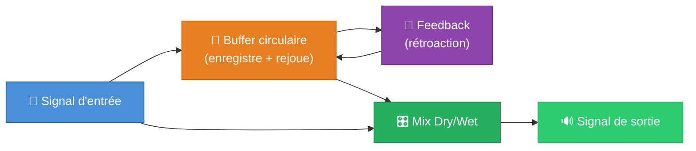

---

## 2. Rappels théoriques — L'écho en acoustique

### L'écho dans la nature

Quand vous criez face à une falaise, le son voyage jusqu'à la paroi, rebondit, et revient à vos oreilles **avec un retard**. C'est un écho.

Le temps de retard dépend de la **distance** entre vous et la surface réfléchissante :

$$t = \frac{2d}{v}$$

Où :
- $t$ = temps de retard (en secondes)
- $d$ = distance à la surface (en mètres)
- $v$ = vitesse du son ≈ 343 m/s

| Distance | Temps de retard | Perception |
|----------|----------------|------------|
| 1 m | ~6 ms | Pas d'écho perçu (effet de « salle ») |
| 11 m | ~65 ms | Slapback (doublage) |
| 50 m | ~290 ms | Écho distinct |
| 170 m | ~1 s | Écho long |

### Observation importante

- **En dessous de ~50 ms** : le cerveau ne perçoit pas deux sons séparés, mais un **enrichissement timbral** (c'est la base de la réverbération).
- **Au-dessus de ~50 ms** : on commence à entendre un **écho distinct**, une répétition identifiable du son original.

### L'écho naturel s'atténue

Dans la nature, chaque rebond perd de l'énergie :
- L'air absorbe les hautes fréquences
- La surface réfléchissante n'est jamais parfaite
- Le son se disperse dans l'espace

C'est pourquoi un écho naturel **s'assombrit et s'atténue** à chaque répétition. L'effet Delay reproduit ce comportement grâce au **feedback** et au **filtre tone**.

---

## 3. Vue d'ensemble de l'effet Delay

Avant de plonger dans les détails, voici une vue d'ensemble de la chaîne de traitement d'un Delay numérique :

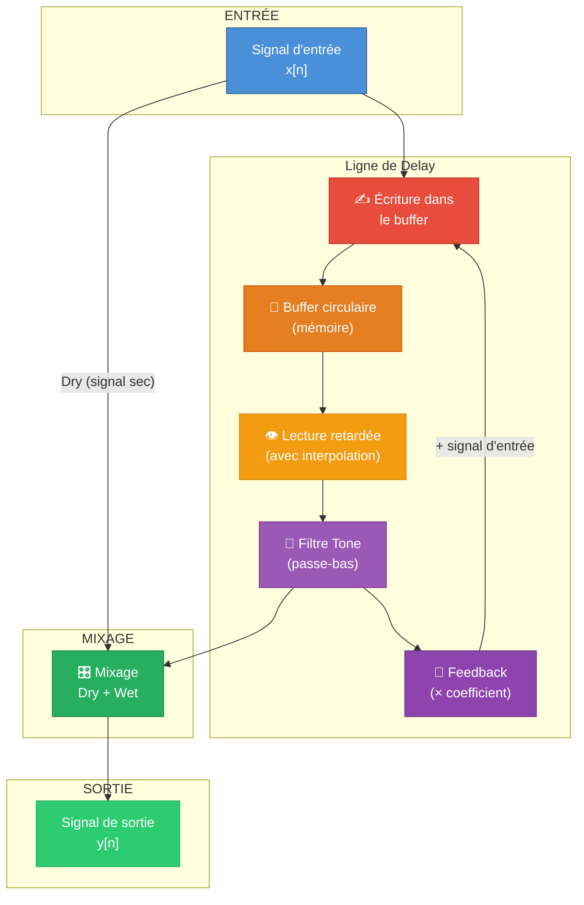

En pseudo-code simplifié, chaque échantillon est traité ainsi :

```
Pour chaque échantillon x[n] :
    1. Lire le son retardé dans le buffer → delayed
    2. Appliquer le filtre tone sur delayed → filtered
    3. Écrire dans le buffer : x[n] + feedback × filtered
    4. Calculer la sortie : y[n] = dry × x[n] + wet × filtered
```

---

## 4. Le buffer circulaire — Le cœur du Delay

### 4.1 Principe : un magnétophone numérique

Imaginez un **magnétophone à bande** (comme les anciens Echoplex ou Roland Space Echo) :

1. La bande magnétique défile en boucle continue
2. Une **tête d'écriture** enregistre le son en temps réel
3. Une **tête de lecture**, placée plus loin sur la bande, rejoue le son enregistré un peu plus tôt
4. La **distance entre les deux têtes** détermine le temps de retard

```
    Tête d'écriture          Tête de lecture
         ↓                        ↓
  ═══════╤════════════════════════╤═══════════
         │    ← distance (temps de delay) →   │
  ═══════╧════════════════════════╧═══════════
         ────────── Bande qui défile ──────────→
```

Dans le monde numérique, la « bande magnétique » est remplacée par un **tableau en mémoire** (un buffer), et les « têtes » sont des **indices** (pointeurs) dans ce tableau.

### 4.2 Écriture et lecture

Le buffer est un simple tableau de nombres flottants (des échantillons audio). Il possède :

- Un **write index** (indice d'écriture) : là où on enregistre le nouvel échantillon
- Un **read index** (indice de lecture) : là où on lit le son retardé

La distance entre les deux donne le **temps de retard** :

$$\text{read\_idx} = \text{write\_idx} - \text{delay\_samples}$$

Où `delay_samples` est le temps de retard exprimé en nombre d'échantillons :

$$\text{delay\_samples} = \text{temps (secondes)} \times \text{sample\_rate}$$

**Exemple concret** à 44 100 Hz :

| Temps de delay | Nombre d'échantillons |
|---------------|-----------------------|
| 10 ms | 441 |
| 100 ms | 4 410 |
| 500 ms | 22 050 |
| 1 s | 44 100 |
| 2 s | 88 200 |

### 4.3 Pourquoi « circulaire » ?

Le buffer a une taille fixe (dans notre cas : 88 200 échantillons = 2 secondes). Quand le pointeur d'écriture arrive au bout, il **revient au début**. C'est exactement comme une bande magnétique en boucle.

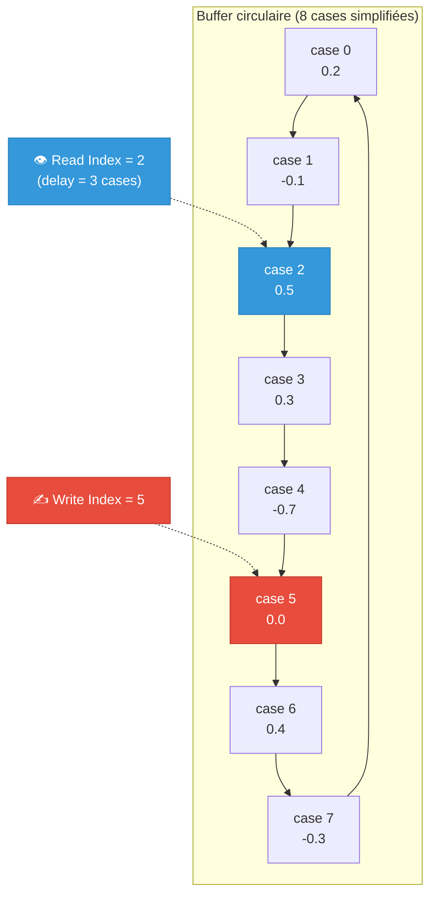

En code, le « retour au début » s'exprime avec l'opérateur modulo :

```cpp
// Avancer le pointeur d'écriture
write_idx++;
if (write_idx >= buf_len) write_idx = 0;  // Retour au début !

// Calculer le pointeur de lecture
float read_idx = write_idx - delay;
while (read_idx < 0) read_idx += buf_len;  // Enroulement si négatif
```

> **Astuce mémoire** : Pensez à une horloge. Quand l'aiguille passe le 12, elle ne va pas au 13 — elle revient au 1. Le buffer circulaire fonctionne pareil.

---

## 5. Les paramètres fondamentaux

### 5.1 Le temps de Delay (Delay Time)

C'est le temps entre le son original et sa première répétition. Dans notre implémentation, il est contrôlé par un potentiomètre normalisé entre 0.0 et 1.0, mappé sur une plage en échantillons :

$$\text{delay\_samples} = \text{MIN} + \text{potard} \times (\text{MAX} - \text{MIN})$$

Avec :
- **MIN** = 2 400 échantillons ≈ **54 ms** (minimum pour un écho audible)
- **MAX** = 88 200 échantillons = **2 secondes**

| Position du potard | Temps de delay | Caractère sonore |
|-------------------|---------------|------------------|
| 0.0 | 54 ms | Slapback / doublage |
| 0.25 | ~530 ms | Écho rythmique court |
| 0.5 | ~1 s | Écho medium |
| 0.75 | ~1.5 s | Écho long |
| 1.0 | 2 s | Écho très long, ambiant |

### 5.2 Le Feedback (rétroaction)

Le feedback détermine **combien de fois l'écho se répète**. Techniquement, c'est un coefficient qui contrôle quelle proportion du signal retardé est réinjectée dans le buffer.

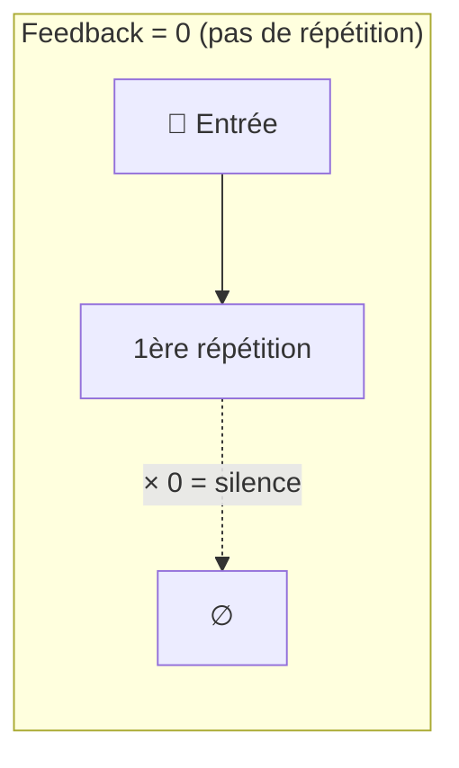

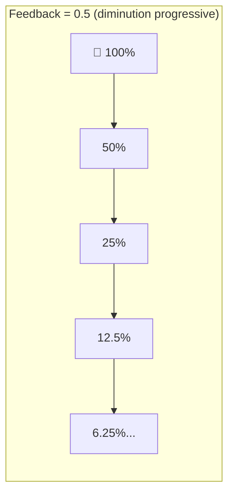

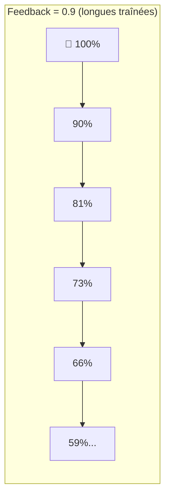

**Attention** : si le feedback atteint **1.0 ou plus**, le signal ne s'atténue jamais (ou pire, il **grossit**), ce qui crée un feedback infini → **saturation**. C'est pour cela que notre code limite le feedback à **0.99 maximum** :

```cpp
void DelayEffect::setFeedback(float fdbk) {
    vdelayFDBK = clampf(fdbk, 0.0f, 0.99f);  // Jamais ≥ 1.0 !
    delay.feedback = vdelayFDBK;
}
```

> **Analogie** : Imaginez-vous dans une pièce entre deux miroirs face à face. Votre reflet se répète à l'infini, mais chaque reflet est un peu plus sombre. Le feedback, c'est la « qualité » des miroirs : un miroir parfait (feedback = 1.0) donnerait des reflets infinis sans perte, un miroir terni (feedback = 0.5) donnerait des reflets qui disparaissent vite.

### 5.3 Le Mix (Dry/Wet)

Le **mix** contrôle l'équilibre entre le signal original (**dry** = sec) et le signal retardé (**wet** = mouillé, avec effet).

$$y[n] = \text{dry} \times x[n] + \text{wet} \times \text{delayed}[n]$$

Dans notre implémentation, dry et wet sont complémentaires :

```cpp
void DelayEffect::setMix(float mix) {
    wetMix = clampf(mix, 0.0f, 1.0f);
    dryMix = 1.0f - wetMix;  // Complémentaire !
}
```

| Mix (wet) | Dry | Wet | Résultat |
|-----------|-----|-----|----------|
| 0.0 | 1.0 | 0.0 | Signal sec uniquement (effet désactivé) |
| 0.25 | 0.75 | 0.25 | Écho discret en arrière-plan |
| 0.5 | 0.5 | 0.5 | Équilibre sec/mouillé |
| 0.75 | 0.25 | 0.75 | Écho dominant |
| 1.0 | 0.0 | 1.0 | Signal retardé uniquement (signal sec absent) |

---

## 6. Interpolation — Lire entre les échantillons

### 6.1 Pourquoi interpoler ?

Le temps de delay est un nombre réel (un `float`), mais les cases du buffer sont des nombres entiers. Que faire quand le pointeur de lecture tombe **entre deux cases** ?

Par exemple, si le delay demandé est de **3.7 échantillons** :

```
Buffer :   [ case 0 ] [ case 1 ] [ case 2 ] [ case 3 ] [ case 4 ]
                                                 ↑           ↑
                                            read_idx = 3.7
                                            (entre case 3 et case 4)
```

Sans interpolation, on lirait simplement la case 3 (troncature), ce qui introduirait du bruit et des discontinuités. L'**interpolation** calcule une valeur intermédiaire lisse entre les deux cases voisines.

### 6.2 Interpolation linéaire

C'est la méthode la plus simple : on trace une **droite** entre les deux échantillons les plus proches et on lit la valeur sur cette droite.

$$\text{sortie} = A + (B - A) \times \text{frac}$$

Où :
- $A$ = valeur à la case entière inférieure
- $B$ = valeur à la case entière supérieure
- $\text{frac}$ = partie fractionnaire de l'indice (entre 0 et 1)

**Exemple** : indice de lecture = 3.7

- Case 3 (A) = 0.5
- Case 4 (B) = 0.8
- frac = 0.7
- Résultat = 0.5 + (0.8 − 0.5) × 0.7 = 0.5 + 0.21 = **0.71**

```
Amplitude
    0.8 ─ ─ ─ ─ ─ ─ ─ ─ ─ ─ ● B (case 4)
                           ╱
    0.71 ─ ─ ─ ─ ─ ─ ─ ─○   ← valeur interpolée (3.7)
                       ╱
    0.5 ─ ─ ─ ─ ─ ─ ● A (case 3)

         ─────────────┼────────┼───────
                   case 3   case 4
```

Dans notre code :

```cpp
uint32_t r0 = (uint32_t)read_idx_f;          // Case entière inférieure
uint32_t r1 = r0 + 1;                        // Case suivante
if (r1 >= buf_len) r1 = 0;                   // Enroulement circulaire
float frac = read_idx_f - (float)r0;          // Partie fractionnaire

float del_read = buffer[r0] + (buffer[r1] - buffer[r0]) * frac;
```

### 6.3 Interpolation Hermite (cubique)

L'interpolation linéaire est rapide mais peut introduire de légères distorsions harmoniques. L'interpolation **Hermite** utilise **4 points** au lieu de 2 pour calculer une courbe plus lisse :

```
Amplitude
              ● x₋₁
           ╱       ╲
          ●          ╲        ● x₂
         x₀          ○ ← valeur interpolée (courbe douce)
                    ╱
                   ● x₁
    ─────┼──────┼──────┼──────┼─────
       n-1     n     n+1    n+2
```

La formule Hermite est plus complexe mais produit des transitions plus naturelles. Elle est utilisée dans la variante `DelayLineOct` de notre code :

```cpp
inline const T ReadHermite(float delay) const {
    const T xm1 = line_[(t - 1) % max_size];  // Point précédent
    const T x0  = line_[(t) % max_size];       // Point courant
    const T x1  = line_[(t + 1) % max_size];   // Point suivant
    const T x2  = line_[(t + 2) % max_size];   // Point d'après
    // ... calcul de la courbe cubique
}
```

| Méthode | Points utilisés | Qualité | Coût CPU |
|---------|----------------|---------|----------|
| Pas d'interpolation | 1 | ❌ Bruit | Très faible |
| Linéaire | 2 | ✅ Correct | Faible |
| Hermite (cubique) | 4 | ✅✅ Excellent | Moyen |

---

## 7. Filtre Tone — Colorer les répétitions

### 7.1 Analogie avec le monde réel

Dans la réalité, quand un son rebondit sur une surface (mur, montagne…), les **hautes fréquences sont absorbées plus vite** que les basses. Résultat : chaque écho successif est un peu plus **sourd**, plus **chaud**, plus **lointain**.

```
Répétition 1 :  "HELLO!"        (brillant, clair)
Répétition 2 :  "hello..."      (plus doux)
Répétition 3 :  "hllo..."       (étouffé)
Répétition 4 :  "...o..."       (très lointain)
```

Le **filtre Tone** reproduit cet effet en coupant progressivement les hautes fréquences à chaque passage dans la boucle de feedback.

### 7.2 Le filtre passe-bas 1 pôle

Notre implémentation utilise un filtre passe-bas à **1 pôle**, le filtre le plus simple possible. Il ne nécessite qu'une seule opération de multiplication-addition par échantillon.

**Équation** :

$$y[n] = a_0 \times x[n] + b_1 \times y[n-1]$$

Où :
- $x[n]$ = échantillon d'entrée
- $y[n]$ = échantillon de sortie
- $y[n-1]$ = échantillon de sortie **précédent** (mémoire du filtre)
- $a_0$ et $b_1$ = coefficients calculés à partir de la fréquence de coupure

**Calcul des coefficients** pour une fréquence de coupure de 3000 Hz :

$$\alpha = e^{-2\pi \times f_c / f_s}$$

$$a_0 = 1 - \alpha \qquad b_1 = \alpha$$

Avec $f_c$ = 3000 Hz et $f_s$ = 44100 Hz :

$$\alpha = e^{-2\pi \times 3000 / 44100} \approx 0.651$$

$$a_0 \approx 0.349 \qquad b_1 \approx 0.651$$

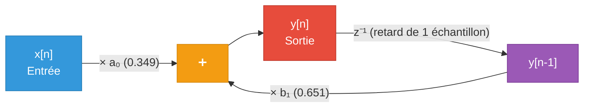

**Effet sur le spectre** : les fréquences au-dessus de 3000 Hz sont progressivement atténuées. Plus le signal fait de tours dans la boucle de feedback, plus il est filtré → les répétitions s'assombrissent naturellement.

```
Fréquence (Hz)     100    1000    3000    10000   20000
                    │       │       │        │       │
Répétition 1 :  ████████████████████████░░░░░░░░
Répétition 2 :  ███████████████████░░░░░
Répétition 3 :  ████████████████░░
Répétition 4 :  ██████████████
                    ↑               ↑
                  Basses         Fréquence de coupure (3 kHz)
                  (préservées)   (les aigus disparaissent)
```

Dans notre code :

```cpp
// Initialisation (une seule fois)
float tone_hz = 3000.0f;
float alpha = expf(-2.0f * PI * tone_hz / sampleRate);
tone_a0 = 1.0f - alpha;
tone_b1 = alpha;

// Application (à chaque échantillon)
float read = tone_a0 * del_read + tone_b1 * tone_z1;
tone_z1 = read;  // Mémorise la sortie pour le prochain échantillon
```

---

## 8. Gestion du changement de temps en temps réel

### 8.1 Le problème du pitch-shift

Quand on modifie le temps de delay **pendant que le son joue**, on change la distance entre la tête d'écriture et la tête de lecture. Cela revient à accélérer ou ralentir la lecture de la bande :

- **Réduire le delay** → la tête de lecture se rapproche → le son est lu plus vite → **hauteur qui monte** (comme accélérer un vinyle)
- **Augmenter le delay** → la tête de lecture s'éloigne → le son est lu plus lentement → **hauteur qui descend** (comme ralentir un vinyle)

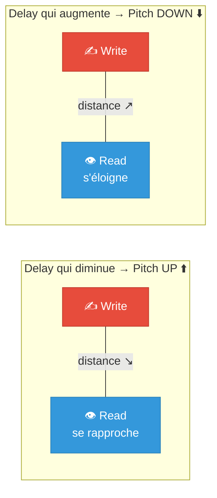

C'est l'effet « tape warble » caractéristique des vieux échos à bande. Certains effets l'exploitent volontairement (chorus, vibrato), mais pour un Delay classique, c'est **indésirable** quand le musicien tourne le potard.

### 8.2 La solution Mute/Fade

Notre implémentation utilise une stratégie astucieuse pour éviter ce pitch-shift lors des changements de temps :

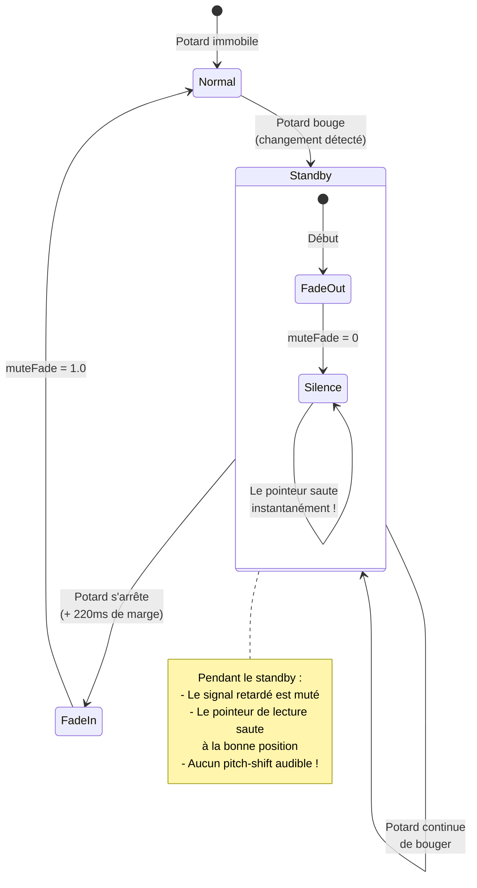

Le principe en 4 étapes :

1. **Détection du mouvement** : le code compare `delayTarget` avec `lastTarget`. Si la différence dépasse 0.1, le potard est en train de bouger.

2. **Fade-out rapide** : le volume du signal retardé descend progressivement à 0 (par pas de 0.01 par échantillon).

3. **Saut instantané** : une fois le silence atteint (muteFade = 0), le pointeur de lecture **saute instantanément** à la nouvelle position. Comme il n'y a plus de son, personne n'entend le saut !

4. **Fade-in** : quand le potard s'arrête (après ~220 ms de stabilité), le volume remonte progressivement à 1.

```cpp
if (standbyTimer > 0) {
    standbyTimer--;
    // Fade-out ultra-rapide
    muteFade -= 0.01f;
    if (muteFade <= 0.0f) {
        muteFade = 0.0f;
        // SAUT INSTANTANÉ — pas de pitch-shift !
        currentDelay = delayTarget;
    }
} else {
    // Potard immobile → Fade-in
    muteFade += 0.01f;
    if (muteFade > 1.0f) muteFade = 1.0f;
}
```

> **Analogie** : C'est comme changer de chaîne de radio. Au lieu de tourner le bouton de fréquence en entendant tous les grésillements entre les stations, vous baissez le volume → changez de station → remontez le volume. Propre et sans bruit !

---

## 9. Schéma complet de la chaîne de traitement

Voici le diagramme complet du traitement d'un seul échantillon, tel qu'implémenté dans `DelayEffect::DelayChannel::Process()` :

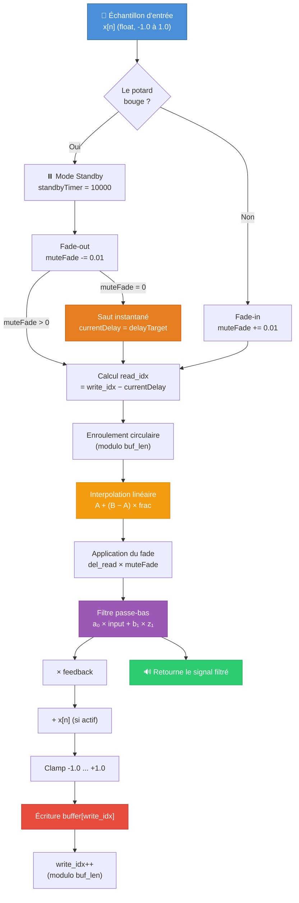

Et dans la boucle principale `update()`, le mixage final se fait ainsi :


> **Note technique** : Le Teensy Audio Library travaille en **int16** (-32768 à +32767). Notre code convertit vers **float** (-1.0 à +1.0) pour le traitement interne, puis reconvertit en int16 à la sortie.

---

## 10. Les variantes du Delay

Notre projet contient trois variantes du Delay, chacune avec sa propre personnalité sonore.

### 10.1 Delay Multi-Tap

Le **multi-tap** ajoute une seconde tête de lecture sur la bande, créant des motifs rythmiques plus complexes.

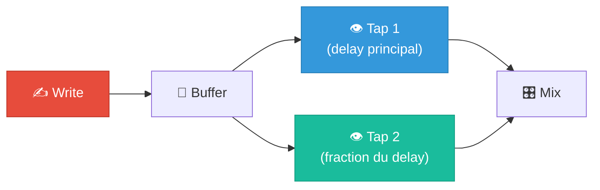

Le second tap est positionné comme une **fraction** du premier :

| Fraction | Nom musical | Effet |
|----------|-------------|-------|
| 2/3 (0.667) | Triplet (triolet) | Rythme ternaire « ta-ta-ta » |
| 3/4 (0.75) | Dotted eighth (croche pointée) | Rythme « The Edge » (U2) |

### 10.2 Delay Reverse

Le **reverse delay** est l'une des variantes les plus spectaculaires. Au lieu de rejouer le son dans le même sens, il le **lit à l'envers**, créant un effet de « pré-écho » surréaliste.

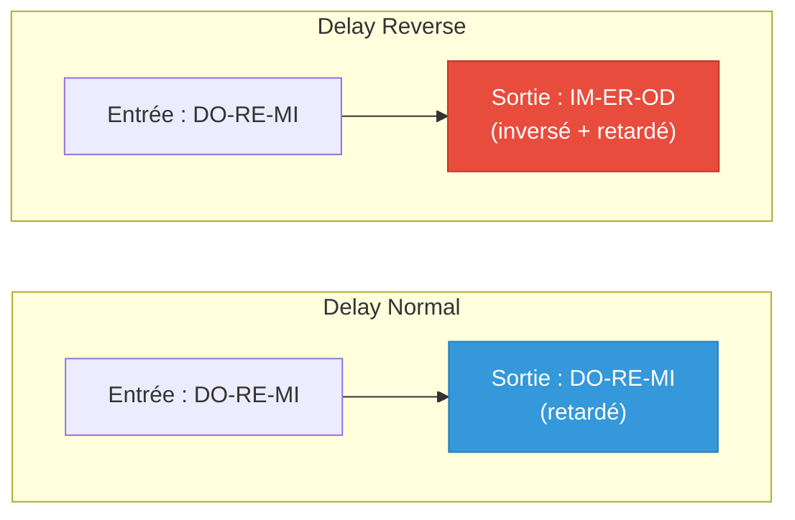

**Comment ça marche ?** Le pointeur de lecture se déplace dans le **sens opposé** au pointeur d'écriture :

```cpp
// Écriture : avance normalement (→)
write_ptr_ = (write_ptr_ + 1) % max_size;

// Lecture : recule ! (←)
read_ptr1_ = (read_ptr1_ - 1 + max_size) % max_size;
```

**Le problème** : quand la tête de lecture « rattrape » la tête d'écriture, il faut la réinitialiser. Cela créerait un clic audible. La solution utilise **deux têtes de lecture en cross-fade** :

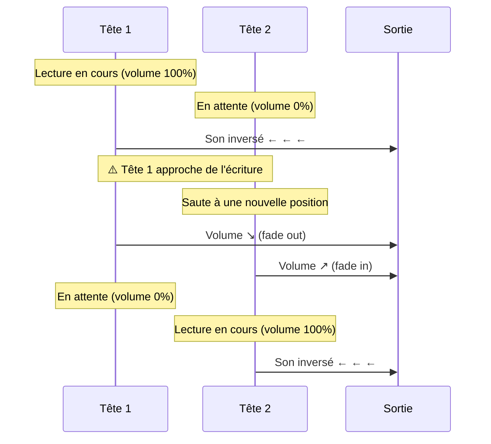

Le cross-fade utilise une courbe **sinusoïdale** (fenêtre de Hann) pour une transition douce :

$$\text{gain}_1 = \sin\left(\frac{\pi}{2} \times \text{fadepos}\right)$$
$$\text{gain}_2 = \sin\left(\frac{\pi}{2} \times (1 - \text{fadepos})\right)$$

> **Pourquoi une courbe sinusoïdale ?** Avec un fade linéaire, l'énergie totale (gain₁ + gain₂) chute au milieu du cross-fade, créant un « trou » de volume. La courbe sinusoïdale maintient un niveau constant : c'est un **equal-power crossfade**.

### 10.3 Delay Octave

Le **delay octave** ajoute un pitch-shift d'une octave aux répétitions. L'astuce est élégante : au lieu de lire la bande à vitesse normale, on la lit **deux fois plus vite** :

$$\text{read\_speed} = 2 \times \text{write\_speed} \quad \Rightarrow \quad \text{fréquence} \times 2 = \text{octave supérieure}$$

```cpp
// Lecture normale (speed = 1)
T a = line_[(write_ptr_ * 1 + delay_) % max_size];

// Lecture octave (speed = 2) → tout est joué 2× plus vite → octave up
T a = line_[(write_ptr_ * 2 + delay_) % max_size];
```

> **Analogie vinyle** : Passer un 33 tours à 78 tours double la vitesse de lecture et monte tout d'une octave. Le delay octave fait exactement ça, mais uniquement sur les répétitions.

---

## 11. Du Delay à la Réverbération

Le Delay et la Réverbération sont étroitement liés. En fait, une réverbération est essentiellement un **réseau de très courtes lignes de delay** avec des feedbacks croisés.

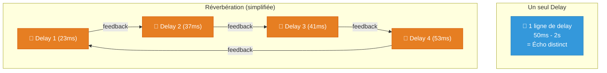

Notre projet utilise d'ailleurs la bibliothèque **CloudSeed** qui implémente une réverbération algorithmique basée sur des lignes de delay modulées et des diffuseurs allpass — tous construits sur le même concept de buffer circulaire que le Delay.

---

## 12. Récapitulatif

### Les concepts clés en un coup d'œil

| Concept | Rôle | Analogie |
|---------|------|----------|
| **Buffer circulaire** | Mémoire qui enregistre et rejoue le son | Bande magnétique en boucle |
| **Write Index** | Où on enregistre le nouvel échantillon | Tête d'enregistrement |
| **Read Index** | Où on lit le son retardé | Tête de lecture |
| **Delay Time** | Distance entre écriture et lecture | Distance des têtes sur la bande |
| **Feedback** | Réinjection du son retardé | Écho qui rebondit entre les murs |
| **Mix (Dry/Wet)** | Équilibre original/retardé | Volume de chaque source |
| **Interpolation** | Lecture entre deux échantillons | Zoom entre les pixels d'une image |
| **Filtre Tone** | Assombrit les répétitions | Absorption naturelle du son par l'air |
| **Mute/Fade** | Évite le pitch-shift au changement de temps | Baisser le volume avant de changer de station |

### Architecture des fichiers

```
src/EffetDelay/
├── Delay.h              → Classe principale DelayEffect
├── Delay.cpp            → Implémentation (buffer, feedback, tone, mute/fade)
├── delayline_oct.h      → Variante multi-tap + octave (DelayLineOct)
├── delayline_reverse.h  → Variante reverse avec cross-fade (DelayLineReverse)
└── CloudSeed/           → Réverbération algorithmique (basée sur des delay lines)
```

### Formules essentielles

| Formule | Signification |
|---------|--------------|
| $\text{delay\_samples} = t \times f_s$ | Conversion temps → échantillons |
| $\text{read} = \text{write} - \text{delay}$ | Position de lecture |
| $y = A + (B - A) \times \text{frac}$ | Interpolation linéaire |
| $y[n] = a_0 \cdot x[n] + b_1 \cdot y[n-1]$ | Filtre passe-bas 1 pôle |
| $\text{sortie} = \text{dry} \times x + \text{wet} \times \text{delayed}$ | Mixage Dry/Wet |

---

## 13. Références

- **Julius O. Smith III**, *Physical Audio Signal Processing* — Stanford CCRMA  
  Référence académique sur les lignes de delay et la réverbération algorithmique.

- **Teensy Audio Library** — PJRC  
  Framework audio utilisé pour le traitement en temps réel sur Teensy 4.x.

- **CloudSeed** — Algorithme de réverbération open-source  
  Implémentation de référence pour la réverbération basée sur des delay lines modulées.

- **DaisySP** — Electrosmith  
  Bibliothèque DSP open-source d'où sont adaptées les classes `DelayLineOct` et `DelayLineReverse`.

---

> *Ce document sera complété par des enregistrements audio comparatifs et des captures de tests dans une prochaine version.*
