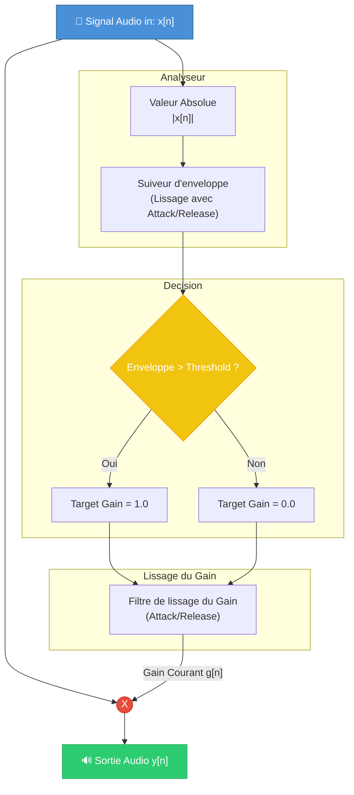

# L'Effet Noise Gate — Fonctionnement et Implémentation

> **Projet** : TDM_TEENSY — Pédalier d'effets guitare sur Teensy  
> **Auteur** : *(à compléter)*  
> **Date** : Août 2026

---

## Table des matières

1. [Introduction](#1-introduction)
2. [Rappels théoriques — La dynamique et le bruit](#2-rappels-théoriques--la-dynamique-et-le-bruit)
3. [Les paramètres fondamentaux](#3-les-paramètres-fondamentaux)
4. [Le cœur du Noise Gate : L'analyseur d'enveloppe](#4-le-cœur-du-noise-gate--lanalyseur-denveloppe)
5. [Schéma complet de la chaîne de traitement](#5-schéma-complet-de-la-chaîne-de-traitement)
6. [Implémentation numérique (DSP) dans le projet](#6-implémentation-numérique-dsp-dans-le-projet)
   - 6.1 [Calcul des coefficients temporels](#61-calcul-des-coefficients-temporels)
   - 6.2 [Suiveur d'enveloppe (Envelope Follower)](#62-suiveur-denveloppe-envelope-follower)
   - 6.3 [Calcul et lissage du gain (Gain Smoothing)](#63-calcul-et-lissage-du-gain-gain-smoothing)
7. [Récapitulatif](#7-récapitulatif)

---

## 1. Introduction

Le **Noise Gate** (ou porte de bruit) est un effet fondamental pour le traitement de la dynamique d'un instrument, particulièrement en contexte de guitare électrique avec de la distorsion. Son but principal est de "fermer" le signal (couper le son) lorsque le musicien ne joue pas, afin d'éliminer le souffle (hiss) ou les ronflettes (hum) des micros de la guitare ou des étages de gain précédents.

Conceptuellement, c'est un interrupteur automatique qui laisse passer le son s'il est suffisamment fort, et qui le coupe s'il est trop faible. Son implémentation DSP nécessite un suivi précis de l'enveloppe du signal (Envelope Follower) et un lissage minutieux de l'atténuation pour éviter les clics audibles.

---

## 2. Rappels théoriques — La dynamique et le bruit

Dans un signal audio, la **dynamique** est la différence entre les sons les plus faibles et les sons les plus forts. Un signal de guitare comporte :
- **Le signal utile** : l'attaque de la note, le sustain, le relâchement.
- **Le bruit de fond** : toujours présent, mais masqué lorsque la note joue fort. Lorsque la note s'éteint ou entre les morceaux, le bruit de fond devient clairement audible.

Le Noise Gate agit comme un comparateur de niveau par rapport à un seuil défini :
- **Signal > Seuil** : La porte s'ouvre, le gain est de 1 (0 dB d'atténuation), le son passe intégralement.
- **Signal < Seuil** : La porte se ferme, le gain descend vers 0, le son est coupé (mute).

---

## 3. Les paramètres fondamentaux

Sur un Noise Gate standard, et dans l'implémentation de la Teensy, on retrouve trois réglages majeurs :

1. **Threshold (Le Seuil)** :
   - C'est le niveau d'amplitude en dessous duquel la porte commence à se fermer.
   - Si le réglage est trop bas, le bruit passera. S'il est trop haut, les notes douces ou le sustain naturel de la guitare seront coupés prématurément.

2. **Attack (L'Attaque)** :
   - Détermine le temps que met la porte à s'ouvrir complètement une fois que le signal dépasse le seuil.
   - Une attaque trop lente mangera le début de la note (perte des transitoires). Une attaque rapide est idéale, mais un temps minimum est requis pour que l'ouverture ne provoque pas un "clic" désagréable.

3. **Release (Le Relâchement)** :
   - Détermine le temps que met la porte à se fermer une fois que le signal passe sous le seuil.
   - Un relâchement très rapide coupera le son brutalement de façon peu naturelle (effet staccato). Un relâchement plus lent permettra de conserver le *decay* naturel de la note.

---

## 4. Le cœur du Noise Gate : L'analyseur d'enveloppe

Pour savoir si le signal dépasse le seuil, il ne suffit pas de regarder un seul échantillon audio $x[n]$. Le signal audio oscille constamment (passant par zéro à chaque période). Si l'on comparait instantanément l'amplitude de chaque échantillon au seuil, la porte s'ouvrirait et se fermerait des centaines de fois par seconde, entraînant une forte distorsion.

On utilise donc un **Suiveur d'enveloppe (Envelope Follower)** : il s'agit conceptuellement d'un filtre passe-bas appliqué sur la valeur absolue du signal. Il permet d'obtenir un contour "lissé" de l'amplitude globale du son au fil du temps.

---

## 5. Schéma complet de la chaîne de traitement

Voici la représentation sous forme de diagramme du trajet du signal et de son analyse dans le DSP.



---

## 6. Implémentation numérique (DSP) dans le projet

Le code source (dans `src/EffetNoiseGate/NoiseGate.cpp`) montre une implémentation très optimisée et efficace de ce principe. L'approche choisie se base sur des filtres IIR du premier ordre pour lisser les variations.

### 6.1 Calcul des coefficients temporels

Le filtre numérique utilise des coefficients calculés à partir des constantes de temps (`Attack` et `Release`) exprimées en millisecondes.
La formule pour calculer ces coefficients $\alpha$ est :

$$ \alpha = e^{- \frac{1}{\tau \times F_s}} $$

Où $\tau$ est le temps en secondes, et $F_s$ la fréquence d'échantillonnage de la Teensy. 
Dans le code, on retrouve exactement ce calcul :
```cpp
attackCoef_ = expf(-1.0f / (attackMs_ * 0.001f * AUDIO_SAMPLE_RATE_EXACT));
releaseCoef_ = expf(-1.0f / (releaseMs_ * 0.001f * AUDIO_SAMPLE_RATE_EXACT));
```
*(Plus la constante de temps est longue, plus le coefficient se rapproche de 1.0, augmentant l'effet de mémoire ou de "lissage").*

Par ailleurs, le mapping du paramètre `Threshold` (qui varie de 0.0 à 1.0 sur l'interface) utilise une fonction **cubique** pour offrir une bien meilleure précision de réglage sur les valeurs d'amplitude très faibles :
```cpp
threshold_ = threshold * threshold * threshold * 0.1f; 
```

### 6.2 Suiveur d'enveloppe (Envelope Follower)

À chaque échantillon audio, l'algorithme calcule sa valeur absolue (`absSample`) et met à jour l'enveloppe (`envelope_`). Cette implémentation se distingue par ses temps de réaction asymétriques selon que le volume monte ou descend :

```cpp
if (absSample > envelope_) {
    // Si le signal monte rapidement : on utilise l'Attack
    envelope_ = attackCoef_ * envelope_ + (1.0f - attackCoef_) * absSample;
} else {
    // Si le signal baisse : on utilise le Release
    envelope_ = releaseCoef_ * envelope_ + (1.0f - releaseCoef_) * absSample;
}
```

### 6.3 Calcul et lissage du gain (Gain Smoothing)

Une fois la valeur de l'enveloppe estimée, elle est comparée au `threshold_` pour décider de la valeur cible du gain (`targetGain`) :

```cpp
float targetGain = (envelope_ > threshold_) ? 1.0f : 0.0f;
```

Cependant, basculer instantanément le gain audio courant de 0 à 1, ou inversement, créerait une discontinuité brutale produisant un clac sonore (zipper noise). L'algorithme applique donc un **deuxième niveau de lissage** sur la variable de gain elle-même, en réutilisant intelligemment les mêmes coefficients :

```cpp
if (targetGain > gain_) {
    // La porte s'ouvre : lissage de l'attaque
    gain_ = attackCoef_ * gain_ + (1.0f - attackCoef_) * targetGain;
} else {
    // La porte se ferme : lissage du relâchement
    gain_ = releaseCoef_ * gain_ + (1.0f - releaseCoef_) * targetGain;
}
```

Enfin, on applique ce gain lissé à l'échantillon d'entrée pour produire le son final :
```cpp
float output = sample * gain_;
```

---

## 7. Récapitulatif

L'implémentation du Noise Gate dans ce projet brille par sa concision et sa pertinence audio :
1. **Le Double Lissage (Double Smoothing)** : Les temps d'attaque et de relâchement sont appliqués en deux étapes : une fois pour stabiliser la détection de l'enveloppe (éviter le hachage), et une seconde fois pour adoucir la variation effective du volume (éviter les clics).
2. **Courbe de Threshold non-linéaire** : L'utilisation d'une courbe cubique rend le bouton de réglage beaucoup plus naturel et musical à utiliser pour détecter le souffle.
3. **Performances O(1)** : L'algorithme ne requiert qu'une poignée de multiplications et d'additions par échantillon. Il ne nécessite **aucune mémoire de retardement (delay line)**, ce qui le rend ultra-rapide et parfaitement dimensionné pour le microcontrôleur de la Teensy.
