# L'Effet Octaver — Partie 1 : Fonctionnement

> **Projet** : TDM_TEENSY — Pédalier d'effets guitare sur Teensy  
> **Auteur** : *(à compléter)*  
> **Date** : Juillet 2026

---

## Table des matières

1. [Introduction](#1-introduction)
2. [Rappels théoriques — L'octave en musique et en physique](#2-rappels-théoriques--loctave-en-musique-et-en-physique)
3. [Vue d'ensemble de l'effet octaver](#3-vue-densemble-de-leffet-octaver)
4. [Approches analogiques classiques](#4-approches-analogiques-classiques)
   - 4.1 [Octave supérieure par redressement pleine onde](#41-octave-supérieure-par-redressement-pleine-onde)
   - 4.2 [Sous-octave par division de fréquence](#42-sous-octave-par-division-de-fréquence)
   - 4.3 [Limitations des approches analogiques](#43-limitations-des-approches-analogiques)
5. [Approches numériques (DSP)](#5-approches-numériques-dsp)
   - 5.1 [Méthode naïve : détection de zéro et division de fréquence](#51-méthode-naïve--détection-de-zéro-et-division-de-fréquence)
   - 5.2 [Méthode avancée : signal analytique et mise à l'échelle de phase](#52-méthode-avancée--signal-analytique-et-mise-à-léchelle-de-phase)
6. [Focus — La méthode par banc de filtres passe-bande complexes](#6-focus--la-méthode-par-banc-de-filtres-passe-bande-complexes)
   - 6.1 [Principe du signal analytique](#61-principe-du-signal-analytique)
   - 6.2 [Filtrage passe-bande complexe (Complex Bandpass Filter)](#62-filtrage-passe-bande-complexe-complex-bandpass-filter)
   - 6.3 [Décomposition en sous-bandes](#63-décomposition-en-sous-bandes)
   - 6.4 [Mise à l'échelle de phase (Phase Scaling)](#64-mise-à-léchelle-de-phase-phase-scaling)
   - 6.5 [Recombinaison des sous-bandes](#65-recombinaison-des-sous-bandes)
7. [Traitement multi-rate : décimation et interpolation](#7-traitement-multi-rate--décimation-et-interpolation)
8. [Récapitulatif de la chaîne de traitement complète](#8-récapitulatif-de-la-chaîne-de-traitement-complète)
9. [Comparaison des approches](#9-comparaison-des-approches)
10. [Références](#10-références)

---

## 1. Introduction

L'**octaver** est un effet audio qui génère, à partir d'un signal d'entrée, un ou plusieurs signaux transposés d'une ou plusieurs octaves — vers le haut ou vers le bas. Il est largement utilisé en guitare électrique et basse pour épaissir le son, simuler un jeu à deux instruments, ou créer des textures sonores inédites.

Ce document constitue la **première partie** du rapport sur l'effet octaver. Il a pour objectif d'expliquer en détail **comment fonctionne l'effet**, tant du point de vue des approches analogiques historiques que des techniques numériques modernes de traitement du signal (DSP).

Le schéma ci-dessous résume les trois grandes familles d'approches que nous allons explorer :

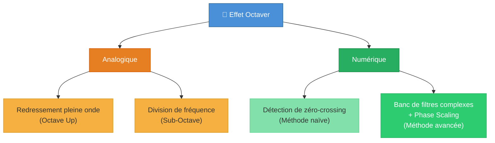
```mermaid
graph TD
    A["🎸 Effet Octaver"] --> B["Analogique"]
    A --> C["Numérique"]
    B --> D["Redressement pleine onde<br/>(Octave Up)"]
    B --> E["Division de fréquence<br/>(Sub-Octave)"]
    C --> F["Détection de zéro-crossing<br/>(Méthode naïve)"]
    C --> G["Banc de filtres complexes<br/>+ Phase Scaling<br/>(Méthode avancée)"]
    
    style A fill:#4a90d9,stroke:#2c5f8a,color:#fff
    style B fill:#e67e22,stroke:#d35400,color:#fff
    style C fill:#27ae60,stroke:#1e8449,color:#fff
    style D fill:#f5b041,stroke:#d4961a
    style E fill:#f5b041,stroke:#d4961a
    style F fill:#82e0aa,stroke:#58d68d
    style G fill:#2ecc71,stroke:#27ae60,color:#fff
```

---

## 2. Rappels théoriques — L'octave en musique et en physique

### Définition musicale

En musique, une **octave** est l'intervalle entre deux notes dont la fréquence fondamentale de l'une est exactement le double (ou la moitié) de l'autre.

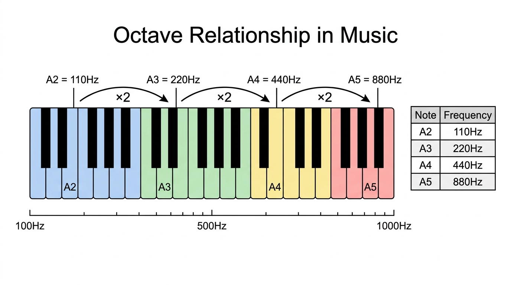

Le tableau suivant illustre cette relation sur la note La :

| Note   | Fréquence | Rapport avec La 4 |
|--------|-----------|-------------------|
| La 2   | 110 Hz    | × 0.25 (−2 octaves) |
| La 3   | 220 Hz    | × 0.5 (−1 octave) |
| **La 4** | **440 Hz** | **Référence** |
| La 5   | 880 Hz    | × 2 (+1 octave) |
| La 6   | 1760 Hz   | × 4 (+2 octaves) |

Chaque passage d'une octave correspond à une **multiplication** (octave supérieure) ou une **division** (octave inférieure) de la fréquence par 2.

### Formulation mathématique

Soit $f_0$ la fréquence fondamentale d'une note :

- **Octave supérieure** : $f_{+1} = 2 \cdot f_0$
- **Octave inférieure** : $f_{-1} = \frac{f_0}{2}$
- **Deux octaves en dessous** : $f_{-2} = \frac{f_0}{4}$

Plus généralement, pour un décalage de $n$ octaves :

$$f_n = 2^n \cdot f_0$$

### Perception auditive et échelle logarithmique

L'oreille humaine perçoit les intervalles de fréquence de manière **logarithmique** : un doublement de fréquence est toujours perçu comme le même intervalle (une octave), quelle que soit la fréquence de départ.

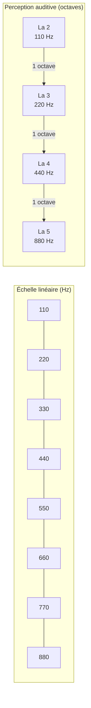
```mermaid
graph LR
    subgraph "Échelle linéaire (Hz)"
        L1["110"] --- L2["220"] --- L3["330"] --- L4["440"] --- L5["550"] --- L6["660"] --- L7["770"] --- L8["880"]
    end
    
    subgraph "Perception auditive (octaves)"
        P1["La 2<br/>110 Hz"] -->|"1 octave"| P2["La 3<br/>220 Hz"]
        P2 -->|"1 octave"| P3["La 4<br/>440 Hz"]
        P3 -->|"1 octave"| P4["La 5<br/>880 Hz"]
    end
```

> **Point clé** : Sur une échelle linéaire, l'intervalle 110→220 Hz (110 Hz de différence) et l'intervalle 440→880 Hz (440 Hz de différence) semblent très différents. Mais auditivement, les deux sont perçus comme **exactement le même intervalle** : une octave. C'est pourquoi les bancs de filtres utilisés dans les octavers numériques modernes utilisent un espacement **logarithmique** des fréquences centrales.

### Effet de la transposition sur le spectre

Lorsqu'on transpose un signal d'une octave, **toutes** ses composantes fréquentielles (fondamentale et harmoniques) sont multipliées ou divisées par le même facteur :

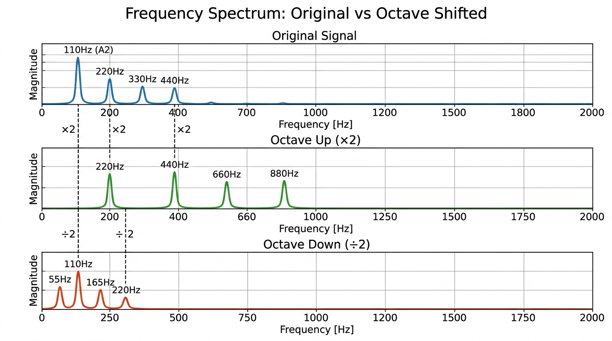

Par exemple, pour une note La 2 (fondamentale 110 Hz) avec ses harmoniques :

| Composante | Signal original | Octave Up (×2) | Octave Down (÷2) |
|-----------|----------------|-----------------|-------------------|
| Fondamentale | 110 Hz | 220 Hz | 55 Hz |
| 2ᵉ harmonique | 220 Hz | 440 Hz | 110 Hz |
| 3ᵉ harmonique | 330 Hz | 660 Hz | 165 Hz |
| 4ᵉ harmonique | 440 Hz | 880 Hz | 220 Hz |

> **Important** : La transposition d'octave **préserve les rapports entre harmoniques**, ce qui conserve le timbre de l'instrument. C'est une propriété unique de l'octave par rapport aux autres intervalles musicaux.

---

## 3. Vue d'ensemble de l'effet octaver

Le principe général de l'effet octaver se décompose en deux chemins parallèles :

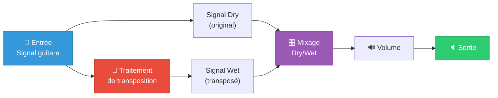
```mermaid
flowchart LR
    IN["🎸 Entrée<br/>Signal guitare"] --> DRY["Signal Dry<br/>(original)"]
    IN --> WET["🔧 Traitement<br/>de transposition"]
    WET --> WETOUT["Signal Wet<br/>(transposé)"]
    DRY --> MIX["🎛️ Mixage<br/>Dry/Wet"]
    WETOUT --> MIX
    MIX --> VOL["🔊 Volume"]
    VOL --> OUT["🔈 Sortie"]
    
    style IN fill:#3498db,stroke:#2980b9,color:#fff
    style WET fill:#e74c3c,stroke:#c0392b,color:#fff
    style MIX fill:#9b59b6,stroke:#8e44ad,color:#fff
    style OUT fill:#2ecc71,stroke:#27ae60,color:#fff
```

L'utilisateur contrôle :
- Le **ratio dry/wet** (proportion signal original vs signal transposé)
- Le **volume** global de sortie
- Le **mode** de transposition (octave up, octave down, deux octaves down)

Les trois modes disponibles sont résumés dans le tableau suivant :

| Mode | Transposition | Facteur de fréquence | Effet perceptif |
|------|---------------|----------------------|-----------------|
| **Octave Up** | +1 octave | × 2 | Son plus aigu, brillant, « 12-cordes » |
| **Octave Down** | −1 octave | × 0.5 | Son plus grave, « basse ajoutée » |
| **2 Oct. Down** | −2 octaves | × 0.25 | Son très grave, « sub-basse », orgue |

---

## 4. Approches analogiques classiques

Les premiers octavers (années 1960-70) utilisaient des circuits analogiques pour manipuler directement la forme d'onde du signal. Ces approches restent importantes à comprendre car elles constituent le fondement historique de l'effet.

### 4.1 Octave supérieure par redressement pleine onde

La technique classique pour produire une **octave supérieure** repose sur un **redresseur double alternance** (*full-wave rectifier*).

#### Principe

Le redressement pleine onde consiste à **inverser les alternances négatives** du signal pour les rendre positives. Le résultat est un signal qui effectue deux cycles complets dans le temps d'un seul cycle original — sa fréquence est donc doublée.

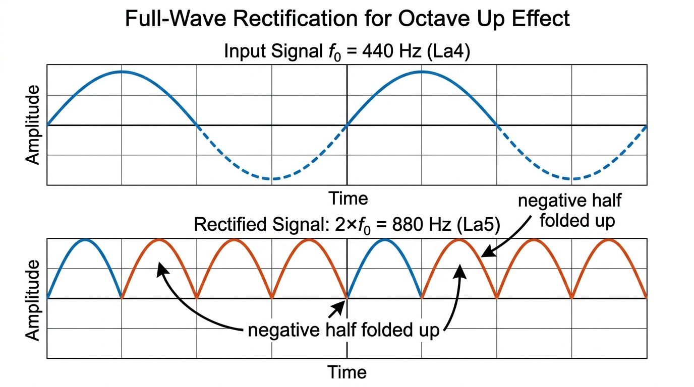

#### Circuit analogique

Le schéma de principe d'un redresseur pleine onde est le suivant :

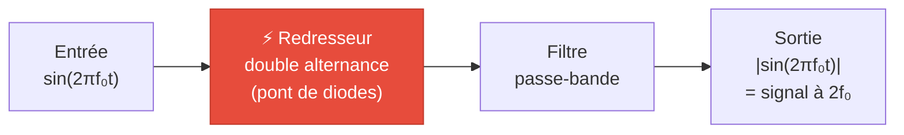
```mermaid
flowchart LR
    IN["Entrée<br/>sin(2πf₀t)"] --> RECT["⚡ Redresseur<br/>double alternance<br/>(pont de diodes)"]
    RECT --> FILT["Filtre<br/>passe-bande"]
    FILT --> OUT["Sortie<br/>|sin(2πf₀t)|<br/>= signal à 2f₀"]
    
    style RECT fill:#e74c3c,stroke:#c0392b,color:#fff
```

#### Formulation mathématique

Si le signal d'entrée est $x(t) = A\sin(2\pi f_0 t)$, alors la sortie redressée est :

$$y(t) = |x(t)| = |A\sin(2\pi f_0 t)|$$

En développant $|\sin(\theta)|$ en série de Fourier :

$$|\sin(\theta)| = \frac{2}{\pi} - \frac{4}{\pi}\sum_{k=1}^{\infty} \frac{\cos(2k\theta)}{4k^2 - 1}$$

En séparant les premiers termes :

$$|\sin(\theta)| = \frac{2}{\pi} - \frac{4}{3\pi}\cos(2\theta) - \frac{4}{15\pi}\cos(4\theta) - \frac{4}{35\pi}\cos(6\theta) - \ldots$$

On constate que :
- Il y a une composante **continue** (DC) : $\frac{2}{\pi} \approx 0.637$
- La **première harmonique** est à **$2f_0$** (octave supérieure), d'amplitude $\frac{4}{3\pi} \approx 0.424$
- Des harmoniques paires supplémentaires apparaissent : $4f_0, 6f_0, \ldots$
- Il n'y a **aucune composante** à $f_0$ — la fondamentale originale a disparu

> **En résumé** : le redressement pleine onde produit un signal riche dont la fondamentale est à $2f_0$ (octave supérieure), mais accompagnée de nombreuses harmoniques parasites qui donnent au son son caractère « sale » et « organique ».

#### Caractéristiques sonores

| Aspect | Description |
|--------|-------------|
| **Timbre** | Son « sale », riche en harmoniques, caractéristique vintage |
| **Latence** | Aucune (traitement purement instantané) |
| **Polyphonie** | Partiellement polyphonique (le redressement fonctionne sur n'importe quel signal) |
| **Fidélité** | Faible — le timbre original est fortement altéré |

### 4.2 Sous-octave par division de fréquence

Pour produire une **sous-octave** (octave inférieure), les circuits analogiques utilisent un **diviseur de fréquence** basé sur une bascule flip-flop.

#### Principe

Le circuit détecte les **passages par zéro** (*zero-crossings*) du signal d'entrée et génère un nouveau signal qui ne change d'état qu'**à chaque deuxième** passage par zéro :

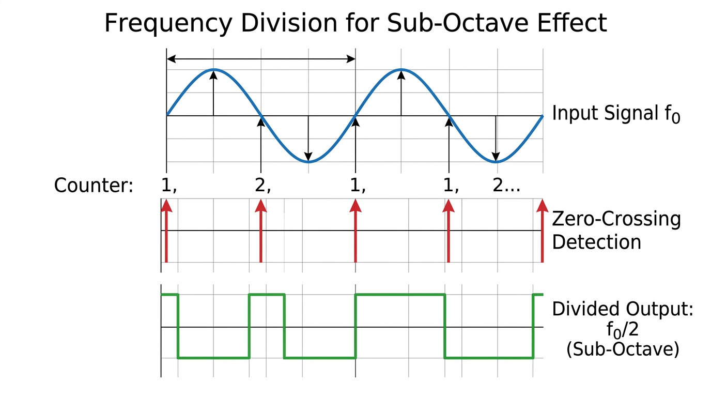

#### Fonctionnement détaillé

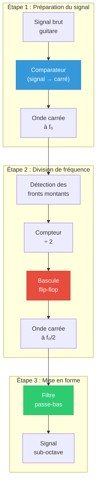
```mermaid
flowchart TB
    subgraph "Étape 1 : Préparation du signal"
        A1["Signal brut<br/>guitare"] --> A2["Comparateur<br/>(signal → carré)"]
        A2 --> A3["Onde carrée<br/>à f₀"]
    end
    
    subgraph "Étape 2 : Division de fréquence"
        A3 --> B1["Détection des<br/>fronts montants"]
        B1 --> B2["Compteur<br/>÷ 2"]
        B2 --> B3["Bascule<br/>flip-flop"]
        B3 --> B4["Onde carrée<br/>à f₀/2"]
    end
    
    subgraph "Étape 3 : Mise en forme"
        B4 --> C1["Filtre<br/>passe-bas"]
        C1 --> C2["Signal<br/>sub-octave"]
    end
    
    style A2 fill:#3498db,stroke:#2980b9,color:#fff
    style B3 fill:#e74c3c,stroke:#c0392b,color:#fff
    style C1 fill:#2ecc71,stroke:#27ae60,color:#fff
```

Le processus fonctionne comme suit :

1. **Comparaison** : le signal analogique est d'abord converti en onde carrée par un comparateur (seuil à zéro)
2. **Détection de front** : chaque front montant (passage de − à +) déclenche le compteur
3. **Division** : la bascule flip-flop change d'état à chaque front détecté, produisant une sortie qui change à la moitié de la fréquence
4. **Filtrage** : un filtre passe-bas adoucit l'onde carrée résultante

#### Illustration de la division

Voici un tableau montrant l'état de la bascule au fil des passages par zéro :

| Passage par zéro n° | Direction | État de la bascule | Sortie |
|---|---|---|---|
| 1 | ↑ montant | Bascule → HIGH | +1 |
| 2 | ↓ descendant | *(pas de changement)* | +1 |
| 3 | ↑ montant | Bascule → LOW | −1 |
| 4 | ↓ descendant | *(pas de changement)* | −1 |
| 5 | ↑ montant | Bascule → HIGH | +1 |
| ... | ... | ... | ... |

> **Résultat** : la sortie effectue un cycle complet en 2 cycles d'entrée → la fréquence est divisée par 2 → **octave inférieure**.

### 4.3 Limitations des approches analogiques

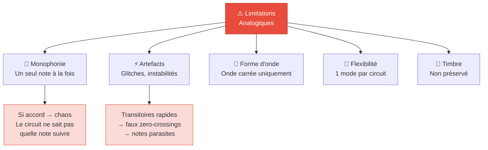
```mermaid
graph TD
    A["⚠️ Limitations<br/>Analogiques"] --> B["🎵 Monophonie<br/>Un seul note à la fois"]
    A --> C["⚡ Artefacts<br/>Glitches, instabilités"]
    A --> D["📐 Forme d'onde<br/>Onde carrée uniquement"]
    A --> E["🔧 Flexibilité<br/>1 mode par circuit"]
    A --> F["🎼 Timbre<br/>Non préservé"]
    
    B --> G["Si accord → chaos<br/>Le circuit ne sait pas<br/>quelle note suivre"]
    C --> H["Transitoires rapides<br/>→ faux zero-crossings<br/>→ notes parasites"]
    
    style A fill:#e74c3c,stroke:#c0392b,color:#fff
    style G fill:#fadbd8,stroke:#e74c3c
    style H fill:#fadbd8,stroke:#e74c3c
```

| Limitation | Description | Impact musical |
|------------|-------------|----------------|
| **Monophonie** | Impossible de traiter des accords ou des notes multiples | Utilisable uniquement pour des lignes mélodiques simples |
| **Artefacts** | Glitches lors des transitoires rapides (attaques) | Sons parasites indésirables, « blurps » |
| **Forme d'onde** | Le signal généré est une onde carrée | Timbre synthétique, pas de fidélité à l'instrument |
| **Flexibilité** | Un seul mode de transposition par circuit | Nécessite un circuit dédié pour chaque octave |
| **Suivi de pitch** | Perte de tracking dans les graves (période longue) | Latence perceptible sur les basses fréquences |

> **Ces limitations ont motivé le développement d'approches numériques plus sophistiquées**, capables de traitement polyphonique et de préservation du timbre.

---

## 5. Approches numériques (DSP)

Le traitement numérique du signal (DSP) offre des possibilités bien plus larges pour l'effet octaver. Deux grandes familles de méthodes existent :

### 5.1 Méthode naïve : détection de zéro et division de fréquence

C'est la **transposition directe** de l'approche analogique dans le domaine numérique.

#### Algorithme détaillé

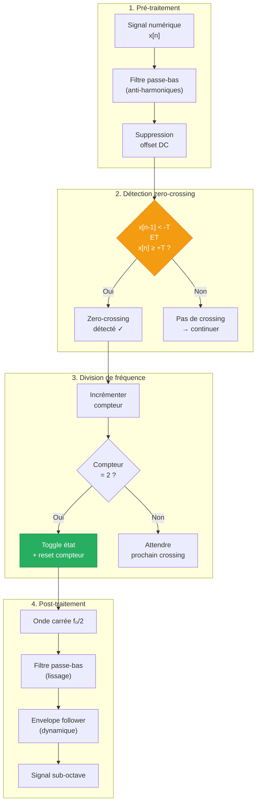
```mermaid
flowchart TB
    subgraph "1. Pré-traitement"
        A1["Signal numérique<br/>x[n]"] --> A2["Filtre passe-bas<br/>(anti-harmoniques)"]
        A2 --> A3["Suppression<br/>offset DC"]
    end
    
    subgraph "2. Détection zero-crossing"
        A3 --> B1{"x[n-1] < -T<br/>ET<br/>x[n] ≥ +T ?"}
        B1 -->|Oui| B2["Zero-crossing<br/>détecté ✓"]
        B1 -->|Non| B3["Pas de crossing<br/>→ continuer"]
    end
    
    subgraph "3. Division de fréquence"
        B2 --> C1["Incrémenter<br/>compteur"]
        C1 --> C2{"Compteur<br/>= 2 ?"}
        C2 -->|Oui| C3["Toggle état<br/>+ reset compteur"]
        C2 -->|Non| C4["Attendre<br/>prochain crossing"]
    end
    
    subgraph "4. Post-traitement"
        C3 --> D1["Onde carrée f₀/2"]
        D1 --> D2["Filtre passe-bas<br/>(lissage)"]
        D2 --> D3["Envelope follower<br/>(dynamique)"]
        D3 --> D4["Signal sub-octave"]
    end
    
    style B1 fill:#f39c12,stroke:#e67e22,color:#fff
    style C3 fill:#27ae60,stroke:#1e8449,color:#fff
```

#### Détection avec hystérésis

La détection de zero-crossing « brute » est sensible au bruit. L'hystérésis ajoute un seuil $T$ pour éviter les faux déclenchements :

```
                    +T ─ ─ ─ ─ ─ ─ ─ ─ ─ ─ ─ ─ ─ ─ ─ ─ ─   Seuil haut
                        ╭─╮     ╭─╮                        
                       /   \   /   \                        
Signal :              /     \ /     \                       
                   ──╱───────╳───────╲──                    
                    /       / \       \                     
                   /       /   \       \                    
                    ╰─╯     ╰─╯                            
                    −T ─ ─ ─ ─ ─ ─ ─ ─ ─ ─ ─ ─ ─ ─ ─ ─ ─   Seuil bas
                        
                        ↑              ↑     ← Zero-crossings validés
                     (ignore les oscillations entre −T et +T)
```

> **Sans hystérésis**, le bruit autour du zéro peut générer des dizaines de faux crossings par cycle, rendant la division de fréquence inutilisable.

#### Limitations de la méthode numérique naïve

Les mêmes que l'approche analogique (monophonie, artefacts), mais avec la possibilité d'ajouter des traitements plus sophistiqués (hystérésis, filtrage adaptatif, etc.). Le problème fondamental reste : **cette approche a besoin d'identifier la fréquence du signal, ce qui est impossible de manière fiable pour un signal polyphonique.**

### 5.2 Méthode avancée : signal analytique et mise à l'échelle de phase

C'est la méthode utilisée dans les octavers numériques polyphoniques modernes. Elle est **fondamentalement différente** de la division de fréquence : au lieu de détecter la fréquence puis de la diviser, elle manipule directement la **phase instantanée** du signal.

> **Idée clé** : si on peut représenter un signal sous la forme $A(t) \cdot e^{j\phi(t)}$, alors multiplier la phase par un facteur $g$ revient à multiplier la fréquence par $g$ — **sans jamais avoir besoin de connaître la fréquence elle-même**.

Cette approche est décrite en détail dans la section suivante.

---

## 6. Focus — La méthode par banc de filtres passe-bande complexes

Cette section détaille la méthode de transposition d'octave par **décomposition en sous-bandes** et **mise à l'échelle de phase** (*phase scaling*). C'est la technique décrite par **Etienne Thuillier** dans sa thèse « *Real-Time Polyphonic Octave Doubling for the Guitar* » (Aalto University, 2016), et inspirée des travaux d'**Andrew J. Noga** sur les filtres passe-bande complexes.

### Vue d'ensemble de la méthode

Avant de plonger dans les détails, voici la vue d'ensemble du processus :

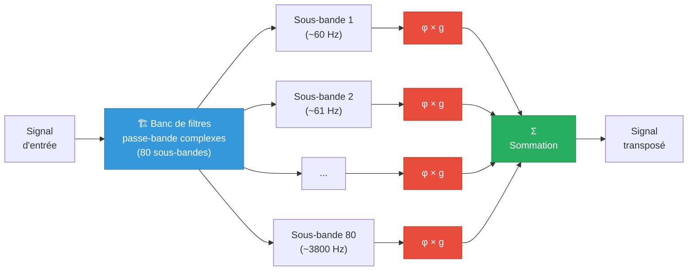
```mermaid
flowchart LR
    IN["Signal<br/>d'entrée"] --> FB["🏗️ Banc de filtres<br/>passe-bande complexes<br/>(80 sous-bandes)"]
    
    FB --> S1["Sous-bande 1<br/>(~60 Hz)"]
    FB --> S2["Sous-bande 2<br/>(~61 Hz)"]
    FB --> S3["..."]
    FB --> S80["Sous-bande 80<br/>(~3800 Hz)"]
    
    S1 --> PS1["φ × g"]
    S2 --> PS2["φ × g"]
    S3 --> PS3["φ × g"]
    S80 --> PS80["φ × g"]
    
    PS1 --> SUM["Σ<br/>Sommation"]
    PS2 --> SUM
    PS3 --> SUM
    PS80 --> SUM
    
    SUM --> OUT["Signal<br/>transposé"]
    
    style FB fill:#3498db,stroke:#2980b9,color:#fff
    style SUM fill:#27ae60,stroke:#1e8449,color:#fff
    style PS1 fill:#e74c3c,stroke:#c0392b,color:#fff
    style PS2 fill:#e74c3c,stroke:#c0392b,color:#fff
    style PS3 fill:#e74c3c,stroke:#c0392b,color:#fff
    style PS80 fill:#e74c3c,stroke:#c0392b,color:#fff
```

### 6.1 Principe du signal analytique

#### Définition

Le **signal analytique** $s_a(t)$ est une représentation complexe d'un signal réel $s(t)$ :

$$s_a(t) = s(t) + j \cdot \mathcal{H}\{s(t)\}$$

où $\mathcal{H}\{s(t)\}$ est la **transformée de Hilbert** du signal. Le signal analytique ne contient que les **composantes fréquentielles positives** du spectre.

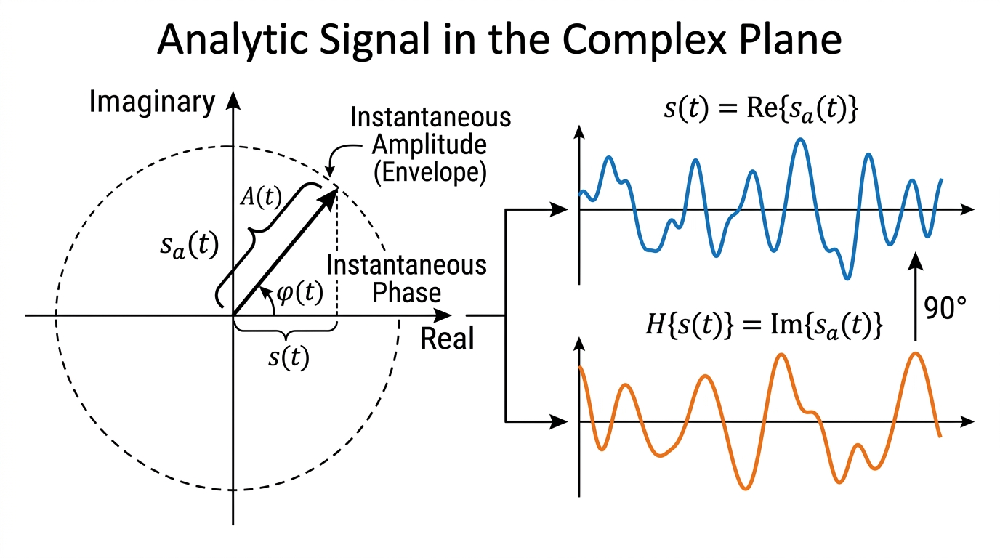

#### Représentation en amplitude et phase (forme polaire)

Le signal analytique peut s'écrire sous forme polaire :

$$s_a(t) = A(t) \cdot e^{j\phi(t)}$$

où :
- $A(t) = |s_a(t)| = \sqrt{s(t)^2 + \mathcal{H}\{s(t)\}^2}$ est l'**amplitude instantanée** (l'enveloppe)
- $\phi(t) = \arctan\left(\frac{\mathcal{H}\{s(t)\}}{s(t)}\right)$ est la **phase instantanée**

La **fréquence instantanée** est alors :

$$f(t) = \frac{1}{2\pi} \cdot \frac{d\phi(t)}{dt}$$

#### Visualisation dans le plan complexe

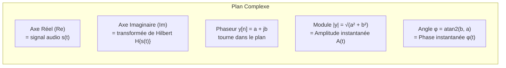
```mermaid
graph TD
    subgraph "Plan Complexe"
        direction TB
        A["Axe Réel (Re)<br/>= signal audio s(t)"] 
        B["Axe Imaginaire (Im)<br/>= transformée de Hilbert H{s(t)}"]
        C["Phaseur y[n] = a + jb<br/>tourne dans le plan"]
        D["Module |y| = √(a² + b²)<br/>= Amplitude instantanée A(t)"]
        E["Angle φ = atan2(b, a)<br/>= Phase instantanée φ(t)"]
    end
```

> **Analogie** : Imaginez une horloge dont l'aiguille tourne. La **longueur** de l'aiguille correspond à l'amplitude (volume) du son, et la **vitesse de rotation** correspond à la fréquence (hauteur) du son. Le signal audio réel est simplement l'**ombre** de cette aiguille projetée sur un mur (la partie réelle).

#### Intérêt pour la transposition d'octave

L'écriture sous forme polaire sépare clairement :
- L'**enveloppe** $A(t)$ → le volume, la dynamique, les attaques
- La **phase** $\phi(t)$ → la hauteur tonale, la fréquence

On peut ainsi **modifier la phase sans affecter l'enveloppe** — c'est la clé de la transposition polyphonique de haute qualité. Le timbre, les attaques et la dynamique de l'instrument sont préservés.

### 6.2 Filtrage passe-bande complexe (Complex Bandpass Filter)

#### Pourquoi un filtre complexe ?

Un filtre passe-bande **réel** classique laisse passer les fréquences autour d'une fréquence centrale $f_c$, mais sa sortie est un signal **réel** — on n'a pas directement accès à la phase instantanée.

Un filtre passe-bande **complexe** produit une sortie **complexe** $y[n] = a + jb$, qui est directement le signal analytique dans la bande passante. On a ainsi accès immédiat à l'amplitude et à la phase sans calcul supplémentaire.

#### Construction à partir d'un filtre passe-bas prototype

On part d'un filtre passe-bas prototype (ici un **biquad** de type LPF tiré du célèbre « *Audio EQ Cookbook* » de Robert Bristow-Johnson). Pour transformer ce filtre passe-bas en filtre passe-bande complexe centré à la fréquence $f_c$, on applique une **translation fréquentielle complexe** :

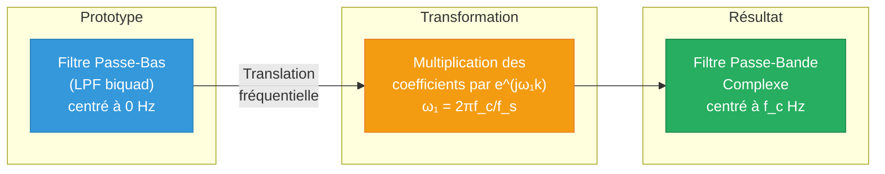
```mermaid
flowchart LR
    subgraph "Prototype"
        LP["Filtre Passe-Bas<br/>(LPF biquad)<br/>centré à 0 Hz"]
    end
    
    subgraph "Transformation"
        T["Multiplication des<br/>coefficients par e^(jω₁k)<br/>ω₁ = 2πf_c/f_s"]
    end
    
    subgraph "Résultat"
        BP["Filtre Passe-Bande<br/>Complexe<br/>centré à f_c Hz"]
    end
    
    LP -->|"Translation<br/>fréquentielle"| T --> BP
    
    style LP fill:#3498db,stroke:#2980b9,color:#fff
    style T fill:#f39c12,stroke:#e67e22,color:#fff
    style BP fill:#27ae60,stroke:#1e8449,color:#fff
```

Les coefficients du filtre passe-bas réel $\{b_k, a_k\}$ sont multipliés par des exponentielles complexes :

$$b'_k = b_k \cdot e^{j \cdot 2\pi f_c \cdot k / f_s}$$
$$a'_k = a_k \cdot e^{j \cdot 2\pi f_c \cdot k / f_s}$$

où $f_s$ est la fréquence d'échantillonnage et $k$ est l'indice du coefficient.

Cette opération **décale** la réponse du filtre passe-bas vers la fréquence $f_c$, créant un filtre passe-bande centré sur $f_c$. L'avantage crucial est que ce filtre complexe ne laisse passer que les fréquences **positives** autour de $f_c$ — il produit directement un signal analytique dans la bande passante.

#### Structure du filtre : Forme Directe Transposée II

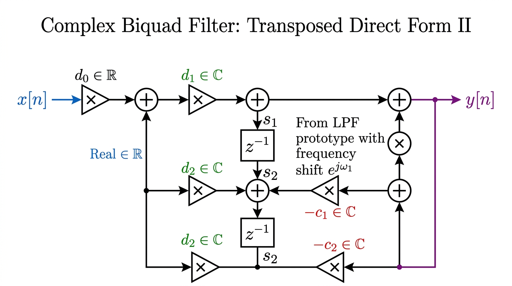

Le filtre passe-bande complexe de second ordre (biquad complexe) s'exprime sous forme directe transposée II :

$$y[n] = s_2[n] + d_0 \cdot x[n]$$
$$s_2[n+1] = s_1[n] + d_1 \cdot x[n] - c_1 \cdot y[n]$$
$$s_1[n+1] = d_2 \cdot x[n] - c_2 \cdot y[n]$$

où :

| Symbole | Type | Description |
|---------|------|-------------|
| $x[n]$ | Réel | Échantillon d'entrée |
| $y[n]$ | **Complexe** | Sortie (signal analytique dans la bande) |
| $d_0$ | Réel | Gain du filtre |
| $d_1, d_2$ | **Complexe** | Coefficients numérateur (feedforward) |
| $c_1, c_2$ | **Complexe** | Coefficients dénominateur (feedback) |
| $s_1, s_2$ | **Complexe** | Variables d'état du filtre |

#### Calcul des coefficients

Les coefficients sont calculés comme suit à partir du prototype LPF :

**1. Pulsations normalisées :**

$$\omega_0 = \frac{\pi \cdot \text{BW}}{f_s} \quad \text{(bande passante)}, \quad \omega_1 = \frac{2\pi \cdot f_c}{f_s} \quad \text{(fréquence centrale)}$$

**2. Paramètres intermédiaires du LPF (Audio EQ Cookbook) :**

$$a_0 = 1 + \frac{\sqrt{2}}{2}\sin(\omega_0), \quad g = \frac{1 - \cos(\omega_0)}{2 \cdot a_0}$$

**3. Coefficients complexes après translation fréquentielle :**

$$d_0 = g \quad \text{(réel)}$$
$$d_1 = e^{j\omega_1} \cdot 2g, \quad d_2 = e^{j2\omega_1} \cdot g$$
$$c_1 = e^{j\omega_1} \cdot \frac{-2\cos(\omega_0)}{a_0}, \quad c_2 = e^{j2\omega_1} \cdot \frac{1 - \frac{\sqrt{2}}{2}\sin(\omega_0)}{a_0}$$

> **Remarque** : Chaque filtre a ses propres coefficients, calculés une seule fois à l'initialisation. Les exponentielles complexes $e^{j\omega_1}$ et $e^{j2\omega_1}$ sont ce qui « déplace » le filtre passe-bas vers la fréquence centrale souhaitée.

### 6.3 Décomposition en sous-bandes

#### Pourquoi décomposer en sous-bandes ?

Un signal musical polyphonique (par exemple un accord de guitare) contient **plusieurs fréquences fondamentales simultanées**. Si l'on essaie de transposer le signal entier en une seule opération, les composantes fréquentielles interfèrent entre elles et produisent des artefacts d'intermodulation.

La solution est de **décomposer le signal en sous-bandes étroites**, chacune ne contenant idéalement qu'une seule composante fréquentielle. On peut alors transposer chaque sous-bande **indépendamment**, puis recombiner les résultats.

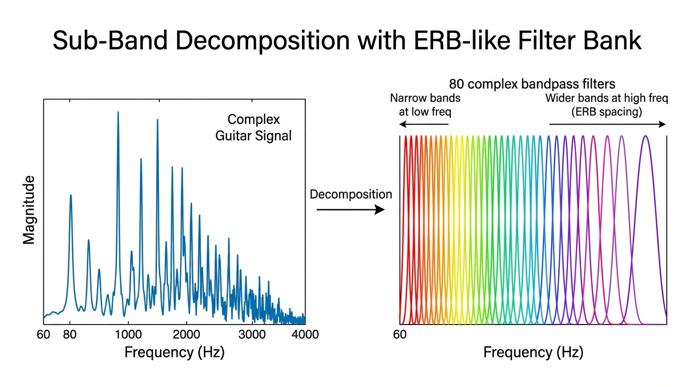

#### Banc de filtres à bandes quasi-ERB

Le banc de filtres utilisé ici est inspiré de l'échelle **ERB** (*Equivalent Rectangular Bandwidth*), qui modélise la résolution fréquentielle de l'oreille humaine : les bandes sont plus étroites dans les basses fréquences et plus larges dans les hautes fréquences.

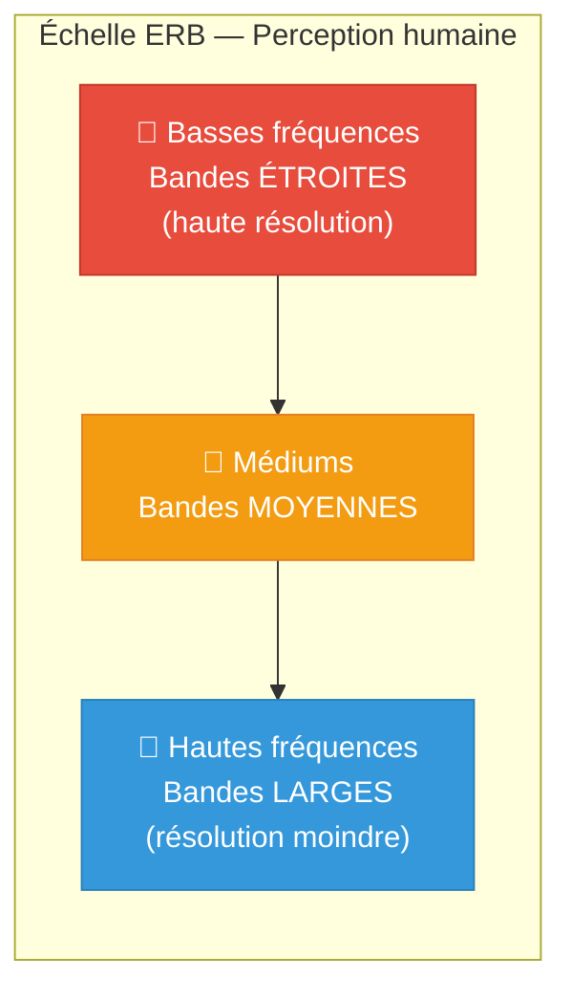
```mermaid
graph LR
    subgraph "Échelle ERB — Perception humaine"
        A["🎵 Basses fréquences<br/>Bandes ÉTROITES<br/>(haute résolution)"]
        B["🎵 Médiums<br/>Bandes MOYENNES"]
        C["🎵 Hautes fréquences<br/>Bandes LARGES<br/>(résolution moindre)"]
    end
    A --> B --> C
    
    style A fill:#e74c3c,stroke:#c0392b,color:#fff
    style B fill:#f39c12,stroke:#e67e22,color:#fff
    style C fill:#3498db,stroke:#2980b9,color:#fff
```

**Fréquences centrales** des sous-bandes :

$$f_c(n) = 480 \cdot 2^{0.027 \cdot n} - 420 \quad \text{Hz}$$

où $n \in \{0, 1, 2, \ldots, 79\}$ est l'indice de la sous-bande. Voici quelques valeurs :

| Indice $n$ | Fréquence centrale $f_c$ | Bande passante $\text{BW}$ | Rôle |
|-----------|------------------------|--------------------------|------|
| 0 | ~60 Hz | ~1.8 Hz | Graves (fondamentale Mi grave) |
| 10 | ~71 Hz | ~2.2 Hz | Graves |
| 20 | ~93 Hz | ~2.7 Hz | Graves (fondamentale La grave) |
| 40 | ~176 Hz | ~5.1 Hz | Médiums bas |
| 60 | ~409 Hz | ~12.5 Hz | Médiums hauts |
| 79 | ~835 Hz | ~27.8 Hz | Aigus |

> **80 sous-bandes** sont utilisées, couvrant le spectre utile de ~60 Hz à ~3800 Hz (après décimation).

**Bande passante** de chaque sous-bande — calculée comme la **moyenne harmonique** des intervalles entre fréquences centrales voisines :

$$\text{BW}(n) = 2 \cdot \frac{(f_{n+1} - f_n)(f_n - f_{n-1})}{(f_{n+1} - f_n) + (f_n - f_{n-1})}$$

Cette formulation assure un **recouvrement régulier** entre bandes voisines et une couverture continue du spectre, sans trous ni redondances excessives.

#### Nombre de bandes par mode

En fonction du mode de transposition, le nombre de sous-bandes utilisées varie :

| Mode | Nombre de bandes | Raison |
|------|-----------------|--------|
| Octave Up ($g = 2$) | **80** | Toutes les bandes, car les fréquences doublées restent dans le spectre |
| Octave Down ($g = 0.5$) | **40** | Les hautes fréquences, une fois divisées par 2, restent couvertes par les bandes basses |
| 2 Oct. Down ($g = 0.25$) | **40** | Même raisonnement |

### 6.4 Mise à l'échelle de phase (Phase Scaling)

C'est le **cœur de l'algorithme**. Pour chaque sous-bande, la sortie du filtre passe-bande complexe fournit un signal analytique $y[n]$ sous forme complexe.

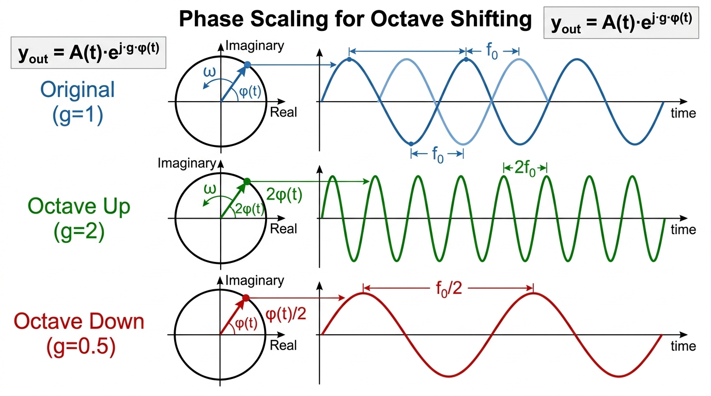

#### Formule générale

On peut écrire le signal analytique sous forme polaire :

$$y[n] = A[n] \cdot e^{j\phi[n]}$$

Pour transposer d'un facteur $g$, on applique la formule de **mise à l'échelle de phase** :

$$\boxed{y_{out}[n] = y[n] \cdot \left(\frac{y[n]}{|y[n]|}\right)^{g-1}}$$

Développons : le terme $\frac{y[n]}{|y[n]|}$ est le **phaseur unitaire** $e^{j\phi[n]}$. Donc :

$$y_{out}[n] = A[n] \cdot e^{j\phi[n]} \cdot e^{j(g-1)\phi[n]} = A[n] \cdot e^{jg\phi[n]}$$

**La phase a été multipliée par $g$, tandis que l'amplitude $A[n]$ est préservée.**

La fréquence instantanée est proportionnelle à la dérivée de la phase, donc multiplier la phase par $g$ multiplie la fréquence par $g$.

> **Remarque clé** : cette opération n'a pas besoin de connaître la fréquence du signal — elle travaille directement sur la phase instantanée. C'est ce qui permet le traitement **polyphonique**.

---

#### Octave supérieure ($g = 2$) — Détail du calcul

Pour $g = 2$, l'exposant est $g - 1 = 1$, donc :

$$y_{out}[n] = y[n] \cdot \frac{y[n]}{|y[n]|}$$

Si $y[n] = a + jb$ (avec $a$ = partie réelle, $b$ = partie imaginaire), alors :

$$\frac{y}{|y|} = \frac{a + jb}{\sqrt{a^2 + b^2}}$$

$$y_{out} = (a + jb) \cdot \frac{a + jb}{\sqrt{a^2 + b^2}} = \frac{(a + jb)^2}{\sqrt{a^2 + b^2}}$$

En développant $(a + jb)^2 = a^2 - b^2 + 2jab$, et en prenant la **partie réelle** (qui est le signal audio de sortie) :

$$\boxed{\text{Re}(y_{out}) = \frac{a^2 - b^2}{\sqrt{a^2 + b^2}}}$$

C'est exactement l'implémentation dans le code (`BandShifter.h`, méthode `update_up1()`) :

```cpp
void update_up1()
{
    const auto a = _y.real();
    const auto b = _y.imag();
    const auto a_carre = a*a;
    const auto b_carre = b*b;
    _up1 = (a_carre - b_carre) * fastInvSqrt(a_carre + b_carre);
    //       ↑ (a²-b²)               ↑ 1/√(a²+b²) = 1/|y|
}
```

> **Optimisation** : au lieu de calculer $\frac{1}{\sqrt{x}}$ avec la division et la racine carrée standard, le code utilise l'algorithme **Fast Inverse Square Root** (rendu célèbre par Quake III), qui utilise une astuce de manipulation de bits pour une approximation très rapide.

---

#### Octave inférieure ($g = 1/2$) — Détail du calcul

Pour $g = 1/2$, l'exposant est $g - 1 = -1/2$. On cherche :

$$y_{out}[n] = y[n] \cdot \left(\frac{y[n]}{|y[n]|}\right)^{-1/2} = A[n] \cdot e^{j\phi[n]/2}$$

Il faut calculer la **racine carrée du phaseur unitaire** $e^{j\phi/2}$ :

$$e^{j\phi/2} = \cos(\phi/2) + j\sin(\phi/2)$$

En utilisant les **identités trigonométriques des demi-angles** :

$$\cos\left(\frac{\phi}{2}\right) = \sqrt{\frac{1 + \cos\phi}{2}}, \quad \sin\left(\frac{\phi}{2}\right) = \text{sgn}(\sin\phi) \cdot \sqrt{\frac{1 - \cos\phi}{2}}$$

Et puisque $\cos\phi = \frac{a}{|y|}$ (partie réelle normalisée), on pose :

$$x = \frac{a}{2|y|}$$

$$c = \cos(\phi/2) = \sqrt{\frac{1}{2} + x}, \quad d = \sin(\phi/2) = \text{sgn}(b) \cdot \sqrt{\frac{1}{2} - x}$$

Le signal de sortie complexe est alors :

$$y_{out} = \text{sgn}_{down} \cdot (a \cdot c + b \cdot d) + j \cdot \text{sgn}_{down} \cdot (b \cdot c - a \cdot d)$$

En prenant la **partie réelle** :

$$\boxed{\text{Re}(y_{out}) = \text{sgn}_{down} \cdot (a \cdot c + b \cdot d)}$$

Implémentation correspondante dans le code (`BandShifter.h`, méthode `update_down1()`) :

```cpp
void update_down1()
{
    const auto a = _y.real();
    const auto b = _y.imag();
    const auto b_sign = (b < 0) ? -1.0f : 1.0f;

    const auto x = 0.5f * a * fastInvSqrt(a*a + b*b);  // = a/(2|y|)
    const auto c = fastSqrt(0.5f + x);                   // = cos(φ/2)
    const auto d = b_sign * fastSqrt(0.5f - x);          // = sgn(b)·sin(φ/2)

    _down1 = _down1_sign * std::complex<float>(
        (a*c + b*d),    // Partie réelle
        (b*c - a*d)     // Partie imaginaire (pour cascade)
    );
}
```

---

#### Problème de l'ambiguïté de signe (Phase Unwrapping)

La division de la phase par 2 introduit une **ambiguïté de signe** fondamentale :

$$e^{j\phi/2} \quad \text{et} \quad e^{j(\phi + 2\pi)/2} = e^{j\phi/2} \cdot e^{j\pi} = -e^{j\phi/2}$$

sont deux racines carrées également valides de $e^{j\phi}$. Sans correction, le signal de sortie peut « sauter » entre les deux solutions, créant des **discontinuités audibles**.

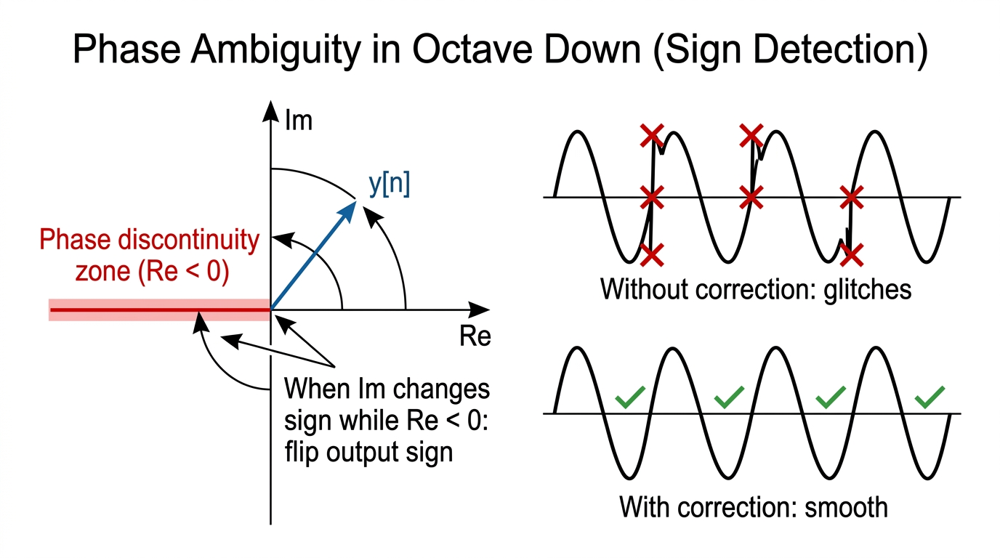

#### Mécanisme de correction

Pour résoudre cette ambiguïté, on détecte les **transitions de phase** du signal analytique $y[n]$. Quand le phaseur traverse le point $-1$ dans le plan complexe (c'est-à-dire quand la partie réelle est négative **et** que la partie imaginaire change de signe), on inverse le signe du signal de sortie :

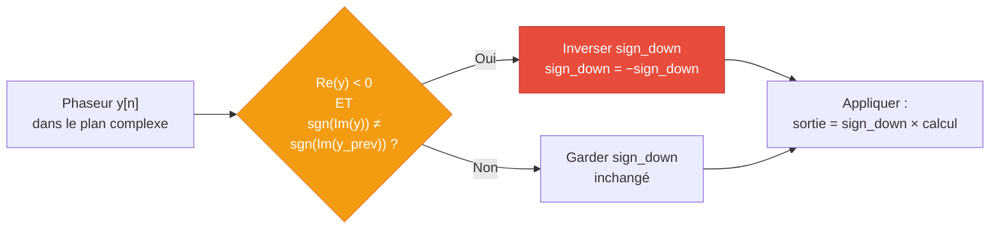
```mermaid
flowchart LR
    A["Phaseur y[n]<br/>dans le plan complexe"] --> B{"Re(y) < 0<br/>ET<br/>sgn(Im(y)) ≠<br/>sgn(Im(y_prev)) ?"}
    B -->|Oui| C["Inverser sign_down<br/>sign_down = −sign_down"]
    B -->|Non| D["Garder sign_down<br/>inchangé"]
    C --> E["Appliquer :<br/>sortie = sign_down × calcul"]
    D --> E
    
    style B fill:#f39c12,stroke:#e67e22,color:#fff
    style C fill:#e74c3c,stroke:#c0392b,color:#fff
```

Code correspondant :

```cpp
// Détection de la transition de phase dans update_filter()
if ((_y.real() < 0) &&
    (std::signbit(_y.imag()) != std::signbit(prev_y.imag())))
{
    _down1_sign = -_down1_sign;  // Inverser le signe
}
```

Ce mécanisme maintient la **continuité de phase** du signal sous-octave, éliminant les glitches.

---

#### Deux octaves en dessous ($g = 1/4$) — Cascade

Pour descendre de **deux octaves**, on applique la même opération de mise à l'échelle de phase **en cascade** :

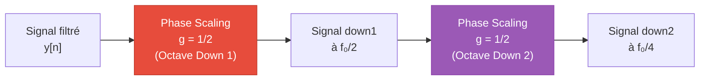
```mermaid
flowchart LR
    Y["Signal filtré<br/>y[n]"] --> D1["Phase Scaling<br/>g = 1/2<br/>(Octave Down 1)"]
    D1 --> D1OUT["Signal down1<br/>à f₀/2"]
    D1OUT --> D2["Phase Scaling<br/>g = 1/2<br/>(Octave Down 2)"]
    D2 --> D2OUT["Signal down2<br/>à f₀/4"]
    
    style D1 fill:#e74c3c,stroke:#c0392b,color:#fff
    style D2 fill:#9b59b6,stroke:#8e44ad,color:#fff
```

L'algorithme est identique, mais appliqué au signal `_down1` (complexe) au lieu du signal d'entrée filtré. Le résultat `_down2` est la partie réelle uniquement (car c'est le signal audio final) :

```cpp
void update_down2()
{
    const auto a = _down1.real();    // ← Utilise la sortie de down1
    const auto b = _down1.imag();
    // ... même calcul que down1 ...
    _down2 = _down2_sign * (a*c + b*d);  // ← Partie réelle uniquement
}
```

> **Effet cumulatif** : la première mise à l'échelle divise la fréquence par 2, la seconde divise encore par 2, pour un total de ÷4 = **deux octaves en dessous**.

### 6.5 Recombinaison des sous-bandes

Après avoir appliqué la mise à l'échelle de phase indépendamment à chaque sous-bande, les signaux résultants sont **sommés** pour reconstituer le signal transposé complet :

$$y_{total}[n] = \sum_{k=0}^{N-1} y_{out,k}[n]$$

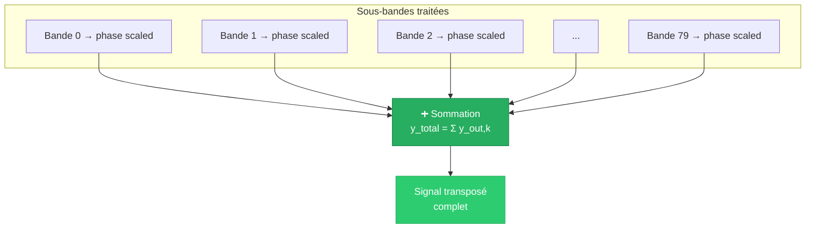
```mermaid
flowchart TB
    subgraph "Sous-bandes traitées"
        S0["Bande 0 → phase scaled"]
        S1["Bande 1 → phase scaled"]
        S2["Bande 2 → phase scaled"]
        SD["..."]
        S79["Bande 79 → phase scaled"]
    end
    
    S0 --> SUM["➕ Sommation<br/>y_total = Σ y_out,k"]
    S1 --> SUM
    S2 --> SUM
    SD --> SUM
    S79 --> SUM
    
    SUM --> OUT["Signal transposé<br/>complet"]
    
    style SUM fill:#27ae60,stroke:#1e8449,color:#fff
    style OUT fill:#2ecc71,stroke:#27ae60,color:#fff
```

Le recouvrement des bandes du banc de filtres assure que la sommation reconstitue fidèlement le spectre complet — c'est le principe de la **reconstruction parfaite** (ou quasi-parfaite dans notre cas, puisque les filtres IIR n'offrent pas une reconstruction mathématiquement parfaite).

---

## 7. Traitement multi-rate : décimation et interpolation

Le banc de 80 filtres complexes est **très coûteux en calcul**. Pour réduire la charge CPU, un traitement **multi-rate** est utilisé : le signal est d'abord sous-échantillonné (décimé), traité à une fréquence d'échantillonnage réduite, puis sur-échantillonné (interpolé) pour revenir à la fréquence originale.

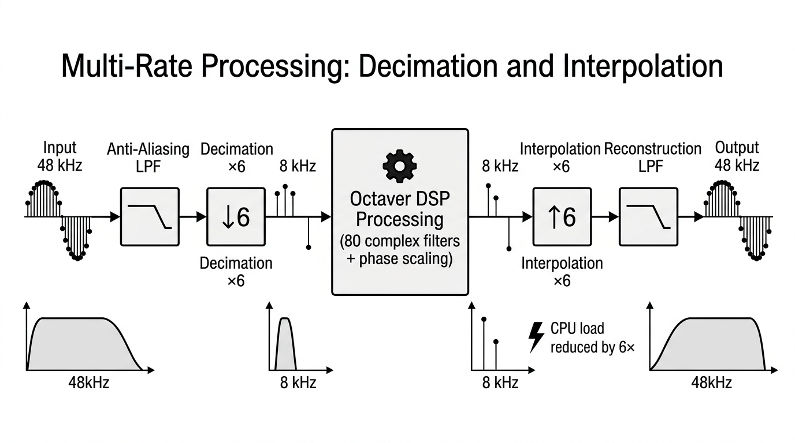

### Principe du multi-rate

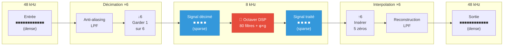
```mermaid
flowchart LR
    subgraph "48 kHz"
        A["Entrée<br/>■■■■■■■■■■■■<br/>(dense)"]
    end
    
    subgraph "Décimation ×6"
        B["Anti-aliasing<br/>LPF"]
        C["↓6<br/>Garder 1<br/>sur 6"]
    end
    
    subgraph "8 kHz"
        D["Signal décimé<br/>■ ■ ■ ■<br/>(sparse)"]
        E["🔧 Octaver DSP<br/>80 filtres + φ×g"]
        F["Signal traité<br/>■ ■ ■ ■<br/>(sparse)"]
    end
    
    subgraph "Interpolation ×6"
        G["↑6<br/>Insérer<br/>5 zéros"]
        H["Reconstruction<br/>LPF"]
    end
    
    subgraph "48 kHz "
        I["Sortie<br/>■■■■■■■■■■■■<br/>(dense)"]
    end
    
    A --> B --> C --> D --> E --> F --> G --> H --> I
    
    style E fill:#e74c3c,stroke:#c0392b,color:#fff
    style D fill:#3498db,stroke:#2980b9,color:#fff
    style F fill:#3498db,stroke:#2980b9,color:#fff
```

### Décimation

La **décimation** réduit la fréquence d'échantillonnage par un facteur entier. Ici, le facteur est **6** : on passe de 48 000 Hz à 8 000 Hz.

Avant de sous-échantillonner, un **filtre anti-repliement** (*anti-aliasing*) est indispensable pour éliminer les fréquences supérieures à la nouvelle fréquence de Nyquist (4 000 Hz). Sans ce filtre, les fréquences au-dessus de 4 kHz se « replieraient » dans le spectre et causeraient des artefacts audibles.

L'implémentation utilise **deux étapes cascadées** pour un rapport qualité/coût optimal :

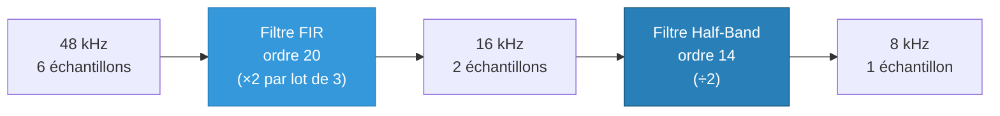
```mermaid
flowchart LR
    IN["48 kHz<br/>6 échantillons"] --> F1["Filtre FIR<br/>ordre 20<br/>(×2 par lot de 3)"]
    F1 --> MID["16 kHz<br/>2 échantillons"]
    MID --> F2["Filtre Half-Band<br/>ordre 14<br/>(÷2)"]
    F2 --> OUT["8 kHz<br/>1 échantillon"]
    
    style F1 fill:#3498db,stroke:#2980b9,color:#fff
    style F2 fill:#2980b9,stroke:#1a5276,color:#fff
```

| Étape | Type | Fréquence d'échantillonnage | Bande passante | Atténuation |
|-------|------|---------------------------|----------------|-------------|
| Filtre 1 | FIR ordre 20 | 48 kHz → 16 kHz | 0–1800 Hz (3 dB ripple) | −80 dB @ 8–24 kHz |
| Filtre 2 | Half-band ordre 14 | 16 kHz → 8 kHz | 0–1800 Hz | −80 dB @ 4–8 kHz |

> **Pourquoi 1800 Hz de bande passante ?** : les fondamentales de la guitare standard vont de ~82 Hz (Mi grave) à ~1319 Hz (Mi aigu, 24ᵉ case). La bande 0–1800 Hz couvre toutes les fondamentales et les premières harmoniques essentielles au timbre.

### Interpolation

L'**interpolation** effectue l'opération inverse : elle ramène le signal de 8 kHz à 48 kHz. Deux étapes polyphases sont utilisées :

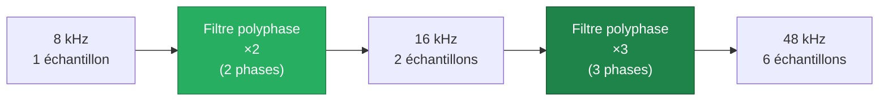
```mermaid
flowchart LR
    IN["8 kHz<br/>1 échantillon"] --> F1["Filtre polyphase<br/>×2<br/>(2 phases)"]
    F1 --> MID["16 kHz<br/>2 échantillons"]
    MID --> F2["Filtre polyphase<br/>×3<br/>(3 phases)"]
    F2 --> OUT["48 kHz<br/>6 échantillons"]
    
    style F1 fill:#27ae60,stroke:#1e8449,color:#fff
    style F2 fill:#1e8449,stroke:#145a32,color:#fff
```

Les **filtres polyphases** sont une technique d'optimisation : au lieu d'insérer des zéros entre les échantillons puis de filtrer, on calcule directement les échantillons interpolés en utilisant des sous-filtres (« phases ») décalés. C'est mathématiquement équivalent mais beaucoup plus efficace en calcul.

| Étape | Facteur | Phases | De → Vers |
|-------|---------|--------|-----------|
| Interpolation 1 | ×2 | `filter1a`, `filter1b` | 8 kHz → 16 kHz |
| Interpolation 2 | ×3 | `filter2a`, `filter2b`, `filter2c` | 16 kHz → 48 kHz |

### Bilan du multi-rate

| Étape | Fréquence | Rôle | Coût relatif |
|-------|-----------|------|--------------|
| Entrée | 48 kHz | Signal audio original | — |
| Après décimation | **8 kHz** | Signal sous-échantillonné | Faible |
| **Traitement** (80 filtres + phase scaling) | **8 kHz** | Calcul de la transposition | **÷6 vs. 48 kHz** |
| Après interpolation | 48 kHz | Signal transposé retourné | Faible |

> **La charge de calcul du banc de filtres est réduite d'un facteur 6**, car chaque filtre ne traite qu'un échantillon pour chaque groupe de 6 échantillons d'entrée. C'est ce qui rend le traitement en temps réel possible sur un microcontrôleur comme le Teensy.

---

## 8. Récapitulatif de la chaîne de traitement complète

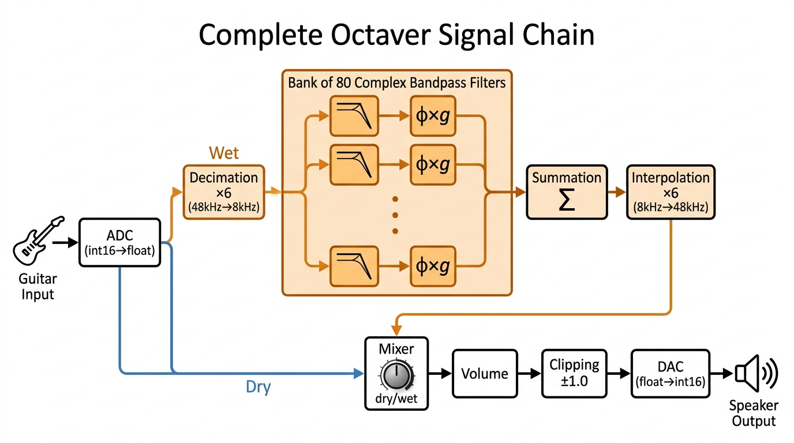

Voici le diagramme de flux complet, de l'entrée audio à la sortie :

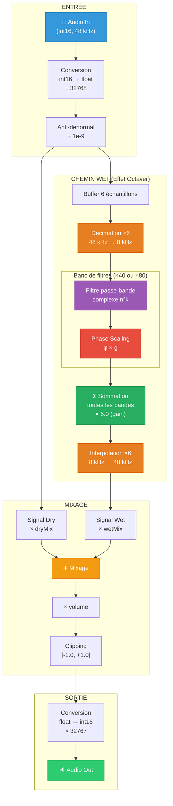
```mermaid
flowchart TB
    subgraph "ENTRÉE"
        IN["🎸 Audio In<br/>(int16, 48 kHz)"]
        CONV1["Conversion<br/>int16 → float<br/>÷ 32768"]
        AD["Anti-denormal<br/>+ 1e-9"]
    end
    
    subgraph "CHEMIN WET (Effet Octaver)"
        BUF["Buffer 6 échantillons"]
        DEC["Décimation ×6<br/>48 kHz → 8 kHz"]
        
        subgraph "Banc de filtres (×40 ou ×80)"
            FILT["Filtre passe-bande<br/>complexe n°k"]
            PS["Phase Scaling<br/>φ × g"]
        end
        
        SUM["Σ Sommation<br/>toutes les bandes<br/>× 6.0 (gain)"]
        INT["Interpolation ×6<br/>8 kHz → 48 kHz"]
    end
    
    subgraph "MIXAGE"
        DRY["Signal Dry<br/>× dryMix"]
        WETSIG["Signal Wet<br/>× wetMix"]
        MIX["➕ Mixage"]
        VOL["× volume"]
        CLIP["Clipping<br/>[-1.0, +1.0]"]
    end
    
    subgraph "SORTIE"
        CONV2["Conversion<br/>float → int16<br/>× 32767"]
        OUT["🔈 Audio Out"]
    end
    
    IN --> CONV1 --> AD
    AD --> BUF --> DEC --> FILT --> PS --> SUM --> INT --> WETSIG
    AD --> DRY
    DRY --> MIX
    WETSIG --> MIX
    MIX --> VOL --> CLIP --> CONV2 --> OUT
    
    style IN fill:#3498db,stroke:#2980b9,color:#fff
    style DEC fill:#e67e22,stroke:#d35400,color:#fff
    style FILT fill:#9b59b6,stroke:#8e44ad,color:#fff
    style PS fill:#e74c3c,stroke:#c0392b,color:#fff
    style SUM fill:#27ae60,stroke:#1e8449,color:#fff
    style INT fill:#e67e22,stroke:#d35400,color:#fff
    style MIX fill:#f39c12,stroke:#e67e22,color:#fff
    style OUT fill:#2ecc71,stroke:#27ae60,color:#fff
```

Le mixage final combine le signal original (dry) et le signal transposé (wet) selon les proportions réglées par l'utilisateur :

$$\text{output}[n] = \left(\text{input}[n] \times \text{dryMix} + \text{octave}[n] \times \text{wetMix}\right) \times \text{volume}$$

avec le clipping hard à $\pm 1.0$ pour éviter toute saturation numérique :

$$\text{output}[n] = \max\left(-1.0, \min\left(1.0, \text{output}[n]\right)\right)$$

---

## 9. Comparaison des approches

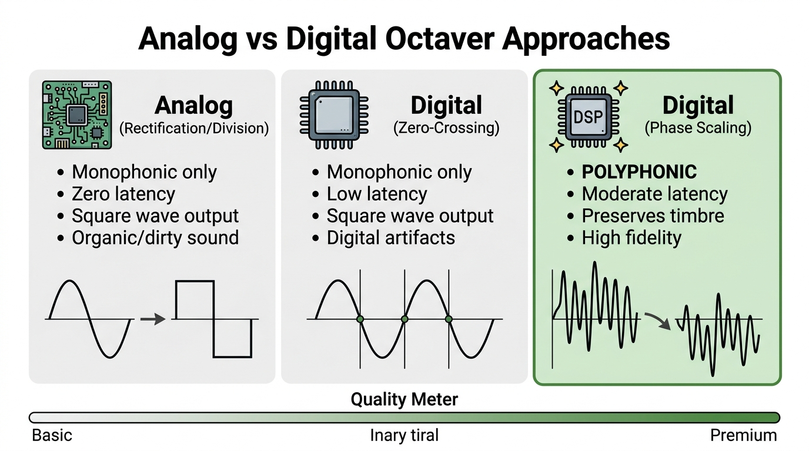

### Tableau comparatif détaillé

| Caractéristique | Analogique (division) | Numérique (zéro-crossing) | Numérique (phase scaling) |
|---|---|---|---|
| **Polyphonie** | ✗ Non | ✗ Non | ✓ **Oui** |
| **Latence** | ~0 | Faible | Modérée (due au multi-rate) |
| **Qualité** | Artefacts organiques | Artefacts numériques | **Haute fidélité** |
| **Complexité** | Circuit dédié | Faible CPU | **Élevée** (banc de 80 filtres) |
| **Modes** | 1 seul par circuit | Sous-octave uniquement | **Up / Down / 2× Down** |
| **Fidélité du timbre** | Onde carrée | Onde carrée | **Préserve le timbre** |
| **Dynamique** | Non préservée | Non préservée | **Préservée** (enveloppe) |
| **Tracking accords** | Chaos | Chaos | **Stable** |
| **Coût matériel** | Composants passifs | MCU basique | MCU puissant (Teensy 4.x) |

### Diagramme radar de comparaison

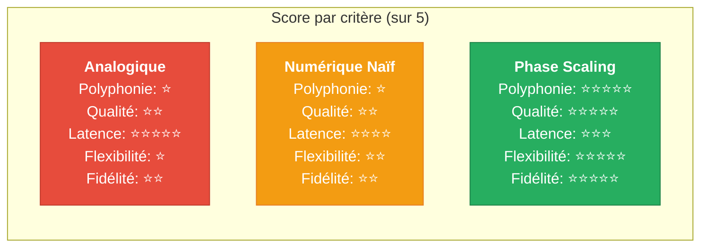
```mermaid
graph TD
    subgraph "Score par critère (sur 5)"
        direction TB
        A["<b>Analogique</b><br/>Polyphonie: ⭐<br/>Qualité: ⭐⭐<br/>Latence: ⭐⭐⭐⭐⭐<br/>Flexibilité: ⭐<br/>Fidélité: ⭐⭐"]
        B["<b>Numérique Naïf</b><br/>Polyphonie: ⭐<br/>Qualité: ⭐⭐<br/>Latence: ⭐⭐⭐⭐<br/>Flexibilité: ⭐⭐<br/>Fidélité: ⭐⭐"]
        C["<b>Phase Scaling</b><br/>Polyphonie: ⭐⭐⭐⭐⭐<br/>Qualité: ⭐⭐⭐⭐⭐<br/>Latence: ⭐⭐⭐<br/>Flexibilité: ⭐⭐⭐⭐⭐<br/>Fidélité: ⭐⭐⭐⭐⭐"]
    end
    
    style A fill:#e74c3c,stroke:#c0392b,color:#fff
    style B fill:#f39c12,stroke:#e67e22,color:#fff
    style C fill:#27ae60,stroke:#1e8449,color:#fff
```

> **Conclusion** : La méthode par mise à l'échelle de phase est **nettement supérieure** en termes de qualité sonore et de polyvalence. Son seul inconvénient est sa complexité calculatoire, compensée par l'utilisation du traitement multi-rate et des optimisations comme le Fast Inverse Square Root.

---

## 10. Références

1. **Thuillier, E.** (2016). *Real-Time Polyphonic Octave Doubling for the Guitar*. Thèse de Master, Aalto University, Finlande.  
   Disponible : [https://core.ac.uk/download/pdf/80719011.pdf](https://core.ac.uk/download/pdf/80719011.pdf)

2. **Noga, A. J.** (2001). *Complex Band-Pass Filters for Analytic Signal Generation and Their Application*. AFRL-IF-RS-TM-2001-1, Air Force Research Laboratory.  
   Disponible : [https://apps.dtic.mil/sti/tr/pdf/ADA395963.pdf](https://apps.dtic.mil/sti/tr/pdf/ADA395963.pdf)

3. **Bristow-Johnson, R.** *Cookbook formulae for audio EQ biquad filter coefficients* (« Audio EQ Cookbook »).  
   Disponible : [https://webaudio.github.io/Audio-EQ-Cookbook/audio-eq-cookbook.html](https://webaudio.github.io/Audio-EQ-Cookbook/audio-eq-cookbook.html)

4. **Wikipedia** — *Analytic Signal*.  
   [https://en.wikipedia.org/wiki/Analytic_signal](https://en.wikipedia.org/wiki/Analytic_signal)

5. **Wikipedia** — *Fast Inverse Square Root*.  
   [https://en.wikipedia.org/wiki/Fast_inverse_square_root](https://en.wikipedia.org/wiki/Fast_inverse_square_root)

---

> **Suite** : La partie 2 de ce rapport détaillera l'**implémentation concrète** dans le projet TDM_TEENSY (architecture du code, classes C++, paramètres et contrôles utilisateur).
