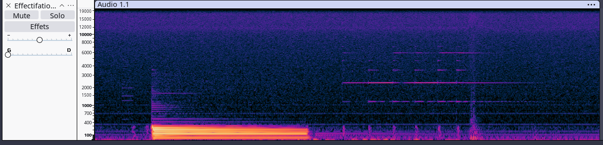
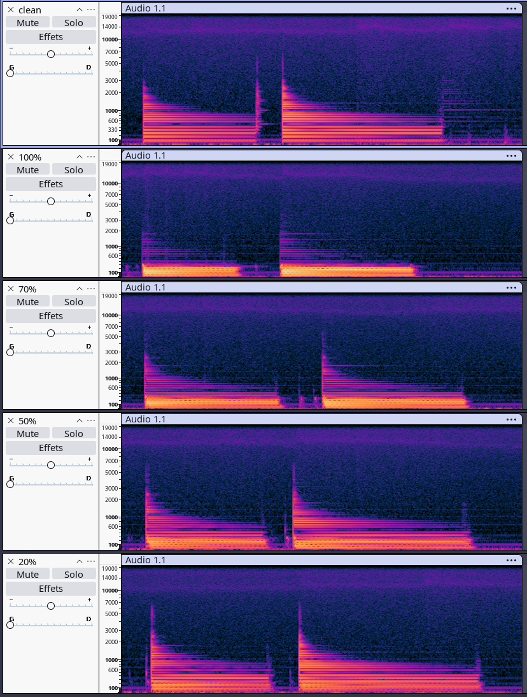

# Tests d'optimisation — Octave Down 1 & Down 2

## Setup de test

Tous les tests sont réalisés sur le **proto Teensy**. Le setup est le suivant :

```
Guitare ──► Codec externe ──► Teensy ──┬──► USB Out (enregistrement Audacity)
                                       └──► Codec externe ──► Sortie analogique
```

> [!NOTE]
> Le préampli est désactivé (trop bruyant). L'amplification est réalisée en numérique via l'effet Bypass.  
> **Sauf mention contraire**, le **mix est à 100%**.

---

## Octave Down 1

### Consommation CPU initiale

| Configuration | CPU |
|:---|:---:|
| 80 bandes, sans modification | **~18.5%** |

### Problématique

Sans modification, l'algorithme est **trop gourmand** (~20% CPU). Le tableau de BandShifters comptait 80 bandes, ce qui offre une bonne couverture fréquentielle mais demande trop de calcul.

De plus, étant donné que nous **baissons d'une octave** (division de la fréquence par 2), l'intérêt d'avoir des bandes de fréquence au-dessus d'une certaine fréquence se perd complètement.

### Analyse des bandes de fréquence

L'algorithme de base génère les fréquences centrales des bandes selon la formule :

$$f(n) = 480 \times 2^{0.027 \times n} - 420$$

où $n$ est l'index de la bande.

| Configuration | Bande max | Fréquence couverte |
|:---|:---:|:---:|
| 80 bandes | n = 79 | 60 Hz → **1 685 Hz** |
| 40 bandes | n = 39 | 60 Hz → **594 Hz** |

Par ailleurs, un **downsampling de facteur 6** est appliqué en amont pour alléger le CPU. On passe ainsi de 44,1 kHz à 7,35 kHz, soit une fréquence de Nyquist à **3 675 Hz**.

### Observation des spectrogrammes

Après observation des spectrogrammes de la note **la plus grave** et de la note **la plus aiguë** jouables sur une guitare en accordage E standard, voici la comparaison détaillée :

#### Signal initial (Clean)


<audio controls>
  <source src="rec/rec_spec_Down_UpAndDown_clean.wav" type="audio/wav">
  Votre lecteur ne supporte pas l'audio.
</audio>

**Constat** : Le signal de base utilise une large bande de fréquence. L'énergie principale se concentre dans les basses et moyennes fréquences de la guitare, tandis que les hautes fréquences apportent la clarté et l'attaque (harmoniques).

#### Octaver à 80 bandes


<audio controls>
  <source src="rec/rec_spec_Down_UpAndDown_80bandes.wav" type="audio/wav">
  Votre lecteur ne supporte pas l'audio.
</audio>

**Constat** : Avec 80 bandes, on couvre des fréquences jusqu'à 1 685 Hz. Le spectre conserve une certaine richesse, mais la consommation CPU est élevée (18.5%). On remarque qu'une grande partie du haut du spectre n'est plus exploitée par rapport au signal Clean, car la génération de la sous-octave décale logiquement l'énergie vers le bas.

#### Octaver à 40 bandes


<audio controls>
  <source src="rec/rec_spec_Down_UpAndDown_40bandes.wav" type="audio/wav">
  Votre lecteur ne supporte pas l'audio.
</audio>

**Constat** : Avec 40 bandes (jusqu'à 594 Hz), le spectre global change très peu visuellement par rapport aux 80 bandes. La majorité de l'énergie de la sous-octave est préservée et la consommation CPU chute à 10.5%. En revanche, on note une suppression des fréquences au-delà de ~400 Hz. Pour la note la plus aiguë, on observe même une absence quasi totale du son.

#### Conclusion

On constate qu'on n'utilise pas toute la bande de fréquence dans le traitement de l'octave inférieure. Conserver 80 bandes représente une sur-consommation de ressources CPU par rapport au bénéfice sonore très limité dans les aigus. Réduire à 40 bandes est le bon choix d'optimisation, mais cela nécessite de trouver un moyen de compenser la perte des hautes fréquences (notamment pour l'attaque).

### Passage à 40 bandes

À 40 bandes, le son reste **plutôt bon**, et la consommation chute significativement :

| Configuration | CPU |
|:---|:---:|
| 80 bandes | ~18.5% |
| **40 bandes** | **~10.5%** |

Comme on peut le voir sur le spectrogramme, le spectre ne change pas drastiquement, car la majorité de l'énergie est en basse fréquence.

> [!WARNING]
> On note tout de même une **suppression des fréquences au-delà de ~400 Hz**, ce qui est cohérent : à 40 bandes, la fréquence maximale couverte est $f(40) = 594$ Hz.  
> Pour la **note la plus aiguë**, on observe une absence quasi totale du son.

### Solution retenue

**Réduire le nombre de bandes** plutôt que de toucher au coefficient de downsampling, car modifier le downsampling pourrait avoir plus de répercussions qu'ignorer certaines bandes hautes.

Les pertes observées dans les hautes fréquences peuvent être **compensées par l'ajustement du mix** : on récupère les fréquences du signal d'origine tout en gardant la fondamentale du signal traité (octave inférieure).

### Choix du mix

Après avoir testé plusieurs valeurs de mix :



<!-- TODO: Ajouter les fichiers audio WAV des différents tests de mix -->
<audio controls>
  <source src="rec/rec_spec_Down_pour_cent_agé.wav" type="audio/wav">
  Votre lecteur ne supporte pas l'audio.
</audio>

**Mix choisi : 70%** — c'est celui qui permet de conserver le plus de hautes fréquences.

> [!NOTE]
> À 70% de mix et 40 bandes, le résultat n'est pas totalement suffisant pour les notes aiguës. Mais en pratique, on utilise rarement un octave down sur les notes les plus aiguës de la guitare — dans ce cas, il suffit de ne pas activer l'effet.

### Résumé Octave Down 1

| Paramètre | Avant | Après |
|:---|:---:|:---:|
| Nombre de bandes | 80 | **40** |
| Mix | 100% | **70%** |
| CPU | ~18.5% | **~10.5%** |
| Qualité (notes graves) | ✅ Bon | ✅ Bon |
| Qualité (notes aiguës) | ✅ Bon | ⚠️ Faible |

---

## Octave Down 2

### Même approche

On applique le même schéma d'optimisation que pour l'octave down 1 :
- **40 bandes**
- **70% de mix**

### Résultat

| Paramètre | Avant | Après |
|:---|:---:|:---:|
| CPU | **~25%** | **~14%** |

<!-- TODO: Ajouter un spectrogramme comparatif pour l'octave down 2 -->
<audio controls>
  <source src="rec/rec_spec_Down2.wav" type="audio/wav">
  Votre lecteur ne supporte pas l'audio.
</audio>

> [!TIP]
> Le gain CPU est encore plus impressionnant sur l'octave down 2 : passage de **25% à 14%**, soit une réduction de **44%** de la charge processeur.

---

## Bilan global — Optimisation Down

| Mode | CPU avant | CPU après | Gain |
|:---|:---:|:---:|:---:|
| Octave Down 1 | ~18.5% | ~10.5% | **−43%** |
| Octave Down 2 | ~25% | ~14% | **−44%** |

La stratégie **réduction de bandes + ajustement du mix** permet de quasiment diviser par deux la charge CPU tout en maintenant une qualité sonore acceptable pour l'usage guitare standard.
