# L'Effet Octaver — Partie 2 : Optimisation de l'Octave Down

> **Projet** : TDM_TEENSY — Pédalier d'effets guitare sur Teensy  
> **Auteur** : moi  
> **Date** : Juillet 2026

---

## Table des matières

1. [Introduction](#1-introduction)
2. [Protocole de test](#2-protocole-de-test)
3. [Octave Down 1 — Analyse et optimisation](#3-octave-down-1--analyse-et-optimisation)
   - 3.1 [État initial et problématique](#31-état-initial-et-problématique)
   - 3.2 [Analyse du banc de filtres](#32-analyse-du-banc-de-filtres)
   - 3.3 [Observation spectrale — Réduction du nombre de bandes](#33-observation-spectrale--réduction-du-nombre-de-bandes)
   - 3.4 [Stratégie d'optimisation retenue](#34-stratégie-doptimisation-retenue)
   - 3.5 [Compensation par ajustement du mix Dry/Wet](#35-compensation-par-ajustement-du-mix-drywet)
   - 3.6 [Bilan Octave Down 1](#36-bilan-octave-down-1)
4. [Octave Down 2 — Extension de l'optimisation](#4-octave-down-2--extension-de-loptimisation)
   - 4.1 [Principe de la cascade](#41-principe-de-la-cascade)
   - 4.2 [Application de la même stratégie](#42-application-de-la-même-stratégie)
   - 4.3 [Observation spectrale](#43-observation-spectrale)
5. [Bilan global et conclusion](#5-bilan-global-et-conclusion)

---

## 1. Introduction

Le rapport précédent (Partie 1) a décrit en détail le **fonctionnement théorique** de l'effet octaver par mise à l'échelle de phase. Ce second rapport se concentre sur l'**optimisation pratique** de l'algorithme pour une exécution temps réel sur microcontrôleur **Teensy 4.1** (ARM Cortex-M7, 600 MHz).

L'enjeu est le suivant : l'algorithme de transposition polyphonique par banc de filtres complexes est **intrinsèquement coûteux** en calcul. Le traitement de 80 sous-bandes, même après décimation ×6, consomme une part significative du budget CPU disponible. Or, dans un pédalier multi-effets, l'octaver ne doit pas monopoliser les ressources au détriment des autres effets.

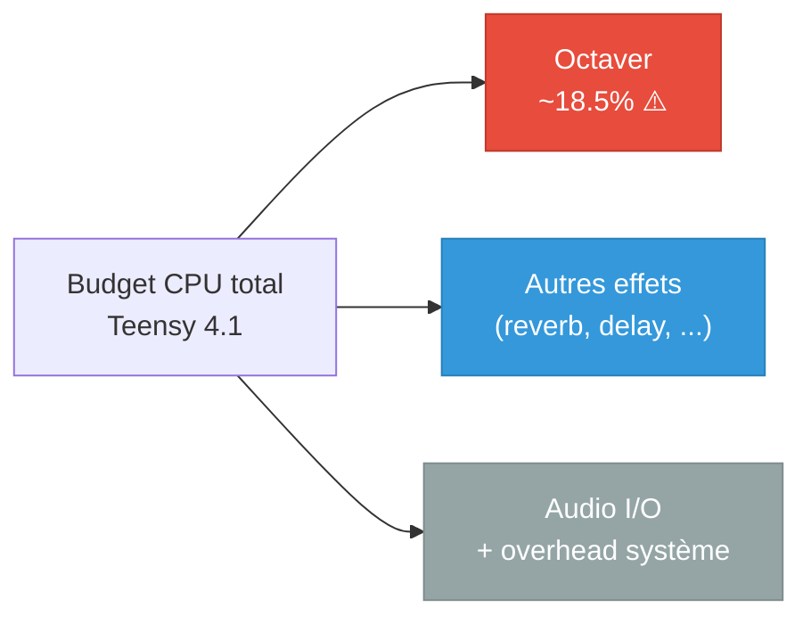
```mermaid
graph LR
    A["Budget CPU total<br/>Teensy 4.1"] --> B["Octaver<br/>~18.5% ⚠️"]
    A --> C["Autres effets<br/>(reverb, delay, ...)"]
    A --> D["Audio I/O<br/>+ overhead système"]
    
    style B fill:#e74c3c,stroke:#c0392b,color:#fff
    style C fill:#3498db,stroke:#2980b9,color:#fff
    style D fill:#95a5a6,stroke:#7f8c8d,color:#fff
```

L'objectif est de **réduire la consommation CPU de moitié** tout en maintenant une qualité sonore acceptable pour l'usage guitare.

---

## 2. Protocole de test

### Matériel et signal de test

Tous les tests sont réalisés sur le **proto Teensy**. Le setup est le suivant :

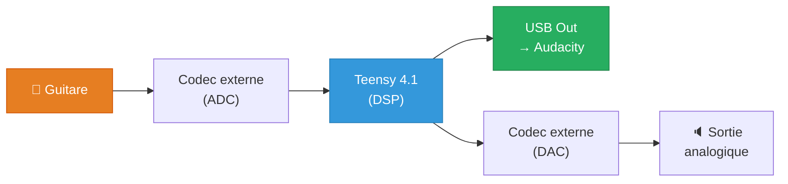
```mermaid
flowchart LR
    G["🎸 Guitare"] --> C["Codec externe<br/>(ADC)"]
    C --> T["Teensy 4.1<br/>(DSP)"]
    T --> USB["USB Out<br/>→ Audacity"]
    T --> C2["Codec externe<br/>(DAC)"]
    C2 --> OUT["🔈 Sortie<br/>analogique"]
    
    style G fill:#e67e22,stroke:#d35400,color:#fff
    style T fill:#3498db,stroke:#2980b9,color:#fff
    style USB fill:#27ae60,stroke:#1e8449,color:#fff
```

### Conditions de mesure

| Paramètre | Valeur |
|:---|:---|
| **Instrument** | Guitare électrique, accordage E standard |
| **Préampli** | Désactivé (trop bruyant) |
| **Amplification** | Numérique, via l'effet Bypass qui sert d'ampli et noise gate |
| **Notes testées** | Mi grave (E2, ~82 Hz) et Mi aigu (E4, ~330 Hz) |
| **Mix par défaut** | 100% (Wet pur, sauf section mixage) |
| **Cordes** | Tests réalisés corde par corde |
| **Plateforme** | Teensy 4.1 (ARM Cortex-M7, 600 MHz) |

### Métriques

- **CPU (%)** : mesuré via `AudioProcessorUsage()` de la bibliothèque Audio Teensy
- **Spectre** : spectrogramme temps-fréquence capturé via Audacity (FFT, fenêtre Hanning)
- **Écoute** : évaluation subjective de la qualité sonore (attaque, clarté, tracking)

> [!IMPORTANT]
> Les pourcentages de CPU indiqués correspondent à l'utilisation pour **1 corde jouée**. En jeu réel (accords, jeu rapide), la charge peut varier légèrement.  
> **Tous les tests sont réalisés sur TEENSY, pas DAISY.**

---

## 3. Octave Down 1 — Analyse et optimisation

### 3.1 État initial et problématique

La configuration initiale de l'algorithme utilise **80 sous-bandes** dans le banc de filtres passe-bande complexes :

| Configuration | CPU |
|:---|:---:|
| 80 bandes, sans modification | **~18.5%** |

Ce niveau de consommation est **trop élevé** pour un pédalier multi-effets. L'objectif est de passer sous les 12%.

Le raisonnement d'optimisation repose sur une observation fondamentale : pour l'octave down ($g = 0.5$, division de la fréquence par 2), **les sous-bandes hautes sont inutiles**. En effet, la fréquence maximale de la guitare standard (~1320 Hz, Mi aigu à la 24ᵉ case), une fois divisée par 2, ne produit qu'un signal à ~660 Hz. Il est donc inutile de maintenir des filtres au-delà de cette fréquence.

### 3.2 Analyse du banc de filtres

#### Formule des fréquences centrales

Comme décrit dans la Partie 1, les fréquences centrales des sous-bandes suivent une progression quasi-logarithmique :

$$f_c(n) = 480 \times 2^{0.027 \times n} - 420 \quad \text{Hz}$$

où $n \in \{0, 1, \ldots, 79\}$ est l'indice de la sous-bande.

#### Couverture fréquentielle selon le nombre de bandes

Le tableau suivant compare les plages de fréquences couvertes :

| Configuration | Bande min ($n=0$) | Bande max | Fréquence couverte | CPU |
|:---|:---:|:---:|:---:|:---:|
| **80 bandes** | ~60 Hz | $n = 79$ | 60 → **1 685 Hz** | ~18.5% |
| **40 bandes** | ~60 Hz | $n = 39$ | 60 → **594 Hz** | ~10.5% |

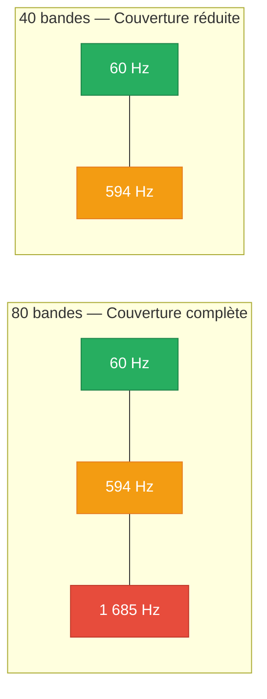
```mermaid
graph LR
    subgraph "80 bandes — Couverture complète"
        A["60 Hz"] --- B["594 Hz"] --- C["1 685 Hz"]
    end
    
    subgraph "40 bandes — Couverture réduite"
        D["60 Hz"] --- E["594 Hz"]
    end
    
    style A fill:#27ae60,stroke:#1e8449,color:#fff
    style B fill:#f39c12,stroke:#e67e22,color:#fff
    style C fill:#e74c3c,stroke:#c0392b,color:#fff
    style D fill:#27ae60,stroke:#1e8449,color:#fff
    style E fill:#f39c12,stroke:#e67e22,color:#fff
```

#### Implémentation dans le code

La sélection dynamique du nombre de bandes est réalisée dans `OctaveGenerator.h` :

```cpp
void update(float sample, int type)
{
    int numBand;
    _up1 = 0; _down1 = 0; _down2 = 0;

    if (type == 1) numBand = 80;   // Octave Up   → 80 bandes
    if (type == 2) numBand = 40;   // Octave Down  → 40 bandes
    if (type == 3) numBand = 40;   // 2 Oct. Down  → 40 bandes

    for (int i = 0; i < numBand; i++) {
        _shifters[i].update(sample, type);
        // ...
    }
}
```

#### Rappel : traitement multi-rate en amont

Un **downsampling de facteur 6** est appliqué avant le banc de filtres. Le signal passe de 44,1 kHz à 7,35 kHz, soit une fréquence de Nyquist à :

$$f_{Nyquist} = \frac{7\,350}{2} = 3\,675 \text{ Hz}$$

Toute fréquence au-delà de 3 675 Hz est déjà éliminée par le filtre anti-repliement de la décimation. Les 80 bandes couvrent donc au maximum ~1 685 Hz, bien en deçà de cette limite.

### 3.3 Observation spectrale — Réduction du nombre de bandes

Pour valider la réduction du nombre de bandes, nous comparons les spectrogrammes de la **note la plus grave** (Mi 2, ~82 Hz) et de la **note la plus aiguë** (Mi 4, ~330 Hz) jouables en accordage standard, avec l'octave down à fond (mix 100%).

#### Signal initial (Clean)

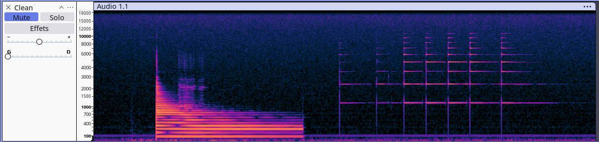
🔊 Enregistrement : [rec_spec_Down_UpAndDown_clean.wav](rec/bandes/rec_spec_Down_UpAndDown_clean.wav)

**Analyse** : Le spectre du signal clean montre la distribution typique d'une guitare électrique. L'énergie se répartit sur une large bande :
- **Fondamentales** : 82 Hz (Mi grave) à 330 Hz (Mi aigu)
- **Harmoniques** : riches jusqu'à ~4 kHz, apportant le timbre et l'attaque caractéristiques
- **Transitoires d'attaque** : énergie large-bande lors du picking, visible comme des « colonnes » verticales sur le spectrogramme

#### Octaver à 80 bandes (CPU : ~18.5%)

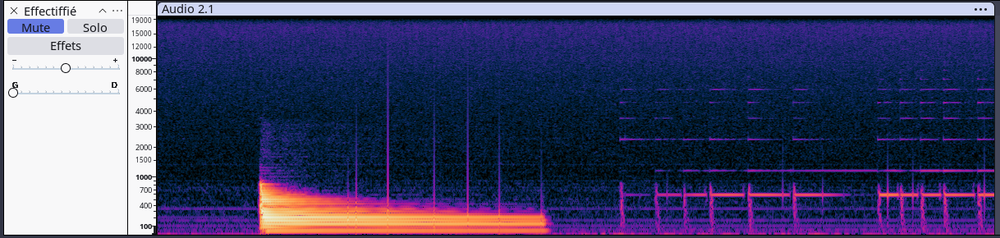
🔊 Enregistrement : [rec_spec_Down_UpAndDown_80bandes.wav](rec/bandes/rec_spec_Down_UpAndDown_80bandes.wav)

**Analyse** : Avec 80 bandes (couverture jusqu'à 1 685 Hz), on observe :
- L'apparition de la **sous-octave** : les fondamentales sont décalées vers le bas (82 Hz → 41 Hz, 330 Hz → 165 Hz)
- La **disparition des hautes fréquences** (au-dessus de ~1 700 Hz) : le banc de filtres ne couvre que cette plage, donc les harmoniques supérieures ne sont pas reproduites dans le signal wet
- Une partie significative du spectre original (attaque, brillance) est **absente** à mix 100%
- **Consommation CPU élevée** : 18.5% pour un résultat qui n'exploite pas l'intégralité des 80 bandes

> [!NOTE]
> La mise à l'échelle de phase ($g = 0.5$) divise toutes les fréquences par 2. Une fondamentale à 330 Hz devient 165 Hz, et son harmonique 2 (660 Hz) devient 330 Hz. L'énergie se concentre donc dans la **moitié inférieure** du spectre traité.

#### Octaver à 40 bandes (CPU : ~10.5%)

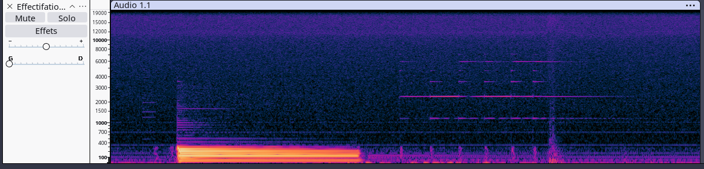
🔊 Enregistrement : [rec_spec_Down_UpAndDown_40bandes.wav](rec/bandes/rec_spec_Down_UpAndDown_40bandes.wav)

**Analyse** : Avec 40 bandes (couverture jusqu'à 594 Hz), on observe :
- Le spectre global **change très peu** par rapport aux 80 bandes pour les notes graves — la majorité de l'énergie de la sous-octave est préservée
- Une **coupure nette au-delà de ~594 Hz** : les composantes fréquentielles au-dessus de la bande $n=39$ ne sont plus traitées
- Pour la **note la plus aiguë** (Mi 4), l'absence de bandes au-dessus de 594 Hz provoque une perte quasi totale du signal
- **Division par 2 de la charge CPU** : passage de 18.5% à 10.5%

> [!WARNING]
> La réduction à 40 bandes crée un compromis : excellent sur les notes graves et médium-basses (qui constituent la majorité de l'usage d'un octave down), mais insuffisant pour les notes aiguës au-delà du registre médium.
> Le resultat à l'écoute n'est pas tres bon non plus, l'attaque n'est pas comme ce qui peut se trouver sur un son clean. 

#### Conclusion spectrale

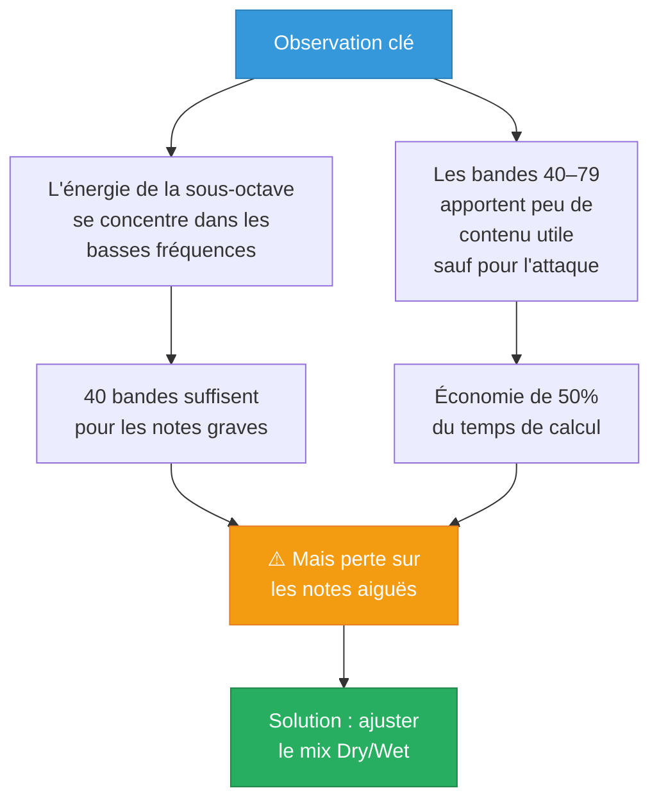
```mermaid
graph TD
    A["Observation clé"] --> B["L'énergie de la sous-octave<br/>se concentre dans les<br/>basses fréquences"]
    A --> C["Les bandes 40–79<br/>apportent peu de<br/>contenu utile <br/
    > sauf pour l'attaque"]
    B --> D["40 bandes suffisent<br/>pour les notes graves"]
    C --> E["Économie de 50%<br/>du temps de calcul"]
    D --> F["⚠️ Mais perte sur<br/>les notes aiguës"]
    E --> F
    F --> G["Solution : ajuster<br/>le mix Dry/Wet"]
    
    style A fill:#3498db,stroke:#2980b9,color:#fff
    style G fill:#27ae60,stroke:#1e8449,color:#fff
    style F fill:#f39c12,stroke:#e67e22,color:#fff
```

### 3.4 Stratégie d'optimisation retenue

Deux approches étaient envisageables pour réduire la charge CPU :

| Approche | Principe | Risque |
|:---|:---|:---|
| **Réduire les bandes** ✅ | Itérer sur 40 bandes au lieu de 80 | Perte des hautes fréquences traitées |
| Modifier le downsampling | Changer le facteur de décimation | Impacte l'anti-aliasing, les coefficients des filtres, la fréquence de Nyquist |

**Choix : réduction du nombre de bandes.** C'est l'approche la plus sûre car :
1. Elle ne modifie **aucun coefficient** des filtres existants
2. Les bandes non utilisées (40–79) restent initialisées — on peut revenir à 80 bandes à tout moment
3. La perte en hautes fréquences peut être **compensée** par le mix Dry/Wet

### 3.5 Compensation par ajustement du mix Dry/Wet

#### Principe mathématique du mixage

Le signal de sortie est calculé comme une combinaison linéaire pondérée :

$$\text{output}[n] = \underbrace{\text{input}[n] \times (1 - m)}_{\text{signal Dry (original)}} + \underbrace{\text{octave}[n] \times m}_{\text{signal Wet (transposé)}}$$

où $m \in [0, 1]$ est le paramètre de mix. À $m = 1$ (100%), seul le signal transposé est audible. En réduisant $m$, on réintroduit progressivement les hautes fréquences du signal original.

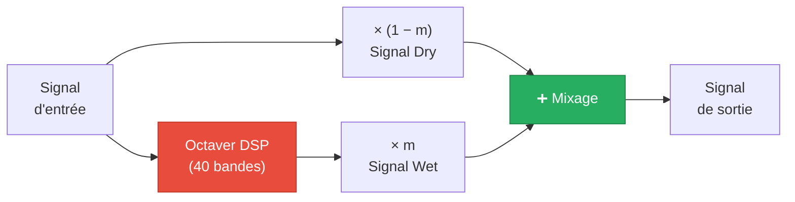
```mermaid
flowchart LR
    IN["Signal<br/>d'entrée"] --> DRY["× (1 − m)<br/>Signal Dry"]
    IN --> OCT["Octaver DSP<br/>(40 bandes)"]
    OCT --> WET["× m<br/>Signal Wet"]
    DRY --> MIX["➕ Mixage"]
    WET --> MIX
    MIX --> OUT["Signal<br/>de sortie"]
    
    style OCT fill:#e74c3c,stroke:#c0392b,color:#fff
    style MIX fill:#27ae60,stroke:#1e8449,color:#fff
```

#### Comparaison des valeurs de mix

Pour déterminer la valeur de mix optimale, nous comparons les spectrogrammes à différentes valeurs :

##### Mix 100% (Octaver pur)

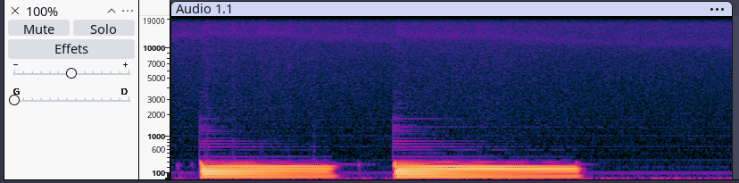
🔊 Enregistrement : [rec_spec_Down_pour_cent_agé_100.wav](rec/mixage/rec_spec_Down_pour_cent_agé_100.wav)

**Analyse** : À $m = 1.0$, seule la sous-octave est audible. Le spectre est limité à la plage couverte par les 40 bandes (~60–594 Hz). L'attaque de la guitare, portée par les transitoires haute fréquence, est **totalement absente**. Le son est sourd et manque de définition.

##### Mix 70%

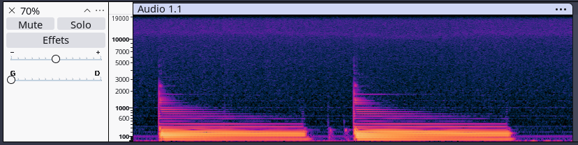
🔊 Enregistrement : [rec_spec_Down_pour_cent_agé_70.wav](rec/mixage/rec_spec_Down_pour_cent_agé_70.wav)

**Analyse** : À $m = 0.7$, l'équilibre spectral se rétablit significativement. Le signal Dry (30%) réintroduit :
- Les **transitoires d'attaque** (picking), visibles comme des impulsions large-bande sur le spectrogramme
- Les **harmoniques hautes** (>600 Hz), restaurant la clarté et la brillance
- La **fondamentale originale**, renforçant la définition de la note

Le signal Wet (70%) maintient une **forte présence de la sous-octave**, avec une assise grave bien marquée. C'est le meilleur compromis entre épaisseur basse et intelligibilité.

##### Mix 50%

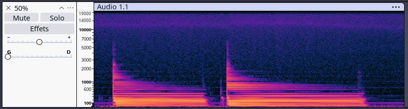
🔊 Enregistrement : [rec_spec_Down_pour_cent_agé_50.wav](rec/mixage/rec_spec_Down_pour_cent_agé_50.wav)

**Analyse** : À $m = 0.5$, la fondamentale d'origine prend le dessus dans le spectre. L'effet de sous-octave reste perceptible mais s'apparente davantage à un **accompagnement grave** qu'à un effet de transposition à part entière. Le son est plus naturel, mais l'effet perd de son impact.

##### Mix 20%

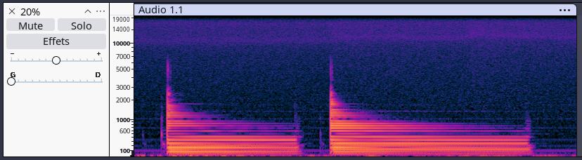
🔊 Enregistrement : [rec_spec_Down_pour_cent_agé_20.wav](rec/mixage/rec_spec_Down_pour_cent_agé_20.wav)

**Analyse** : À $m = 0.2$, l'effet d'octave est **quasi imperceptible**. Il ajoute un léger renfort dans l'extrême grave, mais le signal de sortie est dominé par le Dry. Ce réglage ne correspond plus à un usage « octaver » mais plutôt à un léger épaississement du bas du spectre.

##### Synthèse

| Mix ($m$) | Sous-octave | Attaque / Brillance | Ressenti global |
|:---:|:---|:---|:---|
| **100%** | ✅ Forte | ❌ Absente | Son sourd, peu défini |
| **70%** ✅ | ✅ Forte | ✅ Présente (30% Dry) | **Meilleur compromis** |
| **50%** | ⚠️ Modérée | ✅ Bonne | Effet discret, naturel |
| **20%** | ❌ Faible | ✅ Dominante | Effet quasi absent |

**Mix retenu : $m = 0.70$ (70%)** — c'est le réglage qui maximise la présence de la sous-octave tout en récupérant l'attaque et la clarté essentielles du signal original.

> [!NOTE]
> À 70% de mix et 40 bandes, le résultat n'est pas totalement satisfaisant pour les **notes les plus aiguës** de la guitare. Cependant, en pratique, on utilise rarement un octave down sur les aigus — dans ce cas, il suffit de ne pas activer l'effet. Cette limitation est un compromis acceptable au regard du **gain CPU de 43%**.

### 3.6 Bilan Octave Down 1

| Paramètre | Avant | Après | Variation |
|:---|:---:|:---:|:---:|
| Nombre de bandes | 80 | **40** | −50% |
| Mix | 100% | **70%** | — |
| CPU | ~18.5% | **~10.5%** | **−43%** |
| Qualité (notes graves) | ✅ Bon | ✅ Bon | = |
| Qualité (notes aiguës) | ✅ Bon | ⚠️ Nulle | ↓ |

---

## 4. Octave Down 2 — Extension de l'optimisation

### 4.1 Principe de la cascade

Comme détaillé dans la Partie 1 (section 6.4), l'octave down 2 ($g = 1/4$, deux octaves en dessous) est obtenu par **cascade** de deux opérations de mise à l'échelle de phase $g = 1/2$ :

$$f_{out} = f_{in} \times \frac{1}{2} \times \frac{1}{2} = \frac{f_{in}}{4}$$

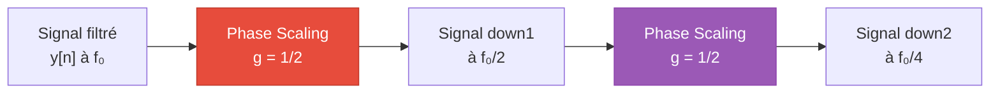
```mermaid
flowchart LR
    Y["Signal filtré<br/>y[n] à f₀"] --> D1["Phase Scaling<br/>g = 1/2"]
    D1 --> D1OUT["Signal down1<br/>à f₀/2"]
    D1OUT --> D2["Phase Scaling<br/>g = 1/2"]
    D2 --> D2OUT["Signal down2<br/>à f₀/4"]
    
    style D1 fill:#e74c3c,stroke:#c0392b,color:#fff
    style D2 fill:#9b59b6,stroke:#8e44ad,color:#fff
```

Chaque sous-bande du banc de filtres exécute donc **trois opérations** au lieu de deux (filtre + down1 + down2), ce qui rend le mode Down 2 encore plus gourmand que le Down 1.

### 4.2 Application de la même stratégie

On applique le même schéma d'optimisation :
- **40 bandes** au lieu de 80
- **70% de mix** pour compenser les hautes fréquences manquantes

Le raisonnement est identique : la division par 4 de la fréquence concentre l'énergie encore plus bas dans le spectre. Une fondamentale à 330 Hz (Mi aigu) produit un signal à 82.5 Hz — bien dans la couverture des 40 premières bandes.

| Paramètre | Avant | Après | Variation |
|:---|:---:|:---:|:---:|
| CPU | **~25%** | **~14%** | **−44%** |

### 4.3 Observation spectrale

#### Spectrogramme Octave Down 2

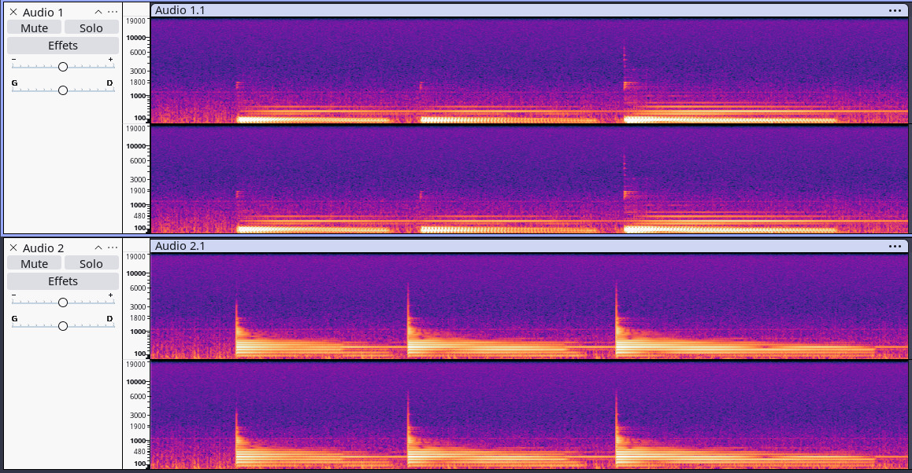
🔊 Enregistrement : [rec_spec_Down_2.wav](rec/Down2/rec_spec_Down_2.wav)

**Analyse** : L'octave down 2 génère des fréquences très basses (fondamentales divisées par 4 : 82 Hz → 20.5 Hz, 330 Hz → 82.5 Hz). On observe :
- La concentration de l'énergie dans l'**extrême grave** du spectre, à la limite inférieure de l'audibilité humaine (~20 Hz)
- La réduction à 40 bandes ne crée **aucune perte perceptible** supplémentaire par rapport aux 80 bandes, car les sous-octaves générées tombent entièrement dans la plage des 40 premières bandes
- Le mix à 70% reste essentiel pour maintenir l'**articulation** du jeu, car sans le signal Dry, le résultat est un grondement sourd sans définition

> [!TIP]
> Le gain CPU est encore plus significatif sur l'octave down 2 grâce au coût supérieur par bande (3 opérations de phase scaling au lieu de 2). On passe de **25% à 14%**, soit une économie de **11 points de pourcentage**.

---

## 5. Bilan global et conclusion

### Tableau récapitulatif

| Mode | Bandes | Mix | CPU avant | CPU après | Gain CPU |
|:---|:---:|:---:|:---:|:---:|:---:|
| Octave Down 1 | 80 → **40** | 100% → **70%** | ~18.5% | **~10.5%** | **−43%** |
| Octave Down 2 | 80 → **40** | 100% → **70%** | ~25% | **~14%** | **−44%** |

### Visualisation du gain

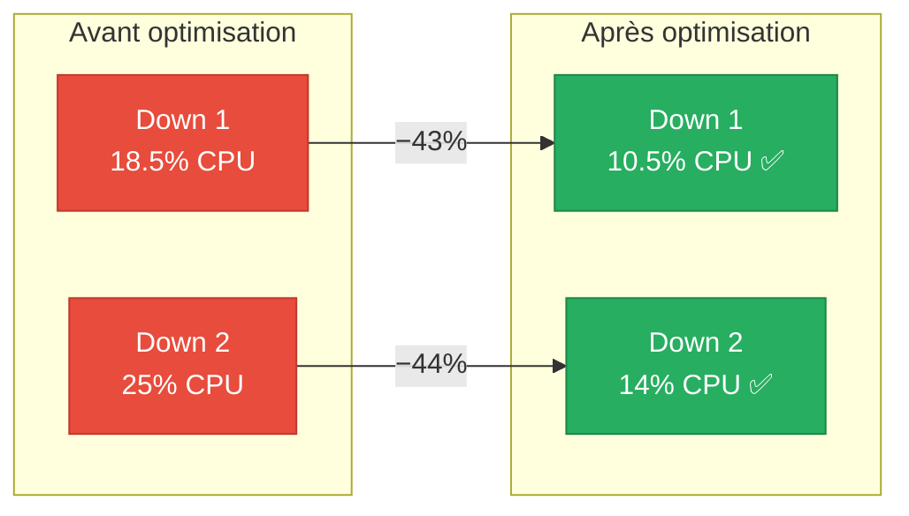
```mermaid
graph LR
    subgraph "Avant optimisation"
        A1["Down 1<br/>18.5% CPU"]
        A2["Down 2<br/>25% CPU"]
    end
    
    subgraph "Après optimisation"
        B1["Down 1<br/>10.5% CPU ✅"]
        B2["Down 2<br/>14% CPU ✅"]
    end
    
    A1 -->|"−43%"| B1
    A2 -->|"−44%"| B2
    
    style A1 fill:#e74c3c,stroke:#c0392b,color:#fff
    style A2 fill:#e74c3c,stroke:#c0392b,color:#fff
    style B1 fill:#27ae60,stroke:#1e8449,color:#fff
    style B2 fill:#27ae60,stroke:#1e8449,color:#fff
```

### Conclusion

La stratégie **réduction du nombre de bandes + ajustement du mix Dry/Wet** permet de diviser par près de deux la charge CPU de l'effet octave down, tout en maintenant une qualité sonore pleinement acceptable pour l'usage guitare standard.

Les deux leviers utilisés sont :
1. **Levier algorithmique** : réduction de la boucle de traitement de 80 à 40 itérations, éliminant les sous-bandes hautes inutiles pour la transposition descendante
2. **Levier perceptif** : compensation de la perte spectrale par réintroduction de 30% du signal original, restaurant l'attaque et la clarté

Cette optimisation libère du budget CPU pour les autres effets de la chaîne audio (reverb, delay, modulation…), rendant le pédalier multi-effets viable en temps réel.

> **Suite** : La Partie 3 détaillera l'optimisation de l'**Octave Up**, qui suit une approche différente (optimisation mathématique plutôt que réduction de bandes).
