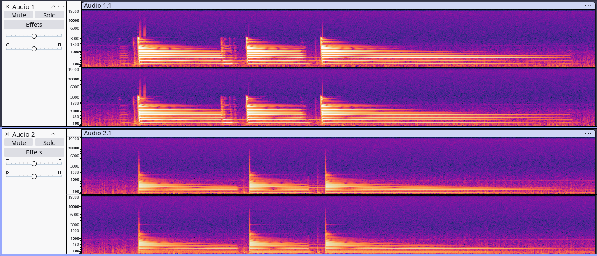

# Tests d'optimisation — Octave Up

## Setup de test

Tous les tests sont réalisés sur le **proto Teensy**. Le setup est le suivant :

```
Guitare ──► Codec externe ──► Teensy ──┬──► USB Out (enregistrement Audacity)
                                       └──► Codec externe ──► Sortie analogique
```

> [!NOTE]
> Le préampli est désactivé (trop bruyant). L'amplification est réalisée en numérique via l'effet Bypass.  
> **Sauf mention contraire**, le **mix est à 100%**.
> Les pourcentages d'utilisation seront pour l'utilisation de l'effet pour **1 corde**
> **Tout est réalisé sur TEENSY, pas DAISY ATTENTION**

---

## Octave Up

### Consommation CPU initiale

| Configuration | CPU |
|:---|:---:|
| 80 bandes, sans modification | **~11.5%** |

### Optimisation identifiée

L'algorithme de l'octave up est **moins gourmand** que le down. Une seule optimisation a été identifiée : un **calcul redondant** dans la fonction `update_up1()` du `BandShifter`.

#### Avant

```cpp
_up1 = (a*a - b*b) * fastInvSqrt(a*a + b*b);
```

Ici, `a*a` et `b*b` sont calculés **deux fois** chacun (une fois pour la différence, une fois pour la somme).

#### Après

```cpp
const auto a_carre = a*a;
const auto b_carre = b*b;
_up1 = (a_carre - b_carre) * fastInvSqrt(a_carre + b_carre);
```

Les carrés sont mis en cache dans des variables locales, éliminant les calculs redondants.

### Résultat

| Paramètre | Avant | Après |
|:---|:---:|:---:|
| Nombre de bandes | 80 | **80** (inchangé) |
| Mix | 100% | **100%** (inchangé) |
| CPU | ~11.5% | **~10.5%** |

> [!TIP]
> Étant donné que l'algorithme pour l'octave up est déjà moins gourmand que les modes down, il n'est **pas nécessaire de réduire le nombre de bandes**. On conserve 80 bandes pour une qualité optimale.
> Cependant, si il y a besoin d'economiser toujours plus de ressources, nous pourront toucher aux bandes

### Observation du spectrogramme


🔊 Enregistrement : [rec_spec_Up.wav](rec/Up/rec_spec_Up.wav)

**Constat** : Contrairement à l'octave inférieure, la génération de l'octave supérieure tire le spectre vers le haut. L'effet crée un contenu harmonique riche et brillant, ce qui justifie d'autant plus le choix de conserver les 80 bandes : une réduction couperait prématurément ces hautes fréquences caractéristiques de l'octave up.

---

## Bilan global — Optimisation Up

| Paramètre | Valeur |
|:---|:---:|
| CPU après optimisation | **~10.5%** |
| Nombre de bandes | 80 |
| Mix | 100% |
| Qualité sonore | ✅ Bonne sur tout le registre |
