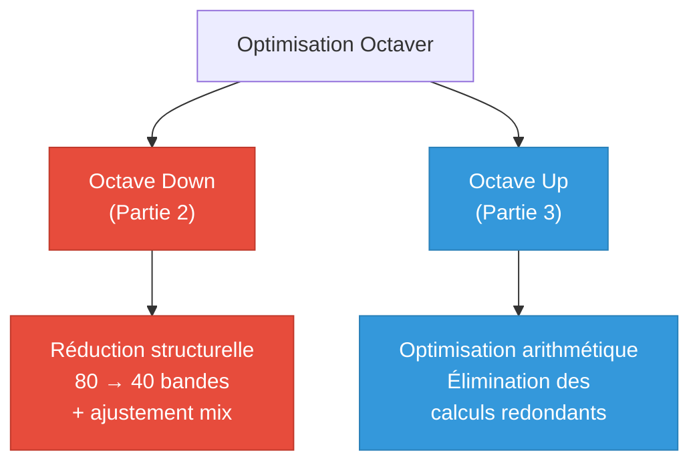
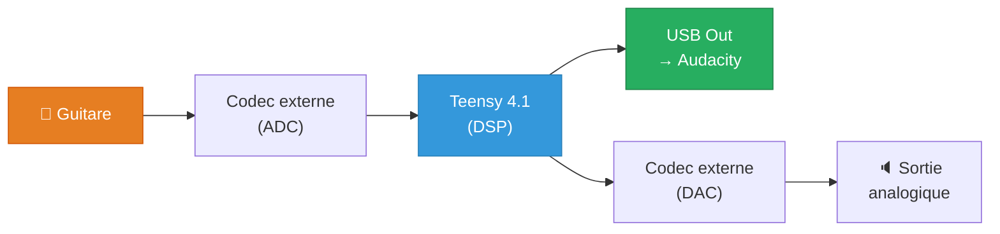
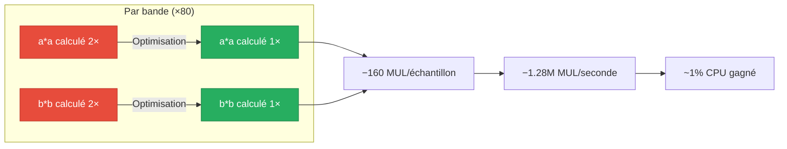
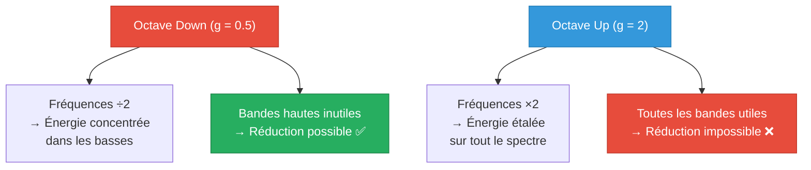
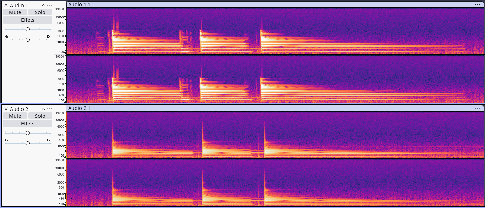
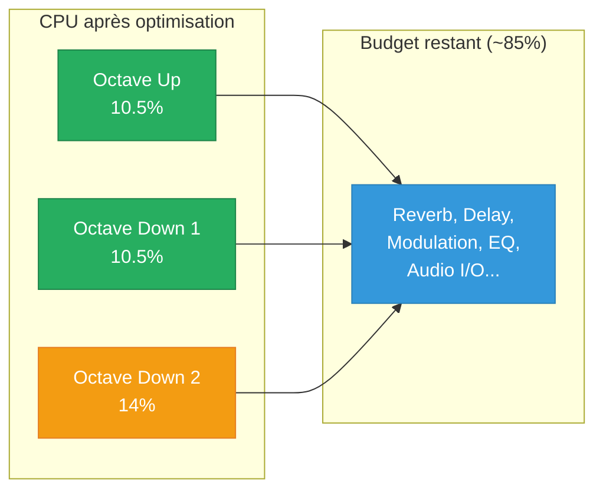

# L'Effet Octaver — Partie 3 : Optimisation de l'Octave Up

> **Projet** : TDM_TEENSY — Pédalier d'effets guitare sur Teensy  
> **Auteur** : moi  
> **Date** : Juillet 2026

---

## Table des matières

1. [Introduction](#1-introduction)
2. [Protocole de test](#2-protocole-de-test)
3. [Octave Up — Analyse et optimisation](#3-octave-up--analyse-et-optimisation)
   - 3.1 [État initial](#31-état-initial)
   - 3.2 [Pourquoi l'Octave Up est moins coûteux que le Down](#32-pourquoi-loctave-up-est-moins-coûteux-que-le-down)
   - 3.3 [Optimisation identifiée : élimination des calculs redondants](#33-optimisation-identifiée--élimination-des-calculs-redondants)
   - 3.4 [Pourquoi ne pas réduire le nombre de bandes](#34-pourquoi-ne-pas-réduire-le-nombre-de-bandes)
   - 3.5 [Observation spectrale](#35-observation-spectrale)
4. [Bilan global et conclusion](#4-bilan-global-et-conclusion)

---

## 1. Introduction

Après avoir optimisé les modes **Octave Down 1** et **Down 2** dans la Partie 2 (réduction de 80 à 40 bandes + ajustement du mix), ce troisième rapport se concentre sur l'optimisation du mode **Octave Up** ($g = 2$, doublement de la fréquence).

Contrairement aux modes Down, l'Octave Up présente un profil de consommation CPU **déjà modéré** (~11.5% contre ~18.5% pour le Down 1). L'approche d'optimisation est donc fondamentalement différente : plutôt qu'une réduction structurelle du nombre de bandes, nous identifions une **optimisation micro-architecturale** au niveau du calcul mathématique.


```mermaid
graph TD
    A["Optimisation Octaver"] --> B["Octave Down<br/>(Partie 2)"]
    A --> C["Octave Up<br/>(Partie 3)"]
    B --> D["Réduction structurelle<br/>80 → 40 bandes<br/>+ ajustement mix"]
    C --> E["Optimisation arithmétique<br/>Élimination des<br/>calculs redondants"]
    
    style B fill:#e74c3c,stroke:#c0392b,color:#fff
    style C fill:#3498db,stroke:#2980b9,color:#fff
    style D fill:#e74c3c,stroke:#c0392b,color:#fff
    style E fill:#3498db,stroke:#2980b9,color:#fff
```

---

## 2. Protocole de test

Le protocole est identique à celui de la Partie 2. Pour rappel :


```mermaid
flowchart LR
    G["🎸 Guitare"] --> C["Codec externe<br/>(ADC)"]
    C --> T["Teensy 4.1<br/>(DSP)"]
    T --> USB["USB Out<br/>→ Audacity"]
    T --> C2["Codec externe<br/>(DAC)"]
    C2 --> OUT["🔈 Sortie<br/>analogique"]
    
    style G fill:#e67e22,stroke:#d35400,color:#fff
    style T fill:#3498db,stroke:#2980b9,color:#fff
    style USB fill:#27ae60,stroke:#1e8449,color:#fff
```

| Paramètre | Valeur |
|:---|:---|
| **Instrument** | Guitare électrique, accordage E standard |
| **Préampli** | Désactivé (trop bruyant) |
| **Amplification** | Numérique, via l'effet Bypass |
| **Mix** | 100% (Wet pur) |
| **Cordes** | Tests réalisés corde par corde |
| **Plateforme** | Teensy 4.1 (ARM Cortex-M7, 600 MHz) |

> [!IMPORTANT]
> Les pourcentages de CPU indiqués correspondent à l'utilisation pour **1 corde jouée**.  
> **Tous les tests sont réalisés sur TEENSY, pas DAISY.**

---

## 3. Octave Up — Analyse et optimisation

### 3.1 État initial

| Configuration | CPU |
|:---|:---:|
| 80 bandes, sans modification | **~11.5%** |

Ce niveau de consommation est déjà **nettement inférieur** aux modes Down (~18.5% pour Down 1, ~25% pour Down 2). Cette différence s'explique par la complexité mathématique moindre du calcul de l'octave supérieure.

### 3.2 Pourquoi l'Octave Up est moins coûteux que le Down

La clé réside dans la formule de mise à l'échelle de phase. Comme décrit dans la Partie 1 (section 6.4), la formule générale est :

$$y_{out}[n] = y[n] \cdot \left(\frac{y[n]}{|y[n]|}\right)^{g-1}$$

#### Cas Octave Up ($g = 2$, exposant $= 1$)

Pour $g = 2$, l'exposant est $g - 1 = 1$. Le calcul se réduit à une simple multiplication complexe suivie d'une normalisation :

$$y_{out} = \frac{(a + jb)^2}{\sqrt{a^2 + b^2}} \quad \Rightarrow \quad \text{Re}(y_{out}) = \frac{a^2 - b^2}{\sqrt{a^2 + b^2}}$$

**Opérations requises** : 2 multiplications (carrés), 1 addition, 1 soustraction, 1 appel à `fastInvSqrt`, 1 multiplication finale.

#### Cas Octave Down ($g = 1/2$, exposant $= -1/2$)

Pour $g = 1/2$, l'exposant est $g - 1 = -1/2$. Il faut calculer la **racine carrée du phaseur unitaire** via les formules de demi-angle :

$$c = \cos(\phi/2) = \sqrt{\tfrac{1}{2} + x}, \quad d = \text{sgn}(b) \cdot \sqrt{\tfrac{1}{2} - x}$$

$$\text{avec} \quad x = \frac{a}{2|y|}$$

**Opérations requises** : 2 multiplications, 1 appel à `fastInvSqrt`, **2 appels à `fastSqrt`** (racines carrées supplémentaires), 1 test de signe, 2 multiplications-additions, gestion de `_down1_sign`.

#### Comparaison du coût par bande

| Opération | Octave Up | Octave Down |
|:---|:---:|:---:|
| Filtre passe-bande complexe | ✅ | ✅ |
| `fastInvSqrt` | 1 appel | 1 appel |
| `fastSqrt` | **0** appel | **2** appels |
| Détection de transition de phase | **Non** | **Oui** (`_down1_sign`) |
| Multiplications totales | ~4 | ~8 |
| Sortie | Réelle uniquement | **Complexe** (pour cascade) |

> [!NOTE]
> La différence de coût entre Up et Down est **multipliée par le nombre de bandes** (80). Les 2 appels supplémentaires à `fastSqrt` et la gestion de l'ambiguïté de signe, répétés 80 fois par échantillon décimé, expliquent la différence de ~7 points de CPU (11.5% vs 18.5%).

### 3.3 Optimisation identifiée : élimination des calculs redondants

L'analyse du code source de `update_up1()` dans [BandShifter.h](../../src/EffetOctaver/Util/BandShifter.h) révèle un **calcul redondant** des carrés $a^2$ et $b^2$.

#### Code original

```cpp
void update_up1()
{
    const auto a = _y.real();
    const auto b = _y.imag();
    _up1 = (a*a - b*b) * fastInvSqrt(a*a + b*b);
    //       ↑               ↑          ↑               ↑
    //      a²              b²         a²              b²
    //      ├── calculé ici ─┤          ├── recalculé ──┤
}
```

Le problème est clair : `a*a` et `b*b` sont chacun **calculés deux fois** — une fois pour la différence $(a^2 - b^2)$ et une fois pour la somme $(a^2 + b^2)$.

#### Analyse mathématique

Les deux expressions utilisent les mêmes termes intermédiaires :

$$\text{Re}(y_{out}) = \underbrace{(a^2 - b^2)}_{\text{numérateur}} \times \underbrace{\frac{1}{\sqrt{a^2 + b^2}}}_{\text{fastInvSqrt}}$$

Les valeurs $a^2$ et $b^2$ apparaissent dans les **deux** sous-expressions. En les mettant en cache dans des variables locales, on élimine 2 multiplications redondantes par appel.

#### Code optimisé

```cpp
void update_up1()
{
    const auto a = _y.real();
    const auto b = _y.imag();
    const auto a_carre = a*a;   // ← Calculé une seule fois
    const auto b_carre = b*b;   // ← Calculé une seule fois
    _up1 = (a_carre - b_carre) * fastInvSqrt(a_carre + b_carre);
}
```

#### Impact quantitatif

Cette optimisation élimine **2 multiplications flottantes** par appel à `update_up1()`. Sachant que cette fonction est appelée **80 fois par échantillon décimé** (une fois par bande), l'économie totale est de :

$$\Delta_{\text{ops}} = 2 \times 80 = 160 \text{ multiplications flottantes par échantillon décimé}$$

En ramenant au taux d'échantillonnage d'entrée (48 kHz, avec décimation ×6, soit 8 000 appels/seconde) :

$$\Delta_{\text{total}} = 160 \times 8\,000 = 1\,280\,000 \text{ multiplications/seconde éliminées}$$


```mermaid
graph LR
    subgraph "Par bande (×80)"
        A["a*a calculé 2×"] -->|"Optimisation"| B["a*a calculé 1×"]
        C["b*b calculé 2×"] -->|"Optimisation"| D["b*b calculé 1×"]
    end
    
    B --> E["−160 MUL/échantillon"]
    D --> E
    E --> F["−1.28M MUL/seconde"]
    F --> G["~1% CPU gagné"]
    
    style A fill:#e74c3c,stroke:#c0392b,color:#fff
    style C fill:#e74c3c,stroke:#c0392b,color:#fff
    style B fill:#27ae60,stroke:#1e8449,color:#fff
    style D fill:#27ae60,stroke:#1e8449,color:#fff
```

> [!TIP]
> Cette optimisation est un exemple classique de **CSE** (*Common Subexpression Elimination*), une technique d'optimisation bien connue des compilateurs. Cependant, selon le niveau d'optimisation du compilateur (`-O1`, `-O2`, `-O3`), cette factorisation peut ne pas être réalisée automatiquement, surtout si `fastInvSqrt` contient des effets de bord (manipulation de bits via `memcpy`) qui empêchent le compilateur de raisonner sur l'expression globale.

#### Note sur le mode Octave Down

On pourrait se demander si la même optimisation est applicable à `update_down1()`. Observons le code :

```cpp
void update_down1()
{
    const auto a = _y.real();
    const auto b = _y.imag();
    const auto b_sign = (b < 0) ? -1.0f : 1.0f;

    const auto x = 0.5f * a * fastInvSqrt(a*a + b*b);  // a² et b² ici
    const auto c = fastSqrt(0.5f + x);
    const auto d = b_sign * fastSqrt(0.5f - x);

    _down1 = _down1_sign * std::complex<float>((a*c + b*d), (b*c - a*d));
}
```

Ici, `a*a` et `b*b` n'apparaissent qu'**une seule fois** (dans l'appel à `fastInvSqrt`). Il n'y a donc pas de redondance exploitable. L'optimisation CSE est spécifique à `update_up1()` en raison de la structure mathématique particulière de la formule de l'octave supérieure $(a^2 - b^2) / \sqrt{a^2 + b^2}$.

### 3.4 Pourquoi ne pas réduire le nombre de bandes

Contrairement aux modes Down, la réduction du nombre de bandes n'est **pas pertinente** pour l'Octave Up. Le raisonnement est le suivant :

#### Comportement spectral de l'octave supérieure

La mise à l'échelle de phase avec $g = 2$ **double** toutes les fréquences :

| Composante | Fréquence originale | Après octave up (×2) |
|:---|:---:|:---:|
| Fondamentale Mi grave | 82 Hz | **164 Hz** |
| Harmonique 2 | 164 Hz | **328 Hz** |
| Harmonique 3 | 246 Hz | **492 Hz** |
| Fondamentale Mi aigu | 330 Hz | **660 Hz** |
| Harmonique 2 | 660 Hz | **1 320 Hz** |
| Harmonique 3 | 990 Hz | **1 980 Hz** |

Les fréquences doublées se distribuent sur **toute la plage** couverte par le banc de filtres (60–1 685 Hz). Réduire à 40 bandes (couverture jusqu'à 594 Hz) éliminerait les harmoniques essentielles au timbre de l'octave supérieure, produisant un son étriqué et dénaturé.


```mermaid
graph TD
    A["Octave Down (g = 0.5)"] --> B["Fréquences ÷2<br/>→ Énergie concentrée<br/>dans les basses"]
    A --> C["Bandes hautes inutiles<br/>→ Réduction possible ✅"]
    
    D["Octave Up (g = 2)"] --> E["Fréquences ×2<br/>→ Énergie étalée<br/>sur tout le spectre"]
    D --> F["Toutes les bandes utiles<br/>→ Réduction impossible ❌"]
    
    style A fill:#e74c3c,stroke:#c0392b,color:#fff
    style D fill:#3498db,stroke:#2980b9,color:#fff
    style C fill:#27ae60,stroke:#1e8449,color:#fff
    style F fill:#e74c3c,stroke:#c0392b,color:#fff
```

#### Budget CPU suffisant

De plus, à ~11.5% de CPU (10.5% après optimisation), l'Octave Up est déjà **bien en dessous du budget critique**. La réduction du nombre de bandes n'apporterait qu'un gain marginal au prix d'une dégradation audible de la qualité.

> [!TIP]
> Si, à l'avenir, le budget CPU devenait plus contraint (ajout de nombreux effets supplémentaires), une réduction prudente à **60 bandes** pourrait être envisagée comme compromis. La couverture passerait de 1 685 Hz à ~1 050 Hz, préservant la majorité du contenu harmonique doublé.

### 3.5 Observation spectrale

#### Spectrogramme Octave Up (80 bandes, 100% mix)


🔊 Enregistrement : [rec_spec_Up.wav](rec/Up/rec_spec_Up.wav)

**Analyse** : Le spectrogramme de l'octave supérieure confirme le comportement attendu :

- **Doublement des fondamentales** : chaque note jouée produit un contenu spectral à la fréquence double de l'original. Le Mi grave (82 Hz) génère une composante à 164 Hz, le Mi aigu (330 Hz) produit une composante à 660 Hz
- **Richesse harmonique** : contrairement à l'octave down qui « appauvrit » le spectre en le concentrant vers le bas, l'octave up **enrichit** le spectre en ajoutant du contenu dans les médiums et aigus. Le son résultant est brillant et riche, évoquant un effet « 12 cordes »
- **Couverture du banc de filtres exploitée** : l'énergie se distribue sur l'ensemble de la plage 60–1 685 Hz, confirmant que les 80 bandes sont toutes sollicitées
- **Qualité du tracking** : les transitoires d'attaque (picking) sont bien préservées sur tout le registre de la guitare, y compris les notes les plus aiguës — ce qui contraste avec l'octave down où les aigus étaient problématiques

> [!NOTE]
> Le mix est maintenu à **100%** car l'octave up ne souffre d'aucune perte spectrale (toutes les bandes sont utilisées). Il n'y a pas besoin de réintroduire le signal Dry pour compenser un manque de hautes fréquences.

---

## 4. Bilan global et conclusion

### Tableau récapitulatif

| Paramètre | Avant | Après | Variation |
|:---|:---:|:---:|:---:|
| Nombre de bandes | 80 | **80** (inchangé) | — |
| Mix | 100% | **100%** (inchangé) | — |
| CPU | ~11.5% | **~10.5%** | **−9%** |
| Qualité sonore | ✅ Bonne | ✅ Bonne | = |

### Comparaison des trois modes optimisés

| Mode | Optimisation appliquée | CPU après | Qualité |
|:---|:---|:---:|:---|
| **Octave Up** | CSE (mise en cache des carrés) | **~10.5%** | ✅ Excellente sur tout le registre |
| **Octave Down 1** | 80 → 40 bandes + mix 70% | **~10.5%** | ✅ Bonne (graves), ⚠️ Limitée (aigus) |
| **Octave Down 2** | 80 → 40 bandes + mix 70% | **~14%** | ✅ Bonne (graves), ⚠️ Limitée (aigus) |


```mermaid
graph LR
    subgraph "CPU après optimisation"
        A["Octave Up<br/>10.5%"]
        B["Octave Down 1<br/>10.5%"]
        C["Octave Down 2<br/>14%"]
    end
    
    subgraph "Budget restant (~85%)"
        D["Reverb, Delay,<br/>Modulation, EQ,<br/>Audio I/O..."]
    end
    
    A --> D
    B --> D
    C --> D
    
    style A fill:#27ae60,stroke:#1e8449,color:#fff
    style B fill:#27ae60,stroke:#1e8449,color:#fff
    style C fill:#f39c12,stroke:#e67e22,color:#fff
    style D fill:#3498db,stroke:#2980b9,color:#fff
```

### Conclusion

L'optimisation de l'Octave Up illustre un principe important en optimisation embarquée : **tous les problèmes de performance ne se résolvent pas de la même manière**. Là où les modes Down bénéficiaient d'une réduction structurelle (moins de bandes à traiter), le mode Up a tiré profit d'une optimisation arithmétique ciblée.

Les trois leviers d'optimisation utilisés dans l'ensemble du rapport sont :

| Levier | Appliqué à | Gain |
|:---|:---|:---|
| **Réduction structurelle** (moins de bandes) | Down 1, Down 2 | ~43–44% CPU |
| **Compensation perceptive** (ajustement mix) | Down 1, Down 2 | Qualité maintenue |
| **Optimisation arithmétique** (CSE) | Up | ~9% CPU |

L'ensemble des trois modes de l'octaver consomme désormais au maximum **~14% du CPU** (mode Down 2, le plus coûteux), contre **~25%** avant optimisation. Le budget CPU libéré permet l'intégration sereine de l'octaver dans la chaîne multi-effets du pédalier.
