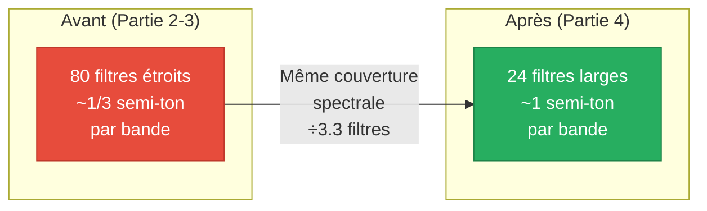
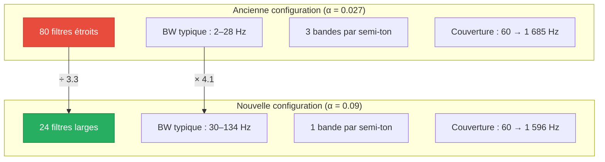
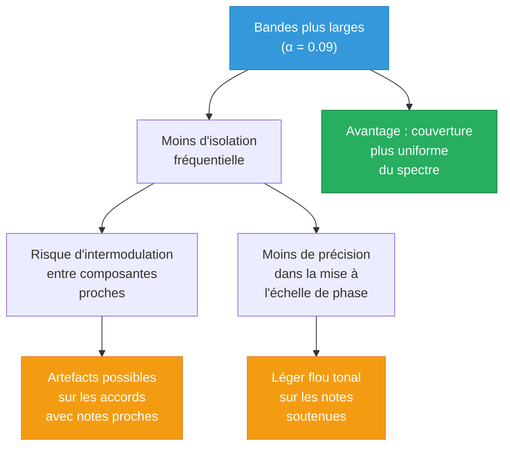
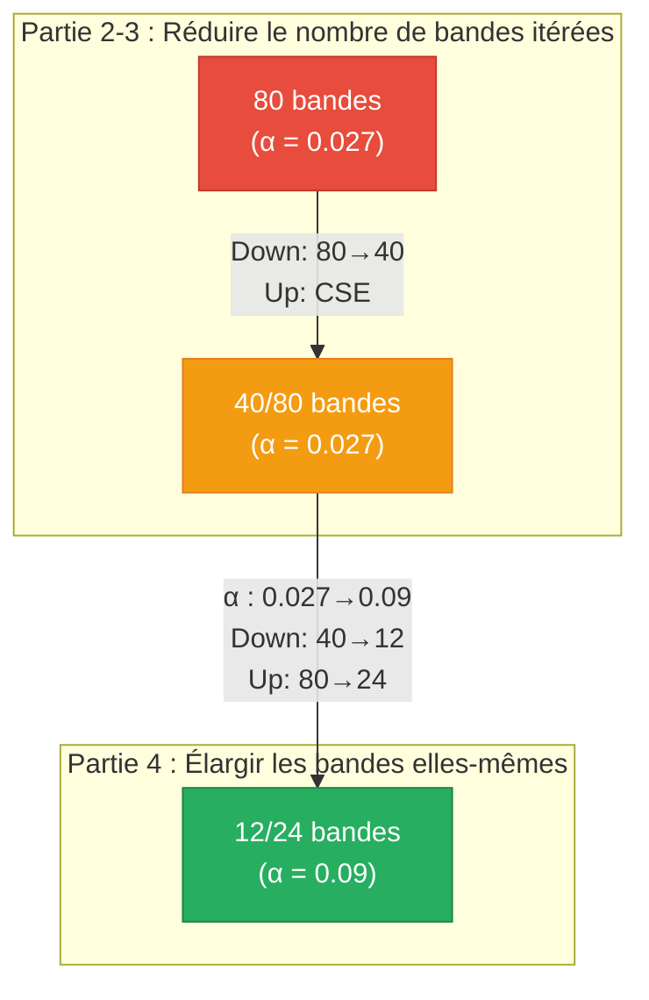

# L'Effet Octaver — Partie 4 : Optimisation par élargissement des bandes

> **Projet** : TDM_TEENSY — Pédalier d'effets guitare sur Teensy  
> **Auteur** : *(à compléter)*  
> **Date** : Juillet 2026

---

## Table des matières

1. [Introduction](#1-introduction)
2. [Rappel de la situation après les Parties 2 et 3](#2-rappel-de-la-situation-après-les-parties-2-et-3)
3. [Principe de l'optimisation](#3-principe-de-loptimisation)
   - 3.1 [Paramètre clé : le coefficient d'espacement](#31-paramètre-clé--le-coefficient-despacement)
   - 3.2 [Ancien espacement : ~1/3 de semi-ton par bande](#32-ancien-espacement--13-de-semi-ton-par-bande)
   - 3.3 [Nouvel espacement : ~1 semi-ton par bande](#33-nouvel-espacement--1-semi-ton-par-bande)
   - 3.4 [Comparaison de la couverture fréquentielle](#34-comparaison-de-la-couverture-fréquentielle)
4. [Impact sur le nombre de bandes](#4-impact-sur-le-nombre-de-bandes)
   - 4.1 [Nouveau dimensionnement par mode](#41-nouveau-dimensionnement-par-mode)
   - 4.2 [Implémentation dans le code](#42-implémentation-dans-le-code)
5. [Compromis qualité / performance](#5-compromis-qualité--performance)
   - 5.1 [Effet sur la résolution fréquentielle](#51-effet-sur-la-résolution-fréquentielle)
   - 5.2 [Conséquences perceptives attendues](#52-conséquences-perceptives-attendues)
6. [Résultats expérimentaux](#6-résultats-expérimentaux)
   - 6.1 [Octave Down 1](#61-octave-down-1)
   - 6.2 [Octave Down 2](#62-octave-down-2)
   - 6.3 [Octave Up](#63-octave-up)
7. [Bilan global et conclusion](#7-bilan-global-et-conclusion)

---

## 1. Introduction

Les Parties 2 et 3 de ce rapport ont permis de réduire significativement la consommation CPU de l'octaver en jouant sur deux leviers : la **réduction du nombre de bandes** (de 80 à 40 pour les modes Down) et l'**élimination de calculs redondants** (CSE pour le mode Up). Ces optimisations ont ramené le CPU de ~25% (Down 2) à ~14%.

Cette quatrième partie explore un levier d'optimisation plus fondamental : **l'élargissement des bandes passantes** des filtres du banc. En augmentant la largeur de chaque sous-bande, on peut couvrir le même spectre utile avec **beaucoup moins de filtres**, réduisant ainsi drastiquement le nombre d'itérations de la boucle de traitement.



---

## 2. Rappel de la situation après les Parties 2 et 3

| Mode | Bandes | Mix | CPU | Qualité |
|:---|:---:|:---:|:---:|:---|
| Octave Up | 80 | 100% | ~10.5% | ✅ Excellente |
| Octave Down 1 | 40 | 70% | ~10.5% | ✅ Bonne (graves), ⚠️ Limitée (aigus) |
| Octave Down 2 | 40 | 70% | ~14% | ✅ Bonne (graves), ⚠️ Limitée (aigus) |

L'optimisation des Parties 2-3 avait **réduit le nombre de bandes itérées** (40 au lieu de 80 pour le Down), mais les **80 filtres restaient tous initialisés** en mémoire avec leurs coefficients calculés à l'ancienne résolution. L'idée de cette Partie 4 est de repenser la résolution du banc de filtres lui-même.

---

## 3. Principe de l'optimisation

### 3.1 Paramètre clé : le coefficient d'espacement

Les fréquences centrales des sous-bandes sont générées par la formule :

$$f_c(n) = 480 \times 2^{\alpha \cdot n} - 420 \quad \text{Hz}$$

Le paramètre $\alpha$ contrôle l'**espacement logarithmique** entre bandes successives. Plus $\alpha$ est grand, plus les bandes sont **espacées** (et donc plus larges), et moins il en faut pour couvrir une plage de fréquences donnée.

### 3.2 Ancien espacement : ~1/3 de semi-ton par bande

Avec l'ancien coefficient $\alpha = 0.027$ :

$$\Delta_{\text{semi-tons}} = \alpha \times 12 = 0.027 \times 12 = 0.324 \text{ semi-tons par bande}$$

Cela signifie qu'il fallait environ **3 bandes pour couvrir un seul semi-ton** musical. C'est une résolution très fine — bien supérieure à ce que l'oreille humaine peut distinguer dans le contexte d'un effet d'octave.

### 3.3 Nouvel espacement : ~1 semi-ton par bande

Avec le nouveau coefficient $\alpha = 0.09$ :

$$\Delta_{\text{semi-tons}} = 0.09 \times 12 = 1.08 \text{ semi-tons par bande}$$

Chaque bande couvre désormais **environ 1 semi-ton** — l'intervalle minimal entre deux notes sur le manche d'une guitare (une case).

> [!NOTE]
> Le rapport $\frac{0.09}{0.027} = 3.33$ indique que les bandes sont désormais **3.3× plus espacées**. Cela signifie que la largeur passante de chaque filtre est proportionnellement plus grande, et que le nombre de filtres nécessaires est divisé par ~3.3 pour une même couverture fréquentielle.

### 3.4 Comparaison de la couverture fréquentielle

Le tableau suivant compare les fréquences centrales pour quelques indices représentatifs :

| Indice $n$ | Ancienne $f_c$ ($\alpha = 0.027$) | Ancienne BW | Nouvelle $f_c$ ($\alpha = 0.09$) | Nouvelle BW |
|:---:|:---:|:---:|:---:|:---:|
| 0 | 60.0 Hz | ~1.8 Hz | 60.0 Hz | ~29.9 Hz |
| 3 | 69.0 Hz | ~1.9 Hz | 158.8 Hz | ~36.1 Hz |
| 6 | 78.8 Hz | ~2.2 Hz | 277.9 Hz | ~43.5 Hz |
| 9 | 89.8 Hz | ~2.5 Hz | 421.5 Hz | ~52.5 Hz |
| 12 | 102.4 Hz | ~2.8 Hz | 594.7 Hz | ~63.3 Hz |
| 18 | 133.3 Hz | ~3.7 Hz | 1 055.4 Hz | ~92.0 Hz |
| 24 | 173.5 Hz | ~4.8 Hz | 1 725.2 Hz | ~133.8 Hz |

**Observation clé** : avec $\alpha = 0.09$, seulement **12 bandes** suffisent pour couvrir de 60 Hz à 533 Hz (équivalent aux anciennes 40 bandes pour le Down), et **24 bandes** couvrent de 60 Hz à 1 596 Hz (équivalent aux anciennes 80 bandes pour le Up).



---

## 4. Impact sur le nombre de bandes

### 4.1 Nouveau dimensionnement par mode

Le même raisonnement que dans les Parties 2-3 s'applique : les modes Down n'ont pas besoin des bandes hautes car la transposition descendante concentre l'énergie dans le bas du spectre.

| Mode | Ancien nombre de bandes | Nouveau nombre de bandes | Couverture |
|:---|:---:|:---:|:---|
| **Octave Up** ($g = 2$) | 80 → (Partie 2: 80) | **24** | 60 → ~1 596 Hz |
| **Octave Down 1** ($g = 0.5$) | 80 → (Partie 2: 40) | **12** | 60 → ~533 Hz |
| **Octave Down 2** ($g = 0.25$) | 80 → (Partie 2: 40) | **12** | 60 → ~533 Hz |

Le gain en nombre d'itérations par rapport à la configuration de la Partie 2 est significatif :

$$\text{Réduction Up} : \frac{80 \to 24}{80} = -70\% \quad ; \quad \text{Réduction Down} : \frac{40 \to 12}{40} = -70\%$$

### 4.2 Implémentation dans le code

Les modifications dans [OctaveGenerator.h](../../src/EffetOctaver/Util/OctaveGenerator.h) sont minimales — seuls le coefficient et les limites de boucle changent :

**Formule des fréquences centrales :**

```diff
 static inline float centerFreq(const int n)
 {
-    return 480.0f * std::pow(2.0f, (0.027f * n)) - 420.0f;
+    return 480.0f * std::pow(2.0f, (0.09f * n)) - 420.0f;
 }
```

**Nombre de bandes par mode :**

```diff
 void update(float sample, int type)
 {
     int numBand;
-    if (type == 1) numBand = 80;   // Up
-    if (type == 2) numBand = 40;   // Down 1
-    if (type == 3) numBand = 40;   // Down 2
+    if (type == 1) numBand = 24;   // Up
+    if (type == 2) numBand = 12;   // Down 1
+    if (type == 3) numBand = 12;   // Down 2
     // ...
 }
```

> [!IMPORTANT]
> Le tableau `_shifters` conserve 80 entrées initialisées (boucle `for (int i = 0; i < 80; ++i)` dans le constructeur). Seules les 12 ou 24 premières sont itérées en pratique. Les entrées restantes occupent de la mémoire mais ne consomment pas de CPU. Une optimisation mémoire future pourrait réduire cette allocation.

---

## 5. Compromis qualité / performance

### 5.1 Effet sur la résolution fréquentielle

L'élargissement des bandes réduit la **résolution fréquentielle** du banc de filtres. Plus une bande est large, moins elle est capable d'isoler une composante fréquentielle unique.

| Paramètre | Ancien ($\alpha = 0.027$) | Nouveau ($\alpha = 0.09$) |
|:---|:---:|:---:|
| Résolution | ~1/3 semi-ton | ~1 semi-ton |
| BW typique (n=5) | ~9.9 Hz | ~40.9 Hz |
| Isolation fréquentielle | Élevée | Modérée |
| Bandes par semi-ton | ~3 | ~1 |

### 5.2 Conséquences perceptives attendues

La réduction de la résolution fréquentielle peut avoir plusieurs conséquences sur la qualité audio :



**Intermodulation** : avec des bandes de ~1 semi-ton, deux notes séparées d'un semi-ton (ex : Mi et Fa) pourraient se retrouver partiellement dans la même bande, créant des battements indésirables lors de la transposition.

**Précision de phase** : la mise à l'échelle de phase fonctionne de manière optimale lorsque chaque bande ne contient qu'une seule composante sinusoïdale. Des bandes plus larges augmentent la probabilité de contenu multi-fréquentiel par bande, ce qui peut dégrader la pureté de la transposition.

**En pratique** : pour un jeu monophonique (notes simples), la résolution d'un semi-ton reste largement suffisante. Les compromis sont surtout audibles en jeu polyphonique serré (accords avec secondes mineures).

> [!TIP]
> L'évaluation subjective de la qualité est déterminante ici. Les spectrogrammes et enregistrements de la section suivante permettront de quantifier la dégradation réelle (si elle existe) par rapport à l'ancienne configuration.

---

## 6. Résultats expérimentaux

### 6.1 Octave Down 1

| Paramètre | Partie 2 | Partie 4 | Variation |
|:---|:---:|:---:|:---:|
| Bandes itérées | 40 | **12** | −70% |
| Coefficient $\alpha$ | 0.027 | **0.09** | ×3.3 |
| Couverture | 60–594 Hz | 60–533 Hz | ≈ |
| Mix | 70% | **70%** | — |
| CPU | ~10.5% | **~5%** | **−52%** |

#### Spectrogramme

<!-- TODO: Ajouter le spectrogramme Octave Down 1 (12 bandes, α=0.09) -->
<!--  -->
<!-- 🔊 Enregistrement : [rec_spec_Down1_12bandes.wav](rec/bandes_larges/rec_spec_Down1_12bandes.wav) -->

**Analyse** : *(à compléter après enregistrement)*

### 6.2 Octave Down 2

| Paramètre | Partie 2 | Partie 4 | Variation |
|:---|:---:|:---:|:---:|
| Bandes itérées | 40 | **12** | −70% |
| Coefficient $\alpha$ | 0.027 | **0.09** | ×3.3 |
| Mix | 70% | **70%** | — |
| CPU | ~14% | **~7%** | **−50%** |

#### Spectrogramme

<!-- TODO: Ajouter le spectrogramme Octave Down 2 (12 bandes, α=0.09) -->
<!--  -->
<!-- 🔊 Enregistrement : [rec_spec_Down2_12bandes.wav](rec/bandes_larges/rec_spec_Down2_12bandes.wav) -->

**Analyse** : *(à compléter après enregistrement)*

### 6.3 Octave Up

| Paramètre | Partie 3 | Partie 4 | Variation |
|:---|:---:|:---:|:---:|
| Bandes itérées | 80 | **24** | −70% |
| Coefficient $\alpha$ | 0.027 | **0.09** | ×3.3 |
| Couverture | 60–1 685 Hz | 60–1 596 Hz | ≈ |
| Mix | 100% | **100%** | — |
| CPU | ~10.5% | **~5%** | **−52%** |

#### Spectrogramme

<!-- TODO: Ajouter le spectrogramme Octave Up (24 bandes, α=0.09) -->
<!--  -->
<!-- 🔊 Enregistrement : [rec_spec_Up_24bandes.wav](rec/bandes_larges/rec_spec_Up_24bandes.wav) -->

**Analyse** : *(à compléter après enregistrement)*

---

## 7. Bilan global et conclusion

### Évolution complète de l'optimisation

| Mode | CPU initial<br/>(Partie 1) | Après Partie 2-3<br/>(bandes réduites) | Après Partie 4<br/>(bandes élargies) | Gain total |
|:---|:---:|:---:|:---:|:---:|
| Octave Up | ~11.5% | ~10.5% | **~5%** | **−57%** |
| Octave Down 1 | ~18.5% | ~10.5% | **~5%** | **−73%** |
| Octave Down 2 | ~25% | ~14% | **~7%** | **−72%** |

### Résumé des optimisations cumulées



Les quatre parties du rapport illustrent une progression logique dans l'optimisation :

| Partie | Levier | Principe |
|:---|:---|:---|
| **Partie 2** | Réduction structurelle | Itérer sur moins de bandes (Down : 80→40) |
| **Partie 3** | Optimisation arithmétique | Éliminer les calculs redondants (CSE) |
| **Partie 4** | Réduction fondamentale | Élargir les bandes ($\alpha$ : 0.027→0.09) pour en nécessiter moins |

> [!IMPORTANT]
> L'élargissement des bandes est l'optimisation la plus **agressive** appliquée jusqu'ici. Contrairement à la simple réduction du nombre d'itérations (Partie 2), elle modifie la **résolution fréquentielle** du banc de filtres. L'évaluation auditive des enregistrements sera déterminante pour valider ce compromis.

Le passage de ~3 bandes par semi-ton à ~1 bande par semi-ton représente un changement significatif de la philosophie du banc de filtres : on passe d'un système à **haute résolution spectrale** (adapté à la polyphonie complexe) à un système à **résolution musicale** (1 bande ≈ 1 note), mieux adapté au budget CPU d'un microcontrôleur embarqué.
