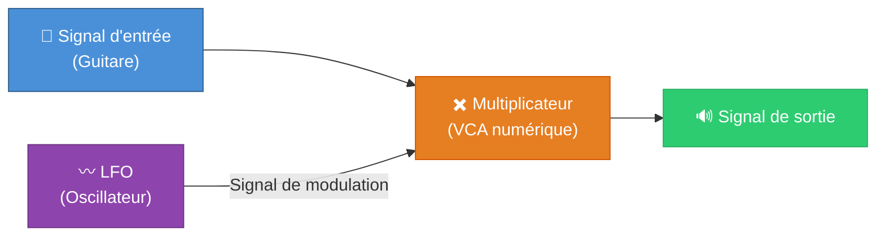
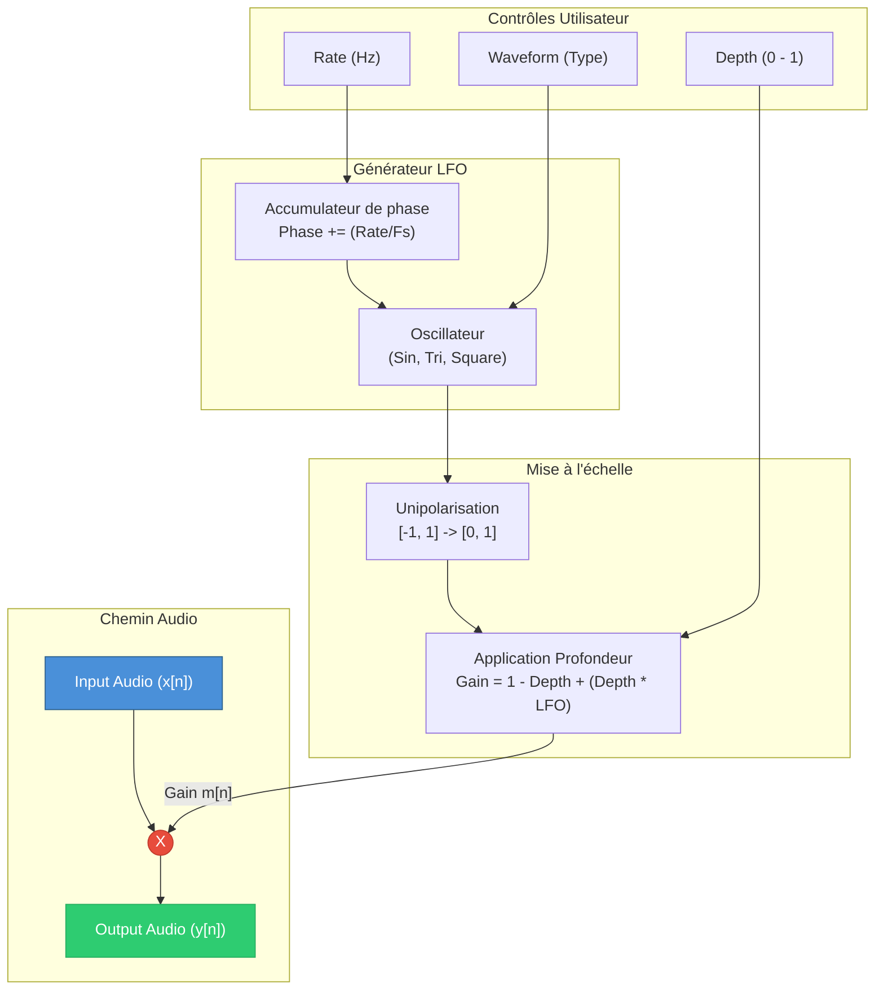

# L'Effet Tremolo — Partie 1 : Fonctionnement

> **Projet** : TDM_TEENSY — Pédalier d'effets guitare sur Teensy  
> **Auteur** : *(à compléter)*  
> **Date** : Août 2026

---

## Table des matières

1. [Introduction](#1-introduction)
2. [Rappels théoriques — L'amplitude et la modulation](#2-rappels-théoriques--lamplitude-et-la-modulation)
3. [Vue d'ensemble de l'effet Tremolo](#3-vue-densemble-de-leffet-tremolo)
4. [Le cœur du Tremolo : le LFO](#4-le-cœur-du-tremolo--le-lfo)
   - 4.1 [Principe du LFO (Low Frequency Oscillator)](#41-principe-du-lfo-low-frequency-oscillator)
   - 4.2 [Les formes d'onde](#42-les-formes-donde)
5. [Les paramètres fondamentaux](#5-les-paramètres-fondamentaux)
6. [L'équation mathématique du Tremolo](#6-léquation-mathématique-du-tremolo)
7. [Implémentation numérique (DSP)](#7-implémentation-numérique-dsp)
   - 7.1 [Le bloc LFO en numérique](#71-le-bloc-lfo-en-numérique)
   - 7.2 [Mise à l'échelle et application au signal](#72-mise-à-léchelle-et-application-au-signal)
8. [Schéma complet de la chaîne de traitement](#8-schéma-complet-de-la-chaîne-de-traitement)
9. [Confusion courante : Tremolo vs Vibrato](#9-confusion-courante--tremolo-vs-vibrato)
10. [Récapitulatif](#10-récapitulatif)

---

## 1. Introduction

Le **Tremolo** est l'un des tout premiers effets audio ayant vu le jour dans l'histoire de la guitare électrique (intégré dans de nombreux amplificateurs dès les années 1950). Il consiste en une variation cyclique et régulière du **volume** (l'amplitude) du signal.

Bien qu'il s'agisse conceptuellement de l'un des effets les plus simples à comprendre — c'est comme si quelqu'un tournait le bouton de volume de l'amplificateur de haut en bas très rapidement — son implémentation requiert la maîtrise d'un élément fondamental en synthèse et en traitement du signal : le **LFO** (Low Frequency Oscillator).

Ce document explique en détail le fonctionnement du Tremolo, depuis la théorie acoustique de base jusqu'à son implémentation algorithmique en C++ pour le Teensy.

---

## 2. Rappels théoriques — L'amplitude et la modulation

### L'Amplitude

Dans un signal audio, l'amplitude représente le niveau, ou la force du signal à un instant $t$. En numérique, le signal audio est une suite d'échantillons $x[n]$ dont la valeur (par exemple entre -1.0 et 1.0) correspond à la position de la membrane du haut-parleur. Modifier l'amplitude globale revient simplement à multiplier ce signal par un gain $g$.

### La Modulation d'Amplitude (AM)

Le Tremolo est une forme basique de **Modulation d'Amplitude**. Contrairement à un gain fixe (un contrôle de volume classique), le gain dans un Tremolo varie constamment dans le temps selon un motif répétitif.

Dans le domaine temporel, on multiplie le signal porteur (la guitare) par un signal modulateur basse fréquence (le LFO). 

---

## 3. Vue d'ensemble de l'effet Tremolo

Pour réaliser un effet de Tremolo, le système numérique doit être capable de :
1. **Générer un signal de modulation** périodique, très lent par rapport aux fréquences audio (généralement entre 1 Hz et 15 Hz).
2. **Adapter ce signal de modulation** pour qu'il dicte le niveau de variation souhaité (la profondeur de l'effet).
3. **Appliquer ce signal** au flux audio entrant par une simple multiplication.

---

## 4. Le cœur du Tremolo : le LFO

### 4.1 Principe du LFO (Low Frequency Oscillator)

Le LFO est un oscillateur qui génère une forme d'onde à des fréquences sub-audio (inférieures à 20 Hz). Contrairement à un oscillateur audio (utilisé pour créer des notes), le LFO est utilisé comme signal de **contrôle** (Control Voltage en analogique).

### 4.2 Les formes d'onde

L'aspect sonore du tremolo dépend énormément de la **forme d'onde** (waveform) produite par le LFO. Voici les plus courantes :

- **Sinusoïdale (Sine)** : La variation de volume est douce et naturelle, très "vintage". Typique des amplis Fender anciens.
- **Triangulaire (Triangle)** : La montée et la descente du volume sont linéaires. Très proche de la sinusoïde mais légèrement plus abrupte aux sommets.
- **Carrée (Square)** : Le volume passe instantanément de fort à faible. Cela produit un effet "haché" ou d'hélicoptère (Stutter effect).
- **Dent de scie / Rampe (Sawtooth / Ramp)** : Créé un effet rythmique pulsé, avec une attaque immédiate puis une chute progressive, ou inversement.

---

## 5. Les paramètres fondamentaux

Sur une pédale de Tremolo typique, on retrouve généralement deux réglages majeurs :

1. **La Vitesse (Rate ou Speed)** : 
   - Détermine la fréquence du LFO (à quelle vitesse le volume monte et descend).
   - Unité : Hertz (Hz). Plage typique : de 1 Hz (lent) à 15-20 Hz (très rapide).
   - *Exemple musical* : Calé sur le tempo du morceau, un Tremolo peut faire osciller le son à la noire, à la croche, etc.

2. **La Profondeur (Depth ou Intensity)** :
   - Détermine l'amplitude de la modulation (jusqu'à quel point le volume baisse).
   - Unité : Pourcentage (0% à 100%).
   - À 0%, le volume ne change pas (gain constant).
   - À 100%, le volume descend jusqu'au silence complet dans les creux de la modulation.

---

## 6. L'équation mathématique du Tremolo

Soit $x[n]$ le signal d'entrée (la guitare) et $y[n]$ le signal de sortie. 
L'équation fondamentale du Tremolo numérique est une multiplication de $x[n]$ par une fonction de modulation $m[n]$ variant entre 0 et 1 :

$$ y[n] = x[n] \times m[n] $$

La fonction de modulation $m[n]$ est dérivée du LFO. Considérons un LFO sinusoïdal $LFO[n]$ qui oscille entre -1.0 et +1.0. 
Pour éviter d'inverser la phase du signal audio (si on multipliait par un nombre négatif), on doit décaler et mettre à l'échelle (scaler) le LFO pour qu'il opère uniquement dans les valeurs positives :

- **Étape 1 : unipolarisation du LFO** : on ramène la plage [-1, 1] à [0, 1].
  $$ LFO_{uni}[n] = \frac{LFO[n] + 1}{2} $$

- **Étape 2 : application de la profondeur (Depth, notée $D$ entre 0 et 1)** :
  La modulation finale doit varier entre $(1 - D)$ et $1$. 
  Par exemple, si Depth = 0.8 (80%), la modulation va de 0.2 à 1.0.
  
  $$ m[n] = 1 - D + (D \times LFO_{uni}[n]) $$
  
  Ou, exprimé plus simplement :
  
  $$ m[n] = 1 - (D \times (1 - LFO_{uni}[n])) $$

---

## 7. Implémentation numérique (DSP)

### 7.1 Le bloc LFO en numérique

Pour générer le LFO numériquement, la méthode la plus courante est l'**Accumulateur de phase** (Phase Accumulator).

Le principe : à chaque échantillon audio, on incrémente une variable "phase" d'un pas calculé en fonction de la fréquence désirée et de la fréquence d'échantillonnage ($F_s$).
La phase évolue par exemple de 0 à $2\pi$ (ou de 0.0 à 1.0). Lorsqu'elle dépasse la valeur maximale, elle "boucle" à 0.

$$ \text{Incrément} = \frac{f_{LFO}}{F_s} \times 2\pi $$
$$ \text{Phase}[n] = (\text{Phase}[n-1] + \text{Incrément}) \bmod 2\pi $$

À partir de cette phase, on calcule la valeur de la forme d'onde :
- **Sinus** : $\sin(\text{Phase}[n])$
- **Carré** : $1$ si Phase < $\pi$, sinon $-1$
- **Triangle** : *(fonction linéaire par morceaux selon le quadrant de la phase)*

### 7.2 Mise à l'échelle et application au signal

Une fois la valeur brute du LFO obtenue, il faut la mettre à l'échelle avec le paramètre `Depth` comme vu dans l'équation. Le calcul doit être effectué pour chaque échantillon audio entrant. 

Contrairement aux effets comme le Delay ou la Réverbération qui nécessitent des tampons (buffers) de mémoire importants pour stocker le signal audio, le Tremolo ne nécessite **aucune mémoire de retardement**. L'opération n'a besoin que de l'échantillon courant, ce qui en fait un algorithme très léger pour le CPU et la RAM d'un microcontrôleur comme le Teensy.

---

## 8. Schéma complet de la chaîne de traitement

---

## 9. Confusion courante : Tremolo vs Vibrato

Il est très fréquent de confondre ces deux effets, notamment en raison d'erreurs historiques d'appellation par certains fabricants mythiques (comme Fender appelant "Vibrato" le circuit de tremolo de ses amplis, ou le chevalet "Tremolo" des guitares Stratocaster qui produit en réalité un vibrato...).

- **Le Tremolo** est une modulation de l'**Amplitude** (le volume monte et descend). L'effet que nous venons d'étudier.
- **Le Vibrato** est une modulation de la **Fréquence** (la note (le pitch) monte et descend). Ce n'est pas un changement de volume, mais une légère variation de la hauteur du son. En DSP, cela nécessite l'utilisation d'un buffer de retard variable (Delay line) modulé par un LFO, ce qui est algorithmiquement plus complexe qu'un Tremolo.

---

## 10. Récapitulatif

1. **Effet AM** : Le Tremolo est une simple Modulation d'Amplitude.
2. **Mémoire O(1)** : Il ne requiert aucun buffer de stockage audio, seulement des multiplications instantanées.
3. **Le LFO est roi** : Toute la "personnalité" du tremolo provient de la qualité du LFO (forme d'onde, propreté mathématique) et de son lissage.
4. **Rate et Depth** : Les deux paramètres piliers qui définissent respectivement la vitesse de l'oscillation et son intensité.

---

## 11. Références

- Will Pirkle, *Designing Audio Effect Plug-Ins in C++* (pour l'implémentation des LFO et l'architecture des oscillateurs numériques)
- DAFX (Digital Audio Effects) - Udo Zölzer
